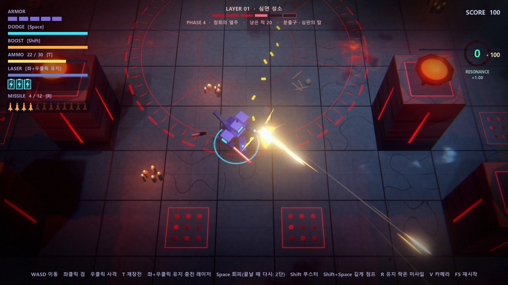
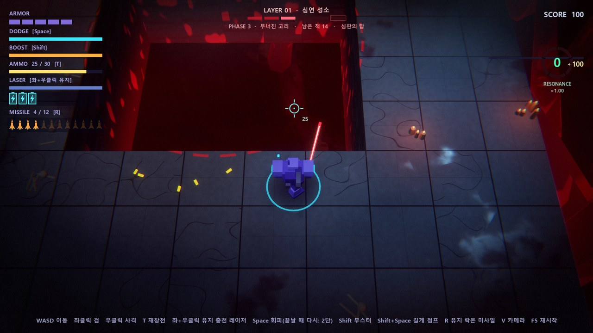
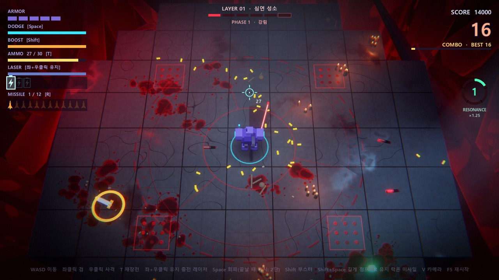
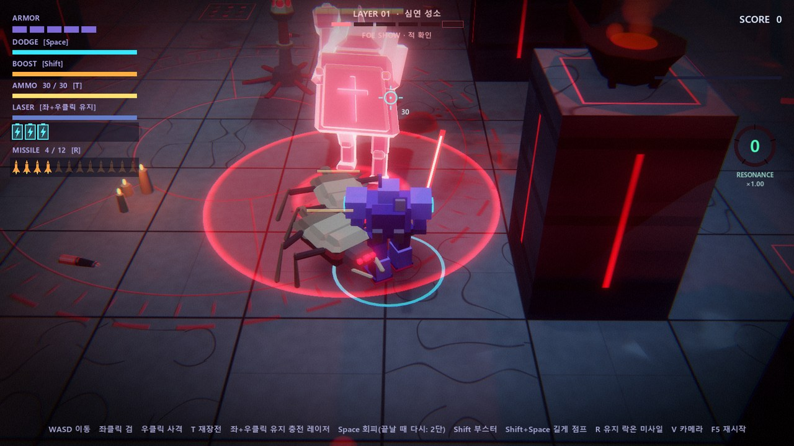
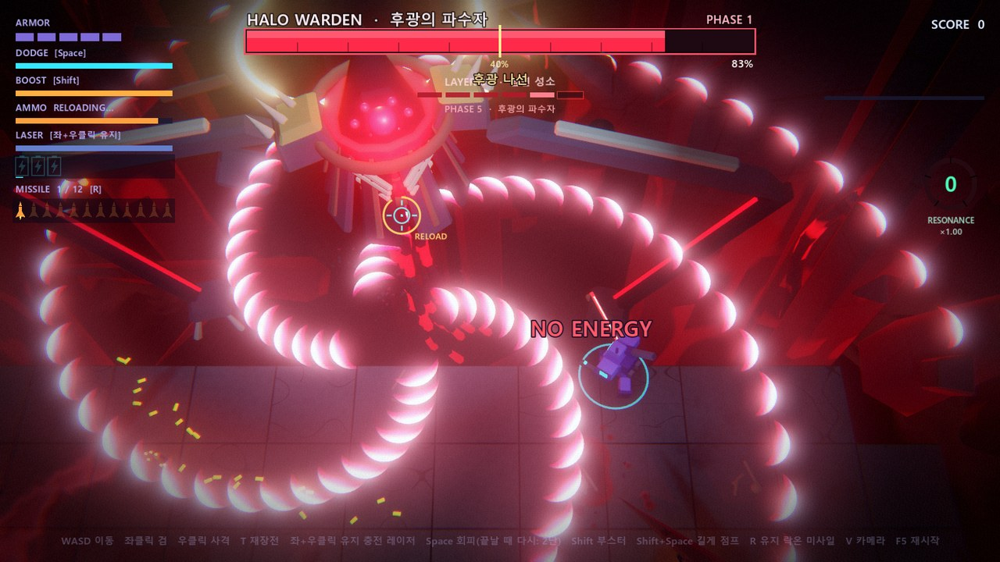
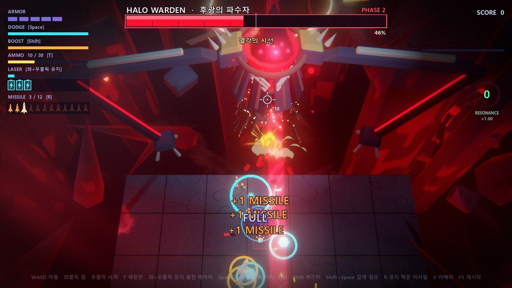

# LAYER 01 · 심연 성소 (KILL KNIGHT 레퍼런스 테스트 씬)

작성일: 2026-10-01 · 실행: `abyss_battle.cmd` (로비 → 테스트 씬 → LAYER 01 · 심연 성소)

기존 맵(밝은 SF 방·용광로)과 분위기가 전혀 다른 **어둡고 조명으로 공간을 그리는 맵**을 별도 테스트 씬으로 만들었다.
레퍼런스는 PlaySide 의 *KILL KNIGHT* (Steam 2694420). 배경·소품·조명·셰이더·적 3종·함정 2종·중간보스·전용 VFX·스테이지 구성까지 이 씬 안에 모두 들어 있고, 기존 씬과 코드는 건드리지 않았다(로비 목록에 한 줄 추가만).



## 1. 레퍼런스 리서치

### 게임 개요 (스토어 페이지 · 리뷰)

- 아이소메트릭 탑다운 액션 슈터. "eldritch arena" 다섯 개(레이어)를 내려가며 끝없이 몰려오는 괴물을 처치한다.
- 아트 방향: *polished, minimalist aesthetic · retro visuals · lo-fi brutalism · dread and dream-like ruins* — 90년대 네온 아케이드에 대한 오마주.
- 레이어 다섯: Solitude · Entanglement · Viscera · Echelon · Reflection. **레이어마다 약 10개의 배치(Phase)가 있고 웨이브를 정리할 때마다 땅이 움직여 다음 배치로 바뀐다.** 레이어 하나는 사실상 계속 모양이 바뀌는 단일 아레나다.
- 레이어마다 새 함정이 하나씩 추가되고, 뒤로 갈수록 함정이 겹친다. 적을 함정으로 유인해 처치할 수 있다.
- 적: 근접형과 원거리형이 섞이고 층이 깊어질수록 장갑형·대형이 추가된다. **약한 잡몹이 단단한 갑각 적을 에워싸고, 갑각 적을 터뜨리면 주변까지 휩쓰는** 배치가 손맛의 핵심. 공격 직전 적이 붉게 번쩍인다.
- 피 보석(blood gem)을 모으면 Kill Power 가 올라 속도·피해가 오르고, 맞으면 깎인다. 화면 오른쪽 위 붉은 고리에 숫자로 표시된다.
- 보스는 2페이즈짜리 하나뿐이라는 평 → 레이어 단위로는 "중간 보스"가 부족하다는 지적이 있었다. 이 씬은 그 빈자리를 채우는 중간보스를 둔다.

### 스크린샷 9장에서 읽은 시각 규칙

| 관찰 | 이 씬에 옮긴 방식 |
|---|---|
| 넓은 석판 격자가 **허공(붉은/청록 심연)에 떠 있다**. 가장자리 아래는 깊이를 알 수 없다 | 2m 석판 15×15 격자가 붉은 심연 위에 떠 있다. 판 옆면 아래로 갈수록 심연 빛·핏줄이 번진다 |
| 바닥은 **어두운 청회색 슬레이트**, 이음매가 얇고 젖은 얼룩이 번들거린다 | 그래디언트 노이즈 얼룩(거칠기↓·반사↑), 아주 얇은 이음매, 드문 금 |
| 조명은 **빛 웅덩이**: 가운데만 밝고 가장자리는 어둡다. 주변광은 거의 없다 | 머리 위 좁은 스포트라이트 + 낮은 주변광(0.07) + 비스듬한 빛기둥 둘 |
| 배경은 실루엣: **브루탈리즘 거석, 고딕 아치, 거대한 가시**, 붉은 안개 | 심연에서 솟은 거석 22개 · 북쪽 아치 5개 · 가시 16개 · 볼류메트릭 붉은 안개 |
| **피 웅덩이가 바닥에 계속 쌓인다** | 체액 데칼(진홍·흑적) 최대 150장, 판에만 투영 |
| 적탄은 **줄지은 초승달/쐐기**, 아주 밝은 HDR 발광 | 진행 방향으로 볼록한 초승달 탄(가산 혼합, 흰 심) |
| 붉은 레이저가 전장을 가로지른다 · 바닥 창살 구멍 | 심판의 탑(쓸고 가는 레이저) · 체액 분출구 창살 판 |
| 녹색 마름모 보석, 오른쪽 위 붉은 고리 숫자 | 청록 공명 결정 · 오른쪽 위 공명 고리 |
| 전체적으로 레트로 질감(그레인, 낮은 채도 위의 강한 발광) | 후처리: 색수차·비네트·그레인·주사선·분할 톤 |



## 2. 스테이지 구성 — "땅이 움직이는 하나의 아레나"

킬 나이트처럼 레이어 하나 = 아레나 하나, 웨이브를 정리하면 땅이 바뀐다. 페이즈 사이에는 HP +1, 남은 적탄 소거, 카메라가 살짝 물러나 판이 솟고 꺼지는 장면을 보여 준다.

| 페이즈 | 판 배치 | 적 (총수) | 함정 | 의도 |
|---|---|---|---|---|
| 1 강림 | 작은 팔각 판 (`descent`) | 허스크 16 | — | 근접 무리만으로 조작 익히기. 가장자리에서 기어올라 오는 연출 소개 |
| 2 날개 회랑 | 양옆 날개가 솟은 넓은 판 (`wings`) | 허스크 14 · 애가꽃 3 | 분출구 | 원거리 탄막 + 바닥 함정 첫 도입 |
| 3 무너진 고리 | 가운데 5×5가 꺼진 고리 (`ring`) | 허스크 12 · 애가꽃 2 · 참회자 1 | 심판의 탑 | 좁은 고리 위에서 쓸고 가는 레이저를 넘는다 |
| 4 참회의 열주 | 넓은 판 + 기둥 8개 (`colonnade`) | 허스크 16 · 애가꽃 3 · 참회자 2 | 분출구 + 탑 | 기둥 엄폐 · 함정 겹침 · 참회자를 허스크가 호위 |
| 5 후광의 파수자 | 북쪽이 열린 성소 (`sanctum`) | 중간보스 1 (+소환) | — | 보스 1페이즈 |
| 6 무너지는 성소 | 십자로 줄어든 판 (`cross`) | 중간보스 2페이즈 | 분출구 | 보스 체력 50%에서 전장이 다시 바뀐다 |
| 클리어 | 가운데 5×5만 남음 (`last`) | — | — | 심연의 빛이 차오르며 레이어 종료 |

- 판 변화 규칙: 가라앉을 판은 1.3초 동안 이음매가 시뻘겋게 달아오르며 떨리고(경고), 가속하며 심연으로 떨어진다. 새 판은 가운데부터 바깥으로 차례로 솟아 맞물리며 먼지·불티를 낸다. 기둥은 솟는 순간부터 막히므로 그 위에 서 있으면 밀려난다.
- 소환 규칙: 허스크는 3~5마리 묶음으로 **한 가장자리에서 줄줄이** 기어오른다(오르기 전 가장자리 아래에서 붉은 눈이 번뜩인다). 참회자 뒤에는 허스크 셋이 호위로 붙는다. 동시 생존 수 상한은 페이즈마다 8~10.
- 공명(Kill Power 대응): 처치하면 청록 결정이 튀고(허스크 1 · 애가꽃 3 · 참회자 6) 가까이 가면 빨려 온다. 8/20/36/56/80개에서 단계가 오르며 점수 배율 +0.25씩. 맞으면 한 단계 떨어진다.



## 3. 적 (로봇 + 정체불명 유기체 세계관에 맞춘 생체기계)

| 적 | 생김새 | 행동 · 공격 | 대응 |
|---|---|---|---|
| **허스크** `husk.gd` | 뼈빛 갑각 세 장 · 흑철 다리 넷 · 붉은 겹눈의 벌레 | 빠르게 추격 → 0.38초 몸을 낮추며 **붉게 번쩍(예고)** → 도약 물기 → 착지 후 0.6초 빈틈. 등장 시 심연 벽을 기어올라 온다 | 예고를 보고 옆으로 빠지거나 베기. 체력이 낮아 무리로 몰려야 위협 |
| **애가꽃 LAMENT** `lament.gd` | 바닥에 뿌리내린 흑철 줄기, 꽃잎 여섯 장이 열리면 진홍 심장이 드러난다 | 꽃잎이 열리는 0.5초 예고 후 ① 세 갈래 **나선** ② 초승달 7개 **장벽** 세 번 ③ 엇갈린 **이중 고리**. 세 번 쏘면 바닥으로 가라앉아 다른 자리에서 다시 핀다 | 장벽 사이 틈 · 고리 사이 틈을 읽는다. 피어나는 문양을 보고 미리 자리 잡기 |
| **갑각 참회자 PENITENT** `penitent.gd` | 등에 성유물 갑각을 지고 십자 홈이 빛나는 방패 갑각을 내민 거구 | 느린 전진(몸을 돌려 방패가 플레이어를 향함) · **내려찍기**(예고 원 0.75초 → 충격 + 초승달 고리 14발) · **돌진**(예고선 0.8초 → 직선 돌진). **정면 갑각은 탄을 튕긴다.** 처치되면 0.75초 부풀었다가 **파열** — 주변 적을 함께 터뜨리고 너무 가까운 플레이어도 다친다 | 옆·뒤로 돌거나 검으로 베기. 허스크 무리 한가운데서 터뜨리면 한꺼번에 정리 |

공통 바탕 `abyss_foe.gd`: 기존 `Enemy` 의 피격·경직·체력바·절단 연출·락온·패링 경직을 그대로 쓰고, 공격 예고는 금빛(패링)과 구별되는 **진홍 맥동 오버레이**. 맞으면 체액이 튀고 바닥에 얼룩이 남는다.



## 4. 중간보스 — HALO WARDEN · 후광의 파수자 (`warden.gd`)

심연 북쪽 위에 떠 있는 8m 성유물 거체. 흑철 판 여덟 장이 종 모양으로 몸통을 감싸고 판 사이로 살덩이 심장이 맥동한다. 두건 아래 작은 눈 여섯과 가운데 큰 눈(약점), 머리 뒤에서 도는 **백금빛 칼날 후광**, 7m 마디 두 개짜리 거대한 팔, 아래로 늘어진 살덩이 관. 붉은 배경에 묻히지 않도록 후광은 백금빛, 차가운 림 조명을 따로 비춘다.

| 페이즈 | 패턴 | 내용 |
|---|---|---|
| 1 | 후광 나선 | 후광이 빨라지며(예고 0.9초) 네 갈래 초승달 나선을 3.4초 뿌린다 |
| 1 | 심판의 창 | 보스에서 부채꼴로 4~5줄 예고선 1초 → 빔. 세 번, 매번 틈 위치가 엇갈린다 |
| 1 | 움켜쥐기 | 손을 플레이어 위로 들어 올려(예고 원 1.1초) 내려찍기 → 충격 · 체액 기둥 · 초승달 고리 12발. **손이 1.4초 박혀 있는 동안 가운데 눈이 열려 피해 ×2, 손은 검으로 벨 수 있다** |
| 1 | 부름 | 포효와 함께 허스크 무리 둘을 가장자리로 불러 올린다 (잡몹이 많으면 생략) |
| 전환 | 무너지는 성소 | 체력 50%: 포효 · 후광의 칼날 두 장이 떨어져 나간다 · 전장이 십자 배치로 바뀌고 분출구가 깨어난다 |
| 2 | 칼날 폭풍 | 후광의 칼날 여덟 장이 떨어져 전장 둘레를 돌며 세 갈래 탄을 쏜 뒤 돌아온다 |
| 2 | 멸각의 시선 | 가운데 눈이 1.4초 충전 → 굵은 빔이 전장을 크게 쓸고 간다(적도 탄다). 끝나면 과열로 눈이 2.2초 드러난다 |
| 2 | 연속 움켜쥐기 · 이중 나선 · 부름 | 내려찍기 3연속, 다섯 갈래 나선 + 반대로 도는 느린 겹 |
| 격파 | | 경련하며 판 사이에서 체액이 연쇄로 터지고, 후광이 부서져 심연으로 떨어진 뒤 마지막 파열과 함께 몸이 심연으로 가라앉는다 |

본체는 전장 밖(검이 닿지 않음) → 총·레이저·미사일로 몸통을, 박힌 손은 검으로. 궁극기 미사일은 `is_boss` 규칙대로 남은 미사일이 모두 보스에게 간다.




## 5. 조명 · 셰이더 · VFX

| 항목 | 파일 | 내용 |
|---|---|---|
| 석판 셰이더 | `abyss_stage.gd` TILE_SHADER | 월드 좌표 그래디언트 노이즈 얼룩(젖은 광택), 판 나눔, 금, 가운데 각인 고리(점선·눈금·별꼴, 진홍 발광), 분출구 창살(끓어오름), 가라앉기 경고(달아오른 이음매), 옆면 지층 + 심연 핏줄 |
| 심연 | VOID_SHADER + FogVolume 둘 | 아래에서 소용돌이치는 진홍 빛 · 볼류메트릭 안개로 가장자리 너머가 붉게 피어오른다 |
| 거석 · 살덩이 · 후광 잔해 | `abyss_props.gd` | 아래로 갈수록 심연 빛을 받는 흑회색 판석(윤곽 림), 맥동 핏줄 관, 부서진 거대 후광 |
| 빛기둥 | SHAFT_SHADER | 볼류메트릭 계단 무늬 없이 부드러운 메시 빛기둥 (머리 위 1 + 비스듬히 2) |
| 조명 | `abyss_main.gd` | 필믹 톤매핑 · 낮은 주변광 · 좁은 키 스포트 · 플레이어 주변 차가운 보조광 · 화로/등불/혼불/분출구/폭발의 실제 광원(순간 조명 `light_flash`) |
| 후처리 | `abyss_post.gd` | 색수차 · 비네트 · 필름 그레인 · 주사선 · 그림자 진홍/하이라이트 청록 분할 톤 · 피격 시 붉은 맥동 (P 키 끔) |
| 초승달 탄 | `abyss_shot.gd` | 가속 · 회전(나선) · 정지 후 출발 지원 |
| 체액 | `abyss_fx.gd` | 절차 생성 얼룩 텍스처 6종 데칼(석판 층에만 투영), 분사 · 파열(원형파+굴절+순간 조명) · 체액 기둥 |
| 예고 | `abyss_fx.gd` | 바닥 위험 원(차오름 · 끝에 깜빡임) · 빔 예고선(흐르는 점선) · 소환 문양 |

## 6. 실행 · 확인

```
abyss_battle.cmd                                   # 로비 없이 바로
powershell -File tools\godot.ps1 wait --fixed-fps 60 res://scenes/abyss.tscn -- --bot --seconds=200
```

| 인자 | 뜻 |
|---|---|
| `--phase=N` | N 페이즈(1~6)부터 시작. 6은 보스 2페이즈부터 |
| `--godmode` | 무적 |
| `--foeshow` | 적 셋을 앞에 세워 두고 관찰 (함께 `--campreset=2` 시네마틱 카메라 추천) |
| `--nopost` | 후처리 끔 (게임 중 P 키) |
| `--dbg` | 3초마다 페이즈·소환 상태 로그 |
| `--nossr` `--novol` `--nossao` `--nosunshadow` `--nokeyshadow` `--dbgfloor=N` | 렌더링 요소를 하나씩 꺼 보는 진단용 |

자동 테스트: `tests/abyss_check.gd` — 판 배치 7종이 이어져 있는지, push_out, 참회자 갑각 반사·파열 연쇄, 페이즈 1~4 진행과 판 변화, 보스 2페이즈(십자 배치) 전환, 격파 후 WIN 까지 확인한다.

## 7. 알려진 한계 · 다음 후보

- 자동 플레이 봇은 무적 없이 보스까지 가면 심판의 창에 자주 맞는다(봇 회피 한계). 사람 플레이 기준 난이도 조정은 아직 하지 않았다.
- 효과음은 기존 합성음을 재사용한다. 심연 전용 앰비언트·보스 음성은 없다.
- 레이어는 하나(심연 성소, 진홍 팔레트)다. 셰이더의 `abyss_col` 하나로 색이 정해지므로 킬 나이트의 Reflection 처럼 청록 레이어를 추가하기 쉽다.
- 메인 섹터 런에는 아직 연결하지 않았다 (별도 테스트 씬).

출처: [Steam 스토어](https://store.steampowered.com/app/2694420/) · [GameGrin 리뷰](https://www.gamegrin.com/reviews/kill-knight-review/) · [Nicholas Amzallag — Kill Knight 레벨 디자인](https://www.nicholasamzallag.com/kill-knight) · [Nintendo Life 리뷰](https://www.nintendolife.com/reviews/switch-eshop/kill-knight)
