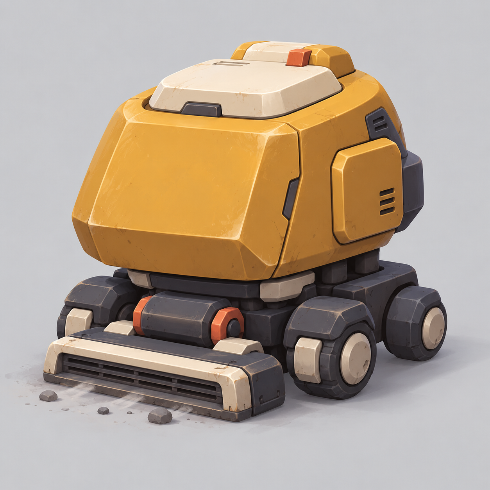
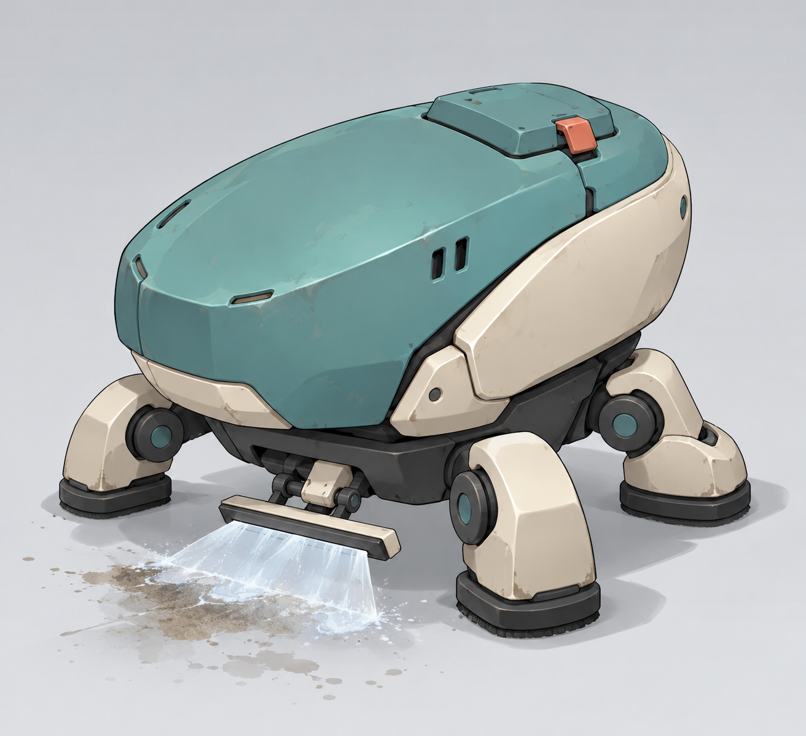
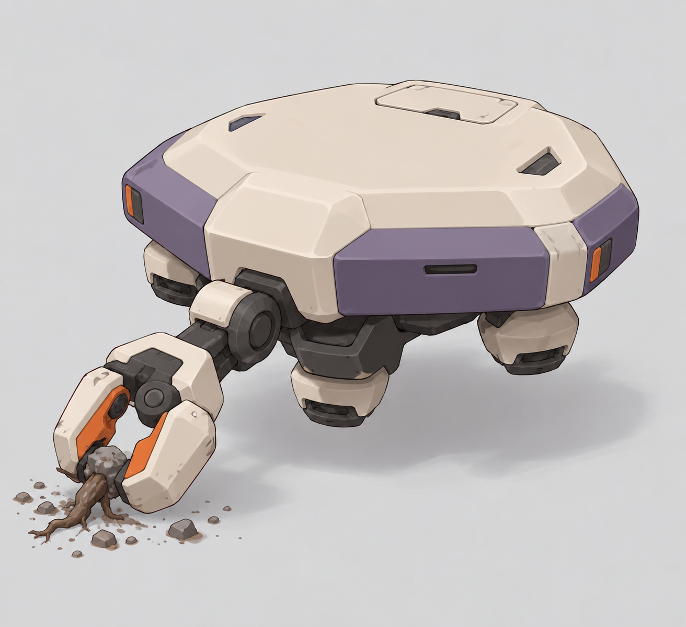

# 청소 드론 디자인 가이드

작성일 2026-10-04 · 상태: 첨부 레퍼런스 분석과 제작 기준 초안 · 개별 시안 미승인

HEXBLADE의 미소녀 파트너가 탑승하는 청소 드론을 제작하기 위한 문서다. 사용자 첨부 7장의 공통 구조를 분석하고, 비슷한 기체의 복제와 과한 형태 발명 사이에서 작업 범위를 정한다. 목표는 **몸통과 이동부와 작업부의 관계가 읽히는 단순한 SD 기계**다. 차이는 익숙한 기계 구조 안에서 파츠 비율과 배치, 청소 도구의 조합으로 만든다.

직접 보이는 특징은 관찰, 게임에 적용하는 판단은 제안으로 구분한다. 아래 비율과 파츠 수는 제작용 제안이며 레퍼런스의 실측값이 아니다. 첨부 이미지 안의 설명문은 작업 지시로 취급하지 않는다.

## 현재 사용자 기준

- 주인공은 메카에, 미소녀 파트너는 자신의 소형 청소 드론에 직접 탑승하여 함께 출격한다.
- 드론은 기본적으로 플레이어 기체보다 살짝 작다. 작은 애완 로봇 크기로 해석하지 않는다.
- 단순한 구조와 큰 몸통, 짧고 두꺼운 부속으로 강하게 SD화한다.
- 얼굴처럼 보이는 디스플레이는 이후 디자인에서 제외한다.
- 세 가지 기체는 형태와 디자인, 분위기가 달라야 한다.
- 브롤스타즈 캐릭터처럼 아기자기한 외형을 원한다. 큰 형태의 과장과 선명한 색면, 둥근 모서리로 적용한다.
- 레퍼런스를 그대로 따라간 시안과 너무 낯선 추상 형태의 시안 모두 목표에 미치지 못했다. 이전 시안을 최종 디자인으로 취급하지 않는다.

## 최신 원형 드론 참고 분석

2026-10-04 추가 첨부를 이번 캐릭터 시트의 우선 외형 기준으로 사용한다. [원본 사본](../output/cleaning-drone-triad-sheet-20261004/references/triad_primary.png)은 작은 해상도의 사선 한 컷이므로 후면 구조와 정확한 치수는 확인할 수 없다. 이전 세척형의 타원 몸통과 사각 발은 이번 형태에 이식하지 않는다.

**직접 관찰:** 본체 전면은 세워진 원형의 두꺼운 고리다. 내부에 밝은 녹색 중심을 가진 원형 모듈 세 개가 삼각형으로 배치되며, 어두운 안쪽과 옅은 하늘색 외장 사이의 대비가 크다. 모듈 사이에는 휘어진 연결면이 보여 단순한 평판보다 깊이가 있다. 화면에 보이는 다리 끝 세 개는 넓은 뿌리에서 아래로 가늘어지는 잎 또는 물방울 모양이고, 짧은 팔과 원형 축으로 본체에 연결된다. 옆에는 독립된 둥근 부품과 어두운 연결부가 붙고, 반대쪽에는 손잡이처럼 보이는 고리 부품이 있다. 상단 돌출부는 작다.

**적용 제안:** 큰 전면 원형 프레임과 삼각 배치의 세 모듈, 짧은 연결팔과 뾰족한 세 다리를 유지한다. 원형 프레임을 수평 비행접시나 타원 캡슐로 바꾸지 않는다. 외장은 옅은 하늘색과 흰색, 내부는 짙은 청회색, 기능 발광은 민트색으로 구분한다. 세 발광부는 청소 장비의 기능 모듈로 해석하며 디지털 눈이나 얼굴 화면을 추가하지 않는다. 내부 조종사와 닫힌 후면 해치는 설정 적용 제안이며 참고 이미지에 보이는 사실이 아니다.

이번 한 장 시트는 대표 사선과 정면 및 측면 및 후면, 대기와 세 발 이동 및 몸을 기울인 작업 자세, 삼중 흡입과 소용돌이 세척 스킬 후보, 민트 기류의 생성과 회전 및 잔여 입자 소멸을 담는다. 다각도 외장은 같은 전면 고리와 세 모듈, 세 다리 및 측면 부품을 유지한다. 후면 커버와 해치, 스킬과 성격은 미확정 제안으로 구분한다.

결과는 [원형 삼중 모듈 드론 캐릭터 시트](../output/cleaning-drone-triad-sheet-20261004/triad_character_sheet.png)이며 실제 [프롬프트](../output/cleaning-drone-triad-sheet-20261004/prompt.txt)도 보존했다. 그림에는 전면 원형 고리와 삼각 배치 모듈, 뾰족한 다리와 측면 부품, 여러 자세와 흡입 기류가 나타난다. 후면은 작은 원본에서 확인되지 않는 제안이다. 시점별 다리와 숨은 연결부를 정밀하게 일치시키거나 실제 관절/탑승 공간을 검증한 제작 도면이 아니며, 모델링 전 연결부 확인이 필요하다. TRIAD는 임시 표기다.

## 레퍼런스별 관찰과 적용

번호는 사용자 첨부 순서다. 원작의 설정이나 제작 의도는 별도 조사하지 않았으며, 그림에서 보이는 구조만 분석했다.

| 이미지 | 직접 관찰한 구조 | SD 인상을 만드는 요소 | 적용 제안 | 그대로 가져오지 않을 요소 |
|---|---|---|---|---|
| [1 파란 지상 로봇](../output/cleaning-drone-guided-20261004/references/ref_01.png) | 넓은 상부 하우징, 좁은 연결축, 둘레를 두른 하부 프레임과 짧은 바퀴 지지대. 상단 별도 장비. | 상부를 크게 하고 하부를 짧게 만든 압축된 비율. | 짧은 상하 연결부와 굵은 테두리, 짧은 작업 지지대. | 두 조명의 얼굴 인상, 포신, 같은 색과 파츠 배치. |
| [2 파란 기체 스케치 묶음](../output/cleaning-drone-guided-20261004/references/ref_02.png) | 둥근 모서리의 각진 외장과 짙은 프레임, 궤도와 바퀴, 일부 비행형 구성. 큰 장비가 몸통 가까이 붙음. | 짧은 하부와 두꺼운 장비, 좁은 관절 틈. 같은 계열 안에서 실루엣 변화. | 부품 문법을 유지하며 이동 방식과 대표 도구로 종류를 구분. | 탱크 형상과 장비의 복제, 무기를 청소 도구라고 이름만 바꾸는 것. |
| [3 올리브색 둥근 기체](../output/cleaning-drone-guided-20261004/references/ref_03.png) | 여러 곡면 외장으로 나뉜 둥근 몸체, 짧은 방사형 지지대, 열리는 덮개. | 대부분을 차지하는 몸체와 작은 다리, 원형 연결부. | 덮개와 몸통의 경계, 짧은 관절, 접어 넣는 세척 헤드. | 동일한 구형 패널 분할, 중앙 발광부와 주변 조명의 눈 인상. |
| [4 회색 링형 기체](../output/cleaning-drone-guided-20261004/references/ref_04.png) | 넓은 상부 링과 작은 중앙 캡, 어두운 하부, 접히는 판형 지지대. 안쪽 발광 띠. | 적은 장비 수, 상하 크기 대비, 구조를 나누는 빈 공간. | 넓은 외장과 작은 하부, 한 번 접히는 부속, 절제한 발광. | 링과 중앙 캡과 삼각 하부를 같은 비율로 묶어 가져오는 것. |
| [5 흰 원반형 삼족 기체](../output/cleaning-drone-guided-20261004/references/ref_05.png) | 큰 원반 외장, 짧은 세 다리와 원형 연결부. 펼친 자세와 접힌 자세. | 원반과 짧은 다리의 반복, 간단한 가동 방향, 밝은 외장과 어두운 내부의 대비. | 납작한 몸통과 굵은 삼족 구조, 이동과 작업 자세의 간단한 변화. | 동일한 원반과 긴 안테나, 같은 관절 실린더 배치. |
| [6 밥솥 모티프 로봇](../output/cleaning-drone-guided-20261004/references/ref_06.png) | 큰 원통 몸체와 뚜껑, 손잡이, 짧은 받침 다리. 생활용품의 특징. | 익숙한 물건의 큰 몸체와 작은 다리에서 생기는 친근함. | 작업 장비의 손잡이와 뚜껑, 넓은 외장을 친근하게 단순화. | 밥솥 자체의 외형, 꽃무늬와 조작판을 그대로 붙이는 것. |
| [7 파란 부유 로봇](../output/cleaning-drone-guided-20261004/references/ref_07.png) | 둥근 상부 덮개, 짧은 측면 판, 어두운 하부, 아래를 향하는 추진부. | 큰 상부와 작은 하부의 대비, 간결한 둥근 실루엣. | 상부와 추진부의 구분, 짧은 덮개와 부속을 통한 귀여운 비율. | 눈 디스플레이, 같은 귀 모양 판과 동일한 둥근 머리 구성. |

## 공통으로 유지할 기계 구조

**관찰:** 큰 외장과 그보다 작은 이동부 또는 추진부가 반복해서 등장한다. 이음새와 어두운 내부 프레임, 짧은 연결부가 부품 역할을 구분한다. 외장을 단순화해도 연결 구조는 남아 있다. 2번은 이 구조를 유지하면서 기체 종류를 다양하게 만든다.

**제안:** 드론 하나를 주 몸통, 이동부, 작업 도구의 세 덩어리로 설명할 수 있어야 한다. 좌석과 작업 탱크는 외장에 담고, 외부에는 짧은 관절과 서비스 패널을 남긴다. 매끈한 곡면 하나로 전부 합치거나 작은 부품으로 빈 곳을 채우지 않는다.

탑승 해치는 상부나 후면에 작게 표현한다. 큰 투명 조종석을 추가하지 않는다. 실제 탑승 공간과 합체 구조는 모델링 단계에서 따로 검증한다. 현재 콘셉트만으로 인체 수용이나 치수가 증명된다고 보지 않는다.

## 비율과 파츠 구성 제안

| 항목 | 첫 제작 기준 | 확인 목적 |
|---|---|---|
| 플레이어와 크기 | 전체 부피가 살짝 작은 동료 기체로 설정. 정확한 배율은 플레이어와 나란히 놓고 후속 결정. | 애완 로봇이나 거대한 탑승 차량으로 치우치지 않게 한다. |
| 주 몸통 | 지상형은 전체 높이의 약 60~70%부터 탐색. 부유형은 상부 외장의 폭과 부피를 기준으로 평가. | 큰 몸통과 작은 이동부의 대비. |
| 이동부 | 짧고 굵은 다리, 몸통 아래에 일부 묻히는 바퀴와 궤도. | 길쭉한 자세 방지. |
| 대표 도구 | 한 개의 도구 계열을 강조. 몸통보다 작은 크기로, 접합부가 읽히게 부착. | 청소 역할과 구조를 함께 읽게 한다. |
| 큰 형태 | 몸통 1개, 하부 1개, 도구 1개와 반복 지지부 정도의 5~8개 덩어리부터 시작. | 큰 단위로 변화 생성. |
| 연결부 | 도구와 다리의 뿌리에 짧은 원형 축이나 굵은 브래킷. | 외장에 붙은 장식처럼 보이지 않게 한다. |

숫자는 사용자 확정값이 아니다. 실루엣을 이해하기 위한 시작 조건이며 매력을 해치면 조정한다.

## 아기자기한 표현 규칙

브롤스타즈처럼 표현해 달라는 요청은 스타일 지시로 적용한다. 특정 캐릭터를 재현하거나 그 게임의 정확한 제작 규칙을 주장하지 않는다.

- 모서리를 크게 둥글리되 상자와 원통, 덮개와 다리의 경계는 남긴다.
- 이동부를 짧게 압축하고 작업 도구를 알아보기 좋은 크기로 강조한다.
- 주색 1개와 보조색 1개, 어두운 프레임을 기본으로 작은 강조색만 추가한다.
- 넓은 면에 큰 명암을 넣고 반사광을 간단히 표현한다. 전면을 반짝이는 사탕처럼 처리하지 않는다.
- 큰 외장 면은 조용하게 두고, 기능을 설명하는 이음새와 축 주변에 디테일을 모은다.
- 귀여움은 낮은 무게중심과 짧은 발, 과장된 작업 자세에서 만든다. 눈이나 입을 붙이지 않는다.
- 모서리 마모는 작게 넣고, 작업 이펙트로 기체 실루엣을 가리지 않는다.

## 레퍼런스를 새 디자인으로 바꾸는 방법

한 이미지에서 외형과 색과 도구를 한꺼번에 가져오지 않는다. 반대로 레퍼런스의 기계 구조까지 없애고 과일이나 바람개비 형상으로 치환하지도 않는다.

1. 둥근 상자, 타원 캡슐, 납작한 다각형처럼 익숙한 주 몸통을 선택한다.
2. 다른 참고에서 이동부나 연결 방식을 선택한다. 예를 들어 2번의 각진 외장에 5번의 짧은 삼족 구조를 조합한다.
3. 무기나 센서 자리에 청소 도구를 놓되, 흡입판과 분사판, 집게처럼 용도가 읽히는 끝 형상을 만든다.
4. 외장 비율과 도구 위치, 패널 분할과 배색을 바꾼다. 색만 바꾼 복제로 끝내지 않는다.
5. 세 기체를 같은 시점으로 그려 몸통과 이동부와 도구가 각각 구별되는지 비교한다.

주 몸통은 익숙한 기계 형상 하나로 유지하고, 독특한 외형 변화는 대표 도구나 연결부 한 곳에 집중한다.

## 이번 시안 제작 명세

최종 채택안이 아니라 이 가이드를 검증할 후보다.

| 시안 | 몸통과 이동부 | 청소 도구 | 참고 조합 | 분위기 |
|---|---|---|---|---|
| A 잔해 회수형 | 짧고 넓은 둥근 상자 외장, 작고 굵은 네 바퀴, 짧은 하부 프레임. | 아래 앞쪽에 접히는 넓은 흡입판. | 1번의 상하 구분과 2번의 짧은 하부. | 묵직하고 든든한 작업차. |
| B 오염 세척형 | 두꺼운 타원 캡슐, 짧은 세 다리, 작은 어두운 하부. | 앞쪽 아래 한 줄 분사판과 바닥 세척 패드. | 3번의 덮개와 5번의 삼족 구조. | 꼼꼼하고 차분한 정비 장비. |
| C 큰 잔해 해체형 | 납작한 육각 외장, 작은 부유 추진부, 한쪽의 짧고 굵은 작업팔. | 큰 잔해를 잡고 자르는 둔한 절단 집게. | 4번의 상하 폭 대비와 2번의 장비 부착. | 민첩하고 단단한 전문 작업기. |

## 원화 검토 항목

- 작게 보았을 때 몸통과 이동부와 도구가 따로 읽히는가.
- 얼굴 디스플레이나 두 조명을 통한 눈 인상이 없는가.
- 닫힌 해치와 외장, 짧은 축을 통해 탑승 기체와 기계 구조가 유지되는가.
- 다리가 너무 길거나 도구가 몸통보다 커져 실루엣을 지배하지 않는가.
- 같은 레퍼런스의 몸통과 하부와 도구를 한꺼번에 복제하지 않았는가.
- 세 기체의 차이가 배색에만 머물지 않는가.
- 장난감이나 생활용품처럼만 보이지 않고 청소 작업 기체로 읽히는가.
- 플레이어보다 살짝 작은 실제 크기는 후속 나란히 배치 검증으로 남겼는가.

## 캐릭터 시트 제작 방식

사용자 최신 요청은 외형 한 컷 대신 각도와 성격, 액션과 스킬 및 VFX가 한눈에 보이는 종합 캐릭터 시트다. 한 캐릭터를 한 장에 담고, 여러 캐릭터 후보를 같은 장에 섞지 않는다. 첨부 캐릭터 및 VFX 시트 4장은 정보 구성 참고이며 그 캐릭터나 능력을 복제하지 않는다.

첫 시트는 B 세척형 드론을 기반으로 제작한다. 외장과 배색, 짧은 삼족 구조, 상부 해치와 하부 분사판을 여러 그림에서 유지한다. 얼굴 디스플레이는 넣지 않는다. 성격은 꼼꼼하고 의욕적인 작업 파트너라는 제안으로, 몸통 기울기와 발 지지 자세 및 청소 후 짧은 반응으로 표현한다.

- 대표 사선 외형과 정면 및 측면 및 후면을 포함한다.
- 대기와 이동, 몸을 낮춰 집중 세척하는 자세를 비교한다.
- 기본 세척은 좁은 분사와 작은 물방울, 착지 지점의 짧은 튀김으로 표현한다.
- 고압 회전 세척은 발을 고정하고 하부 분사판이 회전해 주변 오염을 정리하는 스킬 후보로 제안한다. 세척기 본체가 다른 기계로 변형되지 않는다.
- 분사 시작과 흐름 및 바닥 반응, 소멸을 구분한 VFX 소품을 같은 색으로 배치한다.
- 꼼꼼하게 얼룩을 확인하는 대기와 짧고 재빠른 걸음, 작업을 끝낸 뒤 몸을 세우는 반응을 넣어 액션의 분위기를 드러낸다.

스킬과 성격, 효과의 형태는 검토용 제안이다. 게임 구현과 사용자 확정, 정밀한 삼면도 또는 애니메이션 검증을 의미하지 않는다.

첫 결과는 [세척형 드론 종합 캐릭터 시트](../output/cleaning-drone-character-sheet-20261004/washer_character_sheet.png)다. 대표 사선과 정면 및 측면 및 후면, 대기와 이동 및 집중 청소, 기본 분사와 고압 회전 세척, VFX 생성과 흐름 및 튀김과 소멸을 한 장에 배치했다. 얼굴 대신 몸통 기울기와 발 동작으로 성격을 제안했다. 실제 생성 [프롬프트](../output/cleaning-drone-character-sheet-20261004/prompt.txt)와 참고 사본도 같은 폴더에 보존했다. 다각도와 액션의 외형은 개념 전달용이며 도면 치수와 관절 가동의 정확성을 검증한 결과가 아니다.

## 가이드 적용 시안과 검토

가이드를 먼저 저장하고 읽기 확인한 뒤 내장 이미지 생성으로 아래 세 장을 제작했다. 입력 프롬프트는 [prompts.txt](../output/cleaning-drone-guided-20261004/prompts.txt)에 보존했다. 참고 원본 사본은 같은 폴더의 references에 있다.

| 결과 | 그림에서 확인한 점 | 남은 검증 |
|---|---|---|
| [A 잔해 회수형](../output/cleaning-drone-guided-20261004/A_debris_collector.png) | 둥근 상자 몸통과 바퀴 프레임, 아래에 별도로 붙은 흡입판. 작은 상부 해치와 짧은 이음부가 보임. | 이동 중 흡입판 간섭, 바퀴 가동 범위, 원화의 모서리 마모를 줄일지 검토. |
| [B 오염 세척형](../output/cleaning-drone-guided-20261004/B_tripod_washer.png) | 긴 타원 덮개와 짧은 다리, 원형 축, 아래에 붙은 분사판. 구형 원본의 동일한 외장을 사용하지 않음. | 삼족 보행과 패드 지지점, 분사판 접힘, 전투 카메라에서의 납작한 몸통 가독성. |
| [C 큰 잔해 해체형](../output/cleaning-drone-guided-20261004/C_hover_cutter.png) | 가운데 구멍 없는 다각형 몸통과 작은 하부 추진부, 짧은 축에 붙은 집게. 링 원본의 전체 구조를 가져오지 않음. | 집게의 실제 절단 동작, 수집부 표현, 작업 중 무게중심과 부유 연출. |

세 장에서 얼굴 디스플레이는 보이지 않고, 익숙한 기계 몸통과 이동부와 도구가 구분된다. 배색만 바꾼 같은 기체로 구성하지 않았다. 이 검토는 원화에서 보이는 특징에 대한 판단이며 모델 검증이나 사용자 승인 결과가 아니다. 아기자기한 스타일이 원하는 수준인지도 사용자 검토로 남긴다.

플레이어 기체와 나란히 배치한 크기 비교, 실제 탑승 공간, 합체 구조와 가동 간섭은 아직 검증하지 않았다. 이번 작업은 가이드와 원화 제작이며 게임 코드와 모델, 스폰 설정을 변경하지 않았다. 이전 시안과 다른 작업자의 파일은 보존했다.
