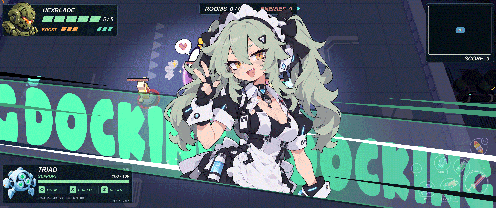
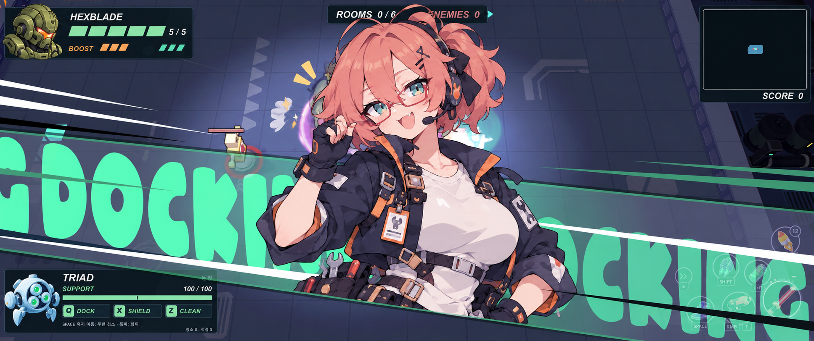

# 사선 DOCKING 컷인 — 사용자 GIF 분석과 구현 설계

작성일: 2026-10-05  
기준: 사용자가 직접 제작한 [원본 GIF](../output/diagonal-docking-study-20261005/reference.gif).  
범위: 연출 분석·구현 설계·다른 캐릭터의 정지 시안 1장. 이번 문서의 새 연출은 게임에 구현하지 않았다.

## 1. 연출을 이해하는 핵심

**하단의 사선 하나를 기준으로, 포트레이트는 그 위를 왼쪽→중앙→오른쪽으로 이동하고, 몸 아래는 그 선에서 정확히 잘린다. 같은 사선 방향으로 DOCKING 글자가 계속 흐르고 긴 집중선이 속도를 보탠다.**

캐릭터의 얼굴과 어깨는 텍스트 띠의 위쪽으로 크게 돌출된다. 포트레이트 전체를 얇은 띠 안에 가두는 구조가 아니다. 띠와 텍스트는 뒤에 있고, 캐릭터가 앞에 있으며, 캐릭터 아래쪽만 띠의 하단선에 맞춰 마스킹된다. 포트레이트의 그림 자체는 대체로 세워 두고 **이동 궤적**을 기울인다.

| 사용자 핵심 포인트 | 화면에서 만들어야 할 관계 | 구현의 기준 |
|---|---|---|
| 살짝 사선인 텍스트 영역 | 화면 너비를 관통하며 오른쪽으로 갈수록 내려가는 넓은 띠 | 화면 크기에 맞춘 사선 폴리곤 |
| 사선을 정확히 따르는 포트레이트 | 진입·정착·퇴장의 바닥 기준점이 한 직선 위에 있음 | 위치를 단일 스칼라 거리 `s`로 계산 |
| 같은 사선을 따르는 Docking | 글자 기준선과 이동 방향이 캐릭터의 진행 방향과 평행 | 같은 방향 벡터, 별도의 텍스트 스크롤 거리 |
| 속도감 있는 집중선 | 긴 흰색·검정·민트 쐐기가 흐름을 강화 | 같은 진행 방향의 흐름선 + 완만하게 수렴하는 선 |



## 2. GIF에서 실제로 확인한 것

원본은 **3415×1432, 5프레임, 한 주기 1000ms**다. 프레임별 표시 시간은 GIF 메타데이터에서 읽었으며, 실제 제작 툴의 키프레임이나 이징 값을 추측해 적은 것이 아니다.

| 프레임(0부터) | 표시 구간 | 표시 시간 | 관찰 |
|---|---:|---:|---|
| F0 | 0.00–0.10초 | 100ms | 캐릭터가 왼쪽 화면 밖에 일부 걸쳐 있고 이동 블러가 강함. 띠는 이미 펼쳐져 있음 |
| F1 | 0.10–0.20초 | 100ms | 왼쪽에서 중앙 쪽으로 전진, 캐릭터 아래가 사선 경계와 이어짐 |
| F2 | 0.20–0.40초 | 200ms | 중앙 부근에 도달, 얼굴과 손동작을 읽을 수 있음 |
| F3 | 0.40–0.90초 | 500ms | 중앙 체류. F2보다 약간 전진한 자세이며 글자 위치도 달라짐 |
| F4 | 0.90–1.00초 | 100ms | 오른쪽으로 빠져나가는 중, 다시 이동 블러가 강함 |

[진입 프레임](../output/diagonal-docking-study-20261005/reference_enter.png) · [퇴장 프레임](../output/diagonal-docking-study-20261005/reference_exit.png)

F4에도 캐릭터 일부가 남아 있다. **띠가 처음 생성되는 순간, 완전히 퇴장한 뒤의 화면, 매 프레임의 속도 곡선은 이 GIF만으로 확정할 수 없다.** 중앙 0.20–0.90초는 약 0.7초의 읽기 구간으로 해석할 수 있지만, 5프레임 표본이므로 실제 원본 작업의 정지·미세 이동 비율은 알 수 없다.

DOCKING은 대문자·굵고 둥근 글자로 반복된다. 반복 글자의 일부는 캐릭터와 화면 가장자리 뒤로 가려진다. 반복 무늬와 적은 프레임 수 때문에 정확한 스크롤 속도는 복원하기 어렵다. 아래 구현안은 사용자 설명에 맞춰 **왼쪽에서 오른쪽으로 흐르는 방향**을 기본으로 삼는다. 캐릭터와 텍스트는 방향을 공유하며 속도까지 같을 필요는 없다.

집중선은 얼굴을 중심으로 폭발하는 짧은 방사선보다 **화면을 길게 가르는 가늘고 뾰족한 흰색·검정·민트 선**의 비중이 크다. 전경과 배경에 길이가 다른 선이 겹친다.

### 사선의 관찰값과 설계값

F3의 가리지 않은 녹색 테두리를 원본 픽셀로 대조했다. 위쪽 경계는 대략 (100,559), (400,589), (2600,810), (3100,860), 아래쪽 경계는 대략 (100,1061), (400,1103)을 지난다. 테두리 두께와 가림이 있으므로 수 px 오차가 있는 **근사 관찰값**이다.

- 위 경계: `y ≈ 0.100 x + 549`, 약 5.7°.
- 아래 경계: `y ≈ 0.142 x + 1047`, 약 8.1°.
- 따라서 띠는 엄밀한 평행사변형보다 오른쪽으로 조금 넓어지는 모양이다.
- 구현 시작값은 아래 기준선 **8° / 왼쪽 높이 0.731H**, 위 경계 **5.7° / 왼쪽 높이 0.383H**로 제안한다. 이는 측정값을 정리한 제안이며 원 제작 파일의 설정값은 아니다.

**이동과 하단 마스크는 아래 기준선을 공유한다.** 위 테두리의 장식적인 기울기가 조금 달라도 이 관계는 바뀌지 않는다.

## 3. 공통 좌표계: 어긋나지 않게 만드는 방법

화면 좌표는 오른쪽이 +x, 아래가 +y라고 정의한다. `W,H`는 동일 UI 좌표계의 너비·높이다.

```text
θ = 8°
O = (0, 0.731H)                  # 하단선의 왼쪽 기준점
T = (cosθ, sinθ)                 # 오른쪽 아래로 향하는 단위 접선
N = (-sinθ, cosθ)                # 하단선 아래를 향하는 단위 법선

P(s,q) = O + sT + qN
하단 경계: q = 0
캐릭터가 보이는 쪽: q <= 0
캐릭터를 지우는 쪽: q > 0
```

포트레이트의 기준점은 `P(s,0)`이다. 진입부터 퇴장까지 `s`만 바꾸면 가로·세로 위치가 동시에 맞춰진다. x와 y에 서로 다른 Tween/이징을 걸면 궤적이 휘므로 사용하지 않는다.

```gdscript
# 설계 예시. 게임 파일에 아직 추가하지 않은 로직.
var theta := deg_to_rad(8.0)
var tangent := Vector2(cos(theta), sin(theta))
var origin := Vector2(0.0, viewport_size.y * 0.731)

func put_portrait(s: float) -> void:
    portrait_anchor.position = origin + tangent * s
    # portrait_anchor 밑의 원화는 세운 상태(rotation=0)로 유지.
```

`portrait_anchor`는 원화의 마스크 기준점이다. 자식 TextureRect는 이 기준점보다 위로 올리고, 원화 아래쪽 15~25%는 선 아래에 남도록 여유를 둔다. 그 부분을 마스크가 잘라내므로 이동 중 바닥이 비지 않는다. 얼굴 비율을 맞춘 뒤 캐릭터별 anchor 오프셋을 저장한다.

중앙 정착 위치는 `x_hold ≈ 0.50W`, 따라서 `s_hold = x_hold / T.x`이다. 이 화면 비율에서는 기준점 y가 약 0.90H가 된다. 진입·퇴장 위치는 인물의 가로 폭까지 포함해 완전히 화면 밖으로 정한다. 예를 들어 표시 폭을 `Pw`, 여유를 `M`이라 하면:

```text
s_start = (-Pw/2 - M) / T.x
s_end   = (W + Pw/2 + M) / T.x
```

정규화 좌표의 함정도 주의한다. `u=x/W, v=y/H`이면 기울기 식은 `v=b/H + tanθ*(W/H)*u`다. 종횡비 항을 빼고 `v=b/H+tanθ*u`로 쓰면 화면 비율에 따라 각도가 달라진다.

## 4. 하단 마스크: 띠와 원화에 같은 선을 사용

캐릭터의 머리·어깨에는 상단 마스크를 씌우지 않는다. 캐릭터는 **하단 한쪽 평면만** 자른다. 텍스트는 띠 밖으로 새지 않도록 위·아래 경계를 모두 적용한다.

각 픽셀 위치 p의 부호 있는 거리는 `d = dot(p-O,N)`이다. 캐릭터의 최종 알파는 `원화 알파 × 하단 마스크 알파`이다. d가 양수면 선 아래이므로 지운다. 경계는 약 1px의 안티앨리어싱만 둔다. 긴 페더링이나 직사각형 알파 그라데이션은 사선 접점을 흐리게 한다.

Godot 4 CanvasItem 셰이더의 구성 예시는 다음과 같다. **이 코드는 구현 지침이며 이번 작업에서 실제 게임에 등록·컴파일한 셰이더는 아니다.**

```glsl
shader_type canvas_item;
render_mode unshaded;

uniform vec2 clip_origin;      // 같은 CanvasLayer의 전역 Canvas 좌표
uniform vec2 clip_normal;      // 단위 법선, 선 아래가 양수
varying float clip_distance;

void vertex() {
    vec2 p = (MODEL_MATRIX * vec4(VERTEX, 0.0, 1.0)).xy;
    clip_distance = dot(p - clip_origin, clip_normal);
}
void fragment() {
    float aa = max(fwidth(clip_distance), 0.001);
    float keep = 1.0 - smoothstep(-0.5 * aa, 0.5 * aa, clip_distance);
    COLOR.a *= keep;
}
```

CanvasItem의 fragment 입력 `COLOR`에는 텍스처 색이 이미 들어 있다. 다시 `texture(TEXTURE,UV)`를 곱하지 않는다. [Godot 공식 CanvasItem 셰이더 설명](https://docs.godotengine.org/en/stable/tutorials/shaders/shader_reference/canvas_item_shader.html#color-and-texture).

CPU의 O,N과 셰이더의 p는 같은 Canvas 좌표로 전달해야 한다. Portrait와 띠는 같은 CanvasLayer/Root 아래에 두며, Root 변환이 있으면 다음처럼 변환한다:

```gdscript
var xf := root.get_global_transform()
var o_canvas: Vector2 = xf * origin
var t_canvas: Vector2 = ((xf * (origin + tangent)) - o_canvas).normalized()
var n_canvas := Vector2(-t_canvas.y, t_canvas.x)
material.set_shader_parameter("clip_origin", o_canvas)
material.set_shader_parameter("clip_normal", n_canvas)
```

카메라 월드 좌표나 원화 UV의 가로 경계를 마스크 기준으로 섞지 않는다. 개별 원화에 임의로 그어 놓은 사선 컷을 다시 회전·확대해 맞추는 방식도 피한다. 새 캐릭터의 키·폭이 달라도 화면상의 기준선은 같아야 한다.

띠의 면과 하단 테두리 역시 동일한 O,T로 만든다. 원본처럼 위쪽 기울기가 다른 사다리꼴은 위 선만 별도 정의한다. 텍스트에는 아래쪽 `d_bottom<=0`과 위쪽 `d_top>=0` 두 조건을 함께 적용한다. 이로써 외곽 형태의 차이를 유지하면서 캐릭터·글자의 진행축은 하단선으로 통일할 수 있다.

## 5. 레이어와 텍스트 흐름

권장 노드 역할:

```text
DiagonalDockingCutin : CanvasLayer
  Root : Node2D                  # 모든 좌표의 공통 원점
    FieldDim                     # 약한 화면 어둡힘, 선택
    BandFill                     # 반투명 민트/청록 사선 폴리곤
    TextTrack                    # θ만큼 기울인 DOCKING 반복 텍스처
    BackSpeedLines               # 대부분의 긴 쐐기
    PortraitAnchor               # O+sT를 이동
      Portrait                   # 세운 투명 원화 + 하단 마스크
      MotionGhosts               # 선택, 모두 같은 하단 마스크
    FrontSpeedLines              # 얼굴 밖에 제한한 소수의 선
    LowerSeam                    # 하단 경계의 가는 민트선
```

GIF에서는 포트레이트가 일부 상단 HUD 위로 겹친다. 현재 게임의 HUD는 layer 10, 기존 CockpitCutin은 layer 9다. 원본의 겹침 순서를 그대로 재현하려면 연출을 HUD보다 위로 올리는 선택이 필요하다(예: layer 11). 기존처럼 HUD를 항상 위에 둘 경우에는 원본과 겹침 결과가 달라진다는 점을 명시하고 비교한다. 모든 Control은 입력을 가로채지 않도록 `MOUSE_FILTER_IGNORE`를 사용한다.

텍스트는 굵고 둥근 `DOCKING`이다. 원 GIF의 정확한 폰트명은 확인하지 못했다. 프로젝트에 있는 `assets/fonts/ARCO.otf` 등으로 시안을 비교할 수 있지만 동일 폰트라고 단정하지 않는다. 처음에 Label을 한 번 렌더해 투명 단어 텍스처로 캐시하거나, 미리 만든 알파 텍스처를 쓴다. 매 프레임 글자를 이미지로 다시 만들지 않는다.

반복 간격 P는 실제 글자 너비와 여백을 합쳐 정한다. 글자 길이를 추측한 고정 숫자로 반복하면 루프 이음매가 생긴다.

```text
offset = positive_mod(v_text * elapsed, P)
s_i = i * P + offset             # i는 화면 밖까지 채우는 정수 범위
글자 배치 = O + s_i*T + q_text*N # q_text<0, 띠 안쪽
글자 회전 = θ
```

반복 사본은 화면의 사선 방향 투영 길이를 덮을 만큼 만들고 양쪽에 한 개씩 여유를 둔다. `offset`이 P에서 0으로 돌아갈 때 동일한 사본이 다음 것을 이어받게 한다. 기본 이동은 +T, 속도는 초당 화면 너비의 약 0.25~0.45배를 시작값으로 제안한다. 이는 GIF 실측 속도가 아니다.

**캐릭터가 멈추는 HOLD에서도 글자의 스크롤 시계는 계속 간다.** 캐릭터의 위치 s와 글자의 offset을 하나의 Tween 값으로 묶지 않는다. 대신 방향 벡터와 시간 기준을 공유한다.

## 6. 진입·중앙 체류·퇴장 타이밍

GIF의 1초 리듬을 재현하는 첫 조정안이다. 실제 제작 파일의 이징 복원값은 아니다.

| 단계 | 제안 구간 | 캐릭터 | 텍스트/집중선 |
|---|---|---|---|
| 진입 | 0.00–0.16초 | s_start→중앙 직전, 빠르게 감속 | 글자 흐름 시작, 긴 선 강하게 |
| 정착 | 0.16–0.20초 | 중앙으로 부드럽게 정착 | 얼굴을 가리는 선 감소 |
| 체류 | 0.20–0.90초 | s_hold 유지. 미세 전진을 넣어도 T 방향만 | 글자는 계속 이동, 선은 낮은 강도 |
| 퇴장 | 0.90–1.00초 | s_hold→s_end, 오른쪽 아래로 가속 | 긴 선/짧은 잔상 강화 |
| 정리 | 끝점 도착 | 완전히 화면 밖, 노드 해제 | 띠/선의 알파 정리 |

진입은 ease-out cubic, 퇴장은 ease-in cubic을 시작점으로 제안한다. 바운스를 넣더라도 같은 s축에서만 작게 움직인다. 위아래 별도 바운스를 추가하면 하단선을 벗어나 보인다. 동작을 한 축으로 유지하면서 표정·머리카락의 작은 내부 움직임은 별도 요소로 둘 수 있다.

속도 블러/잔상은 진입과 퇴장에만 강하게 쓴다. 중앙 체류에서 얼굴이 계속 흐려지면 컷인의 읽기 구간이 사라진다. 잔상을 두 개 쓸 경우 `s-Δs` 위치로 배치하고, 각 사본에도 동일한 화면 하단선을 적용해 선 아래로 새지 않게 한다.

집중선 제안값: 긴 선 6~12개, 길이 0.3~0.9W, 굵기 2~12px(800px 높이 기준), 수명 0.05~0.12초. 완만한 수렴점은 화면 오른쪽 밖으로 둔다. 모두 제작 시작값이다. 매 프레임 무작위로 선을 새로 배치하기보다 수명 단위로 재사용하고, 얼굴 영역은 제외한다.

## 7. 현재 게임에 적용할 때의 구현 지점

현재 코드를 읽은 기준으로, `scripts/drone/partner_drone.gd`의 `_begin_recall(fast=true)`가 컷인을 시작하고 `_gattai_impact()`가 실제 합체 완료를 알린다. 이 두 이벤트의 의미는 재사용한다.

현재 `scripts/drone/cockpit_cutin.gd`는 왼쪽의 조종석 패널을 보여 주며, `_motion()`의 퇴장도 왼쪽으로 설정되어 있다. 이번 사용자의 연출로 바꾸려면 다음이 필요하다:

1. 조종석 프레임/배경이 들어 있는 한 장 대신 **인물만 있는 투명 포트레이트**를 준비한다. 기존 `cockpit_plate_clipped.png`에는 배경과 이전 사선 컷이 이미 들어 있어 그대로 쓰면 이번 하단선과 충돌한다.
2. 좌측 패널 배치 로직을 O,T,N의 전체 너비 흐름으로 교체한다.
3. 캐릭터는 왼쪽 진입→중앙→**오른쪽 퇴장**. 기존 왼쪽 복귀 값을 남기지 않는다.
4. 실제 합체 완료 이벤트에서는 짧은 테두리 발광/강한 선 펄스만 더한다. 타이머로 게임의 합체 완료를 만들어 내지 않는다.
5. 합체가 빨리 끝나도 중앙 읽기 구간을 확보한다. 늦게 끝나면 `hold_end=max(0.90, dock_time+0.15)` 같은 규칙으로 체류를 늘릴 수 있다. 완료 전 취소·사망·씬 전환에는 성공 연출을 강제로 보여 주지 않고 종료한다.
6. 단조 실제 시간의 경과에서 일시정지 시간을 빼서 타임라인을 계산한다. 게임 히트스탑에 맞춰 컷인이 의도치 않게 늘어지지 않게 한다. 현재 구현의 프레임별 dt 상한은 느린 프레임에서 전체 길이를 늘릴 수 있으므로, 표시 단계는 누적 절대 경과로 정하고 스프링만 제한 dt로 계산하는 편이 적합하다.
7. 같은 드론의 반복 Q에서 하나의 컷인만 유지하고 Tween/재질/잔상/임시 노드를 정리한다. 기존 월드 효과·음향을 중복 재생하지 않는다.

Tween을 선택한다면 실제 시간/일시정지 정책을 명확히 지정한다. [Godot Tween 문서](https://docs.godotengine.org/en/stable/classes/class_tween.html#class-tween-method-set-ignore-time-scale). 위의 절대 경과 기반 방식으로 구현하면 캐릭터·텍스트·선의 시계를 한 곳에서 관리할 수 있다.

실제 렌더용 리소스는 인물 RGBA 원화(하단 여유 포함), DOCKING용 폰트 또는 알파 텍스처, 띠/선의 도형, 공통 마스크 셰이더면 된다. 이번 요청에서 제작한 아래 시안은 **장면 전체를 그린 컨셉 PNG**이며, 이 구성요소로 분리된 적용 리소스는 아니다.

## 8. 다른 캐릭터로 그린 한 장



살구색 머리·붉은 안경·네이비/주황 작업복의 성인 정비사를 중앙 체류 순간에 배치했다. 원본의 녹색 양갈래 인물과 구분되며, 머리/어깨가 띠 위로 나오고 몸 아래는 사선 하단 경계에 맞춘다. 반복 DOCKING과 긴 흰색·민트·검정 선을 함께 사용했다.

내장 imagegen으로 생성했다. GIF의 F3는 레이아웃 편집 기준, 최초 캐릭터 원본 네 장은 그림체 기준으로 입력했다. [실제 프롬프트](../output/diagonal-docking-study-20261005/prompt.txt). 생성 과정에서 HUD 글자와 세부가 일부 재표현됐으며, 실제 플레이 캡처나 픽셀 정합을 보증하는 구현 결과는 아니다. 한 장의 정지 그림은 이동과 체류 시간을 증명하지 않으므로 동작은 앞의 프레임 분석과 구현 설계로 설명한다.

## 9. 구현 후 확인할 항목

- 캐릭터 기준점의 법선 거리 `dot(anchor-O,N)`가 진입·체류·퇴장에서 계속 0에 가까운가(예: 논리 픽셀 0.5px 이내)?
- 캐릭터 알파가 하단선보다 1px 이상 아래로 새지 않는가? 머리와 손은 상단 띠 밖에서도 정상적으로 보이는가?
- 배경 띠 하단·포트레이트 마스크·글자 기준선의 각도가 동일한 기준에서 계산되는가?
- 중앙에서 캐릭터가 읽히는 동안 DOCKING은 계속 이동하는가? 반복 이음매가 끊기지 않는가?
- 왼쪽 밖에서 시작하고 오른쪽 밖으로 완전히 끝나는가? 퇴장이 왼쪽으로 되돌아가지 않는가?
- 16:10/16:9/원본과 같은 넓은 화면에서도 각도·얼굴 비율·하단 접점이 유지되는가?
- 집중선이 얼굴을 가리지 않고, 체류 중 블러가 사라지는가?
- 저프레임·히트스탑·일시정지·합체 취소·연속 입력에도 타임라인과 정리가 정상인가?
- 실제 게임을 수정한 뒤에는 고정 Godot 실행기로 전체 검사와 해당 씬의 실제 플레이 캡처를 수행한다.

이번 작업에서 확인한 것은 GIF 5프레임/시간 정보, 연출 관계, 새 정지 시안, 문서 링크다. 위 목록은 후속 구현의 검증 기준이며 이미 게임에서 통과한 결과를 뜻하지 않는다.

