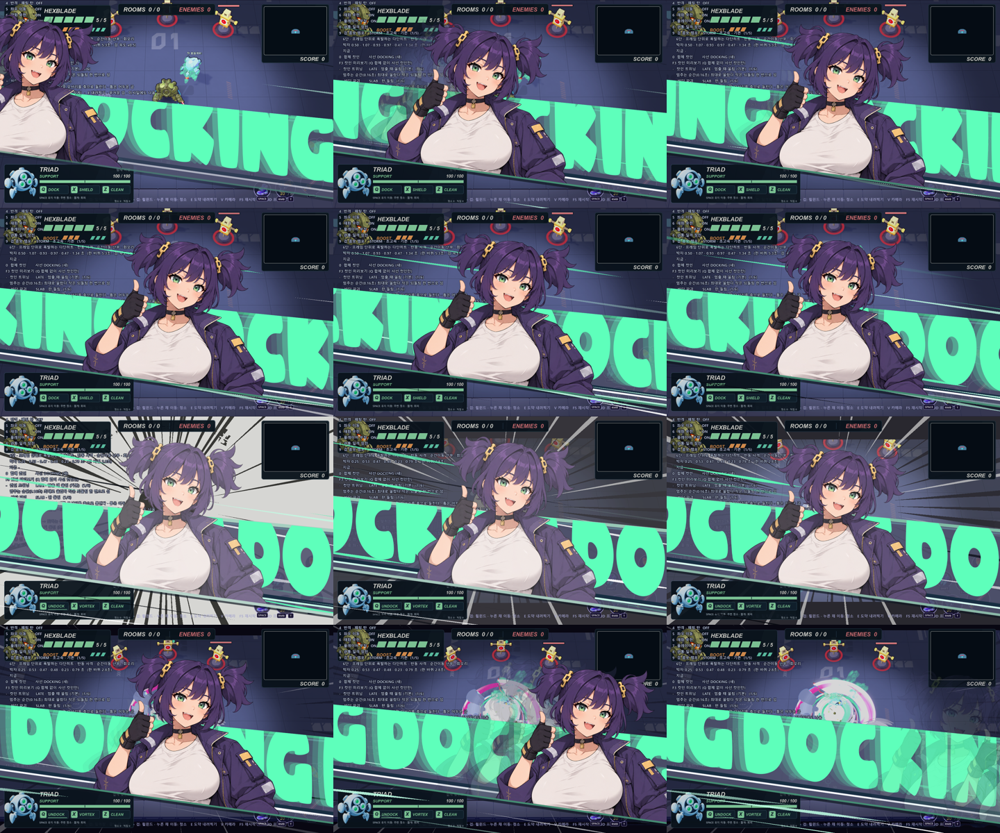
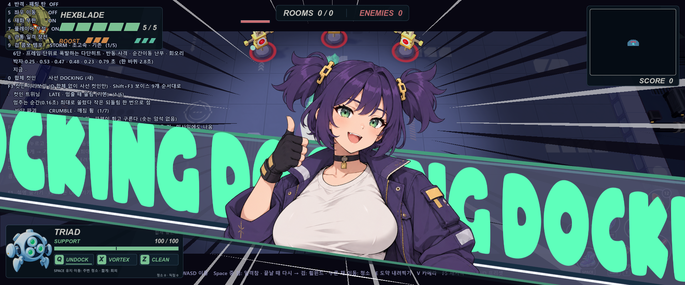
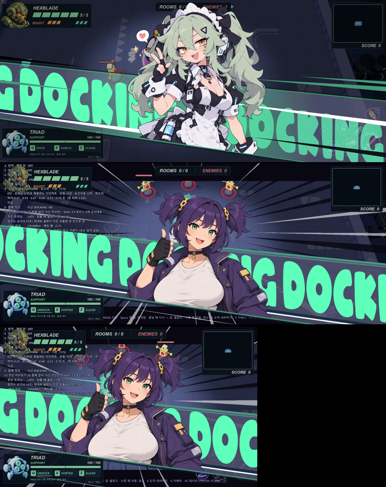
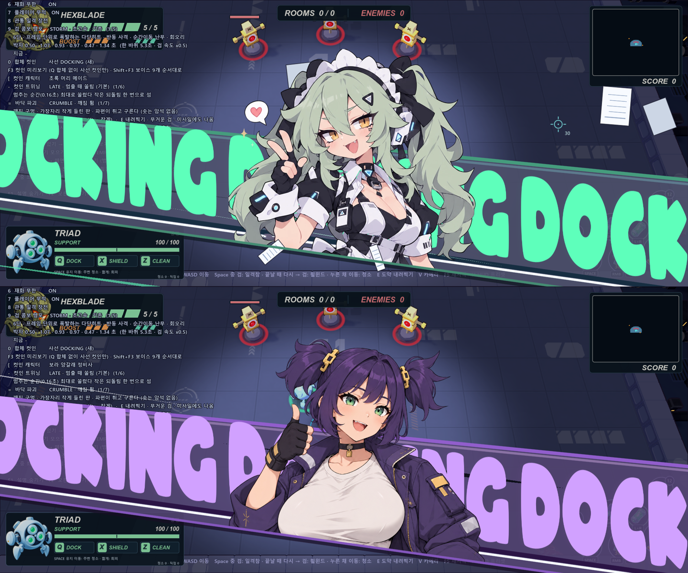
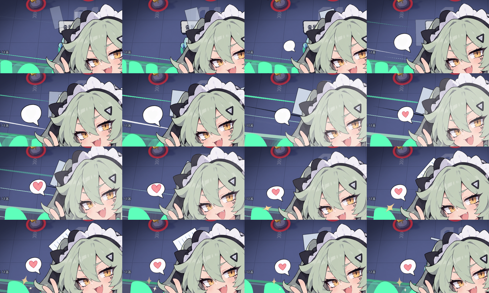
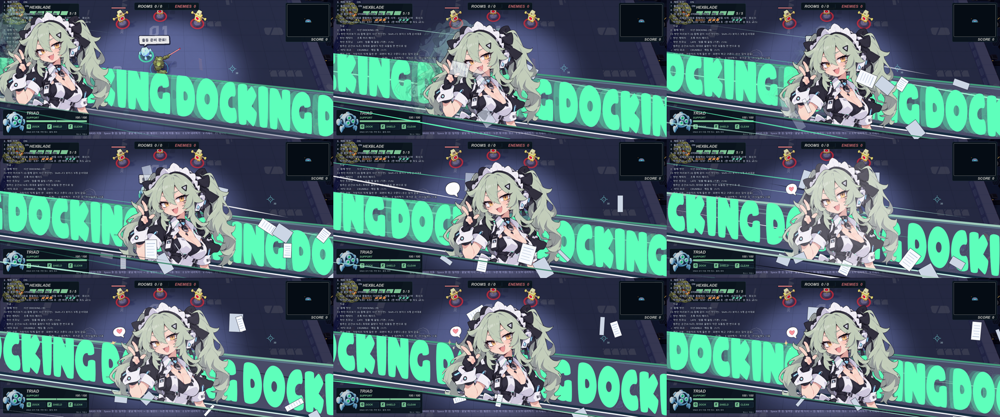
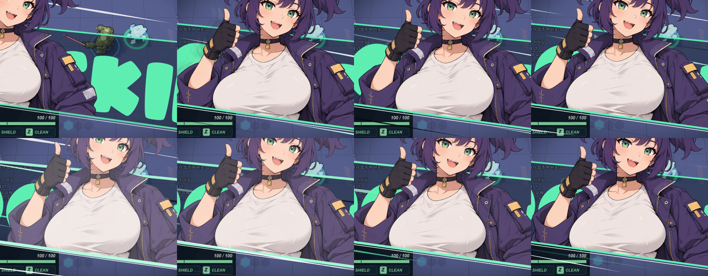
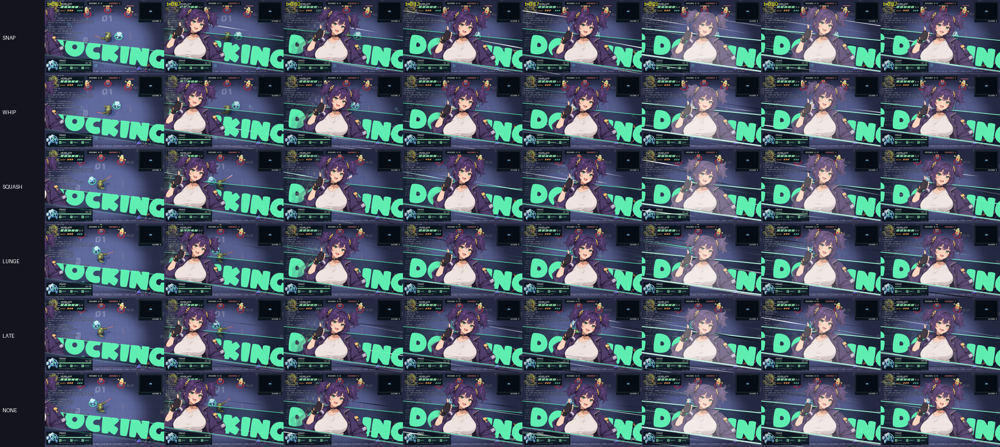

# 사선 DOCKING 합체 컷인 (본편 연결 · Claude)

기준: [사선 DOCKING 컷인 — GIF 분석과 구현 설계](diagonal-docking-cutin-study.md) (Codex). 이 문서는 실제 게임 구현 기록이다.
**Q 즉시 합체의 기본 컷인**이며, 예전 [조종석 컷인](drone-cockpit-cutin.md)은 폐기 예정 보관본으로 남겨 두었다 (아래 "예전 컷인").

## 캐릭터와 테마 색 (8차)

- 캐릭터 2명이 **합체마다 번갈아** 나온다(`DiagonalDockingCutin.CHARACTERS`, `char_mode` "alt"). 허수아비 **[** 키로 번갈아 → 보라 고정 → 초록 고정, 실행 인자 `--cutin-char=alt|purple|green`.
- 캐릭터마다 컷인 전체 테마 색(`THEMES`: 띠 바탕 · 위/아래 테두리 · 띠 안 줄 · 그림자 · 글자 · 집중선 강조색 · 잔상 색)을 따로 둔다 — **초록 머리 메이드 = 그린**(레퍼런스에서 잰 값), **보라 양갈래 정비사 = 퍼플**(같은 명도 관계를 보라로: 띠 (84,69,115) · 글자 (209,161,255)).
- 초록 메이드 원화: 사용자 제공 투명 PNG 1226×1672(원본 보존 `output/diagonal-docking-cutin-20261005/source/`) → `tools/cutin_portraits.py` 가 위에서부터 너비만큼 잘라 1226² 정사각 `assets/portraits/green_maid/green-maid-docking.png`. 전신에 가까운 원화라 하단선은 앞치마 윗부분(세로 0.832). 9차(사용자 "너무 크다, 보라 캐릭터 참고"): 머리끝 화면 높이 0.06H(`hair_screen`) · 크기 상한 0.88H(`side_max_h`) → 화면 배율 약 0.57 로 보라 정비사(0.59)와 얼굴 크기가 비슷.
- **가슴 모핑**: 캐릭터마다 가슴 타원(초록: (0.608, 0.68)·(0.701, 0.673), 반경 0.104). 흔들림 크기는 가슴 반경에 비례(`jig_scale` = 반경 px / 200)라 작은 가슴이 접히지 않는다.
- **머리카락 흔들림** (두 캐릭터 모두): `tools/cutin_portraits.py` 가 머리 색으로 만든 흐린 마스크(256², 초록은 G 가 R·B 보다 큰 세이지/회청색, 보라는 재킷과 겹치지 않게 위쪽 37.5% 안의 보라). 셰이더가 마스크 영역 UV 만 민다 — 뿌리(`hair_root`)는 고정, 끝으로 갈수록(거리²) 크게. 관성 스프링(1.5Hz · 감쇠 0.28 · 최대 46px, 등장 관성 + 합체 충격에 뒤로) + 잔잔한 물결.
- 씬 시작 prewarm 은 두 캐릭터 모두(셰이더·원화 업로드).
- **하트 말풍선 팝업** (초록 메이드, `pops`): `tools/cutin_portraits.py` 가 원화 왼쪽의 말풍선 · 반짝이 2개를 떼어내고(원화에서는 지움) 말풍선의 하트도 따로 분리(하트 자리는 흰색으로 메움) → `green-maid-bubble/heart/sparkle-a/sparkle-b.png`. 기준점(anchor)의 자식이라 캐릭터와 같이 움직이고 기운다. 순서: **말풍선 0.15초**(꼬리 끝을 축으로 비틀며 넘치게 커졌다 살짝 눌림 → 둥실) → **하트 0.25초**(크게 뿅 → 0.45초마다 두근두근) → **반짝이 0.32·0.39초**(돌며 커지고 반짝임). 퇴장 시작 0.08초에 모두 쏙 들어감.
- **서류 종이** (초록 메이드, `papers` 16장): 캐릭터 뒤(왼쪽)·몸 높이에서 0.01~0.14초에 차례로 생겨 지금 캐릭터 속도로 함께 끌려오고, 캐릭터가 서도 관성으로 앞질러 오른쪽(등장 방향)으로 날아간다 — 바람 = 캐릭터 진행 속도를 따라가는 항력(퇴장 때 다시 돌풍) · 팔랑임 · 천천히 낙하 · 뒤집힘(가로 cos, 뒷면은 어둡게) · 회전. 앞면엔 서류 글줄. 40% 는 캐릭터 뒤, 60% 는 앞(몸 아래쪽).

## 보는 법

- 허수아비 시험장(`training.cmd`): 재화 무한(기본 켬)이라 **Q** 로 몇 번이고 합체 → 컷인.
- **F3**: Q 합체 없이 컷인만 다시 보기 (드론 없이 0.22초에 스스로 합체 처리).
- **0 / Shift+0**: 컷인 종류 바꾸기 — 사선 DOCKING(새, 기본) → 조종석(예전) → 끔(만화 연출만). static 이라 다른 씬에도 그대로.
- 실행 인자: `--cutin=diagonal|cockpit|off`.

## 파일

| 파일 | 하는 일 |
|---|---|
| `scripts/drone/diagonal_docking_cutin.gd` (`DiagonalDockingCutin`, CanvasLayer 11) | 컨트롤러. `begin(scene, drone, preview)` · `notify_dock()` · `cancel()` — CockpitCutin 과 같은 계약 |
| `scripts/drone/diagonal_cutin.gdshader` | 포트레이트: 화면 하단선 반평면 마스크(1px AA) + 가슴 UV 모핑 + 합체 흰빛 |
| `scripts/drone/diagonal_band_clip.gdshader` | DOCKING 글자: 하단선 아래 · 위 경계 위를 지움 |
| `scripts/drone/partner_drone.gd` | `cutin_style`(static) · `begin_cutin()` · `_begin_recall(fast)` 에서 begin, `_gattai_impact` 에서 notify_dock |
| `scripts/training/training_main.gd` | 0 키 종류 전환 · F3 미리보기 · 패널 줄 |
| 원화 | `assets/portraits/purple_worker/purple-worker-cheerful.png` (보라 정비사 1254²) · `assets/portraits/green_maid/green-maid-docking.png` (초록 메이드 1226²) + 각 `*-hairmask.png`, 가공 `tools/cutin_portraits.py` |
| 글꼴 | `assets/fonts/ARCO.otf` (원 GIF 글꼴과 같다고 단정하지 않음) |

## 설계 문서와의 대응

- **공통 좌표계** (§3): θ=8°, O=(0, 0.731H), T=(cosθ, sinθ), N=(−sinθ, cosθ). 포트레이트 기준점 = O + s·T, **s 하나로만** 움직인다. 원화는 세운 채(회전 0). 정착 때 살짝 지나침·체류 중 미세 전진·합체 충격도 모두 s 축.
- **하단 마스크** (§4): 포트레이트(와 잔상)는 하단선 한쪽만 자르고 머리·어깨는 띠 밖으로 나온다. 셰이더는 `MODEL_MATRIX` 로 Canvas 좌표를 구해 CPU 의 O·N 과 같은 좌표에서 비교. 글자는 위 경계(5.7°, 0.383H)까지 두 조건.
- **띠** (§5, 6차에 레퍼런스 F3 픽셀로 다시 맞춤): 바탕은 배경보다 **밝은** 슬레이트 보라 (72,75,101)(알파 0.88) · 위 탁한 민트 테두리 (68,155,124) 9px + 그 아래 옅은 밝은 줄 (96,129,147) · 띠 안 아래쪽에 남색 줄 (23,45,67) 12px → 흰 줄 6px (하단선에서 띠 두께의 13.5% · 9.8%) → 민트 하단 테두리 (70,140,114) 6px(포트레이트 앞) → 띠 밖 어두운 그림자. 처음 0.06초에 하단선에서 위로 펼쳐짐. 약한 화면 어둡힘.
- **글자** (6차): 레퍼런스 측정 — 글자는 **회전하지 않고 세운 채** 윗변·아랫변만 하단선 8.3°를 따른다("D" 세로획이 위아래로 같은 x). → `draw_set_transform_matrix` 로 Y 기울이기(가로축 = (sx, sx·tan8°), 세로축 = (0, sy)). 세로 1.15 · 가로 0.6 (7차, 폭/높이 ≈ 0.48), 대문자 높이 0.22H(7차: 0.27H 는 띠가 좁은 왼쪽에서 윗부분이 위 테두리에 잘림 → 줄이고, 화면 왼쪽 끝에서도 위 테두리 아래 0.03H 여유가 남도록 글자 크기를 제한), 바닥선은 하단선에서 띠 두께의 21% 위, 색 (94,255,187) 불투명. 반복 간격 = 실제 글자 너비 × 0.72 + 0.1em (하단선 방향으로 /cosθ).
- **글자 흐름** (7차): 평소 **3.0W/초** — 눈에 거의 안 보일 만큼 빠르게, 뒤쪽으로 옅은 잔상 3겹(느려질수록 부드럽게 사라짐). 합체 순간 **슬로우모션이 걸렸다 풀리듯**: 속도 배율을 로그 공간에서 보간 — 0.12초 사인 ease-out 으로 1% 까지 부드럽게 멎고, 0.24초까지 거의 정지, 0.56초까지 smoothstep 으로 천천히 깨어나 원래 속도. (6차의 선형 급제동/급가속은 기계적이었다.) **캐릭터가 멈춘 체류 중에도 계속 흐른다.**
- **타임라인** (§6, 실제 시간 누적 경과, 일시정지 제외): 진입 0~0.16 ease-out cubic → 정착 ~0.20 → 체류 ~`max(0.90, 합체+0.15)` → 퇴장 0.10 ease-in cubic(오른쪽, 왼쪽 복귀 없음) → 띠·선 정리 0.12. 합체가 1.2초 안에 안 오거나 비행이 끊기면/메카가 쓰러지면 **잠금 없이** 바로 오른쪽으로 퇴장. 스프링만 1/20초 상한 dt.
- **집중선**: 긴 마름모 쐐기 16개(흰·검정·민트) + 앞 4개(흰·검정, 하단선 근처만, 얼굴 영역 제외). 수명 0.07~0.16초 재사용, 진입·퇴장 강하게(초당 120·90) · 체류 약하게(36). 합체 순간 강한 선 6개 추가.
- **잔상**: 진입·퇴장의 빠른 구간에만 2장(s − Δs, 같은 하단 마스크), 체류 중엔 없음.
- **합체 이벤트** (§7-4): 실제 `notify_dock` 에만 — 띠 테두리·이음선 펄스, 포트레이트 흰빛 0.32, s 축 툭 밀림, 가슴 튐, 선 펄스. 타이머로 합체를 만들지 않음(미리보기만 예외).
- **레이어**: 11 (HUD 10 위) — 원본 GIF 처럼 포트레이트가 상단 HUD 를 덮는다. GattaiFX 는 컷인과 함께면 집중선만(compact, layer 8).

## 가슴 흔들림 (모핑, 무겁게)

원화 가슴 두 타원(UV 중심 (0.403, 0.618) · (0.574, 0.622), 반경 0.16, 기울기 −0.05) 안의 UV 를 민다. 좌우 스프링에 **포트레이트 기준점의 가속도**(원화 px 로 환산)를 관성으로 넣는다.

- 2차(사용자 "더 과하게"): 4.2/5.4Hz · ζ 0.085 · 최대 72px — 크지만 빠르게 파르르 떨려 가벼워 보였다.
- **5차(사용자 "위아래로만 움직인다, 좌우 관성으로")**: 4차는 좌우 쏠림이 캐릭터가 달려오는 동안에만 일어나 금방 끝나고, 멈춘 뒤 보이는 동안엔 합체 충격의 세로 처짐만 크게 남았다. → 가로 2.3Hz · 감쇠 0.22 · 배율 0.36 으로 **멈춘 뒤에도 좌우로 출렁**: 오른쪽 약 69px → 합체 충격에 몸이 앞으로 밀리며 왼쪽으로 뒤처짐(가로 −600px/초 충격) 약 −60 → +39 → −20 → 1초 안에 섬. 세로는 합체 충격 2000→650, 진자 들림 0.009→0.003, 늘임 ±22→10% 로 줄였다. 측정: 멈춘 뒤 좌우 최대 69px · 상하 28px.
- 4차(사용자 "등장 방향 관성으로"): 가로를 3.0Hz · 감쇠 0.5 · 관성 배율 0.38 로 — 왼쪽→오른쪽으로 달려오다 서면 가슴이 **오른쪽으로 쏠려 멈추는 순간 최대(약 54px)** → 거의 되돌지 않고(−7px) 0.3초 안에 선다. 화면 밖에서 이미 달려오던 속도로 시작해(첫 프레임 0 → 최고 속도의 가짜 가속 제거) 처음에 왼쪽으로 튀던 것도 없앴다. 세로(무게감 · 합체 때 처짐)는 3차 그대로.
- **3차(사용자 "무게감 있게")**: 진동수를 2.1(가로, 4차에서 3.0)/2.7Hz(세로)로 낮춰 크고 느리게 한두 번 휘청, 감쇠 ζ 0.2 로 잔떨림 없이 가라앉음.
  - 중력: 위로 들린 동안에만 아래로 2600px/초² 끌어당겨 빨리 떨어지고, 아래로 처질 때는 덜 단단해(×0.75) 깊게 처진다.
  - 진자: 좌우로 쏠리면 위로 살짝 들린다(0.009·x²).
  - 합체 충격은 위로 튀는 대신 **아래로 쿵 처지는** 속도(2000px/초) — 처졌다(약 49px) 천천히 올라온다.
  - 오른쪽은 0.05초 늦게 · 1.05배 진동수. 출력은 tanh 로 부드럽게 72px 한계(벽에 튕기는 느낌 없음). 처지면 세로로 늘어지고(±22%) 들리면 눌림.
  - 튜닝은 진입·합체 입력을 그대로 넣은 파이썬 시뮬레이션으로 먼저 확인: 진입 후 가로 58 → −34 → 17px(주기 약 0.48초).

## 캐릭터 트위닝 (프리셋)

모두 기준점(하단선 위 한 점)을 축으로 회전·크기만 바꾸므로 하단선 접점과 마스크는 그대로다. 곡선은 등장 타임라인에 맞춘 짧은 함수(`tilt_at()` · `pop_at()` · `_tween()`)이고 스프링으로 오래 흔들지 않는다.
진입은 ease-out 이라 처음이 가장 빠르고 0.16초에 선다. 6차부터 기본은 사용자가 고른 **LATE(멈출 때 쏠림)**, 나머지는 비교·선택용 변형.

허수아비 시험장 **- / Shift+-** 로 바꾸면 바로 미리보기가 나온다. 실행 인자 `--cutin-tween=snap|whip|squash|lunge|late|none`. static 이라 다른 씬에도 그대로.

| 프리셋 | 내용 | 최대 쏠림 |
|---|---|---|
| **LATE** (기본) | 멈추는 순간 최대로 쏠렸다 작은 되돌림 한 번으로 섬 (사용자 선택) | 0.16초 · 3.4° |
| SNAP | 달려오는 도중 이미 최대로 쏠렸다가 멈추며 작은 되돌림 한 번으로 섬 | 0.07초 · 3.7° |
| WHIP | 처음 0.03초 뒤로 2° 젖혔다가 채찍처럼 앞으로 | 0.08초 · 4.6° |
| SQUASH | 달리는 동안 가로로 8% 늘어났다 쏠림 최대에서 세로로 7% 찌그러짐, 기울기는 작게 · 합체 팝 크게 | 0.06초 · 1.7° |
| LUNGE | 일찍 크게 쏠리고 등장 크기 0.85 → 1, 합체 팝 +9% | 0.06초 · 6.3° |
| NONE | 비교용 — 변화 없음 | — |

공통: 퇴장 0.1초 동안 뒤로 젖혀짐(프리셋별 크기), 합체 팝 0.16초(세로로 쭉 → 살짝 눌림), 체류 숨쉬기 ±0.5%.

## 슬로우모션 · 임팩트 글자 정지

- 컷인이 시작되면 `Main.set_slowmo(0.1)` — 게임 세계가 0.1배로 느려진다.
- **렉 수정**: 예전 `set_slowmo` 는 물리 틱을 60/배율로 올려 0.1배속이면 물리가 실제 초당 600번 돌았다(방 탐색처럼 적이 많은 씬에서 컷인 렉). Godot 는 물리 스텝 수를 실제 시간으로 세고 time_scale 은 스텝당 dt 만 줄이므로(측정: 0.1배속·60틱 → 60스텝/초) 틱은 60 그대로 둔다 — 궁극기·패링·위험 섬광 슬로우모션도 함께 가벼워졌다. 측정(`_capture/cutin_perf_probe.gd`, 방 탐색 적 13~15): 컷인 중 평균 프레임 23~37ms → 10~16ms, 물리 스텝 190~310/초(밀림) → 60/초.
- 첫 컷인 한 번 튐 완화: 드론이 붙는 씬 시작 때 `DiagonalDockingCutin.prewarm` 이 보이지 않게(알파 0.004) 3프레임 그려 셰이더·원화·큰 글리프를 미리 준비한다(첫 컷인 처리 시간 최대 33→21ms). 첫 합체 충격 프레임의 물리 처리(약 36ms, 기존 `_gattai_impact` 의 불꽃·충격파·공간 일그러짐 첫 생성)는 남아 있다. 퇴장 시작부터 정리 끝(0.22초)까지 제곱으로 1 에 복귀, 컷인이 사라지거나 취소·제거될 때도 반드시 1 로 풀고 간다. 궁극기 락온이 시간을 쥐고 있으면 건드리지 않는다.
- 합체 비행(`PartnerDrone._recall`)은 사선 컷인일 때 **컷인의 실제 시계**에 맞춰 날아와 0.22초에 붙는다(슬로우모션에 끌려 늦어지지 않게). 붙은 뒤의 휠윈드는 슬로우모션 속에서 시작해 컷인이 끝나며 정상 속도가 된다.
- 임팩트(실제 합체 순간)에 DOCKING 글자 흐름이 슬로우모션처럼 멎었다 풀린다 (`text_k()`, 위 "글자 흐름").

## 미소녀 보이스

인수인계 [drone-docking-voice-handoff.md](drone-docking-voice-handoff.md) 기준. 사용자 선택 9개(스파랜드 무료 보이스)를 원본 바이트 그대로 `assets/audio/voices/spaland_docking/` 에 복사(SHA256 일치, `CREDITS.txt`, `.import` 같이 올릴 것).

- `scripts/drone/docking_voice.gd` (`DockingVoice`): **실제 합체 성공 순간(`PartnerDrone._gattai_impact`) 한 번**, 9개 중 무작위 — 직전 파일은 연속으로 안 나옴, 게임 RNG 와 독립. Q 입력·컷인 시작·휠윈드·분리·합체 전 취소에는 없음. 사선 컷인일 때만(조종석/끔 모드는 그대로).
- 전용 `AudioStreamPlayer` 하나를 씬 노드 아래에(컷인 자식 아님) → 컷인이 먼저 사라져도 긴 음성(약 1.3초)이 끝까지. 동시 보이스 최대 1개(새 것이 교체), 피치 1.0 고정(슬로우모션·히트스탑과 무관).
- **믹싱 (보이스가 다른 소리보다 확실히 잘 들리게)** — 측정 `_capture/voice_level_probe.gd`(버스 피크 미터): 원본 보이스는 효과음보다 작았다(효과음 최대 0dBFS·평균 −3.5~−4.7, 보이스 최대 −1.5~−5.9·평균 −6.7~−12.6, 게다가 처음엔 −6dB 로 재생).
  1. 파일별 맞춤 `GAIN_DB` + 기본 +2dB.
  2. 전용 버스 `DockVoice`(실행 중 생성): EQ(100Hz −3 · 1k +1 · 3.2k +4 · 10k +1.5 — 탁한 저음을 빼고 말소리 대역을 올림) → 컴프레서(−16dB, 3:1, 되올림 +10dB) → 하드 리미터 −1dBFS. 버스 뒤 9개 모두 최대 −1dBFS · 평균 −5~−8 로 고르게.
  3. **덕킹**: 보이스가 나오는 동안 Master −10dB, 보이스 버스는 +10dB 로 상쇄 → 보이스는 그대로, 효과음·드론음 등 다른 모든 소리만 작아짐(0.04초에 내려가고 보이스가 끝나면 0.45초에 복귀, 실제 시간). 결과: 보이스가 다른 소리보다 평균 약 8~10dB 크게 들린다. 씬 전환·노드 제거 때 Master 를 원래 값으로 되돌림.
- 일시정지에 같이 멈춤(PAUSABLE), M 음소거면 새 재생 차단 + 재생 중인 것도 무음, 메카가 쓰러지거나 드론이 제거되면 정지.
- 허수아비 **F3** 미리보기의 합체 순간에도 무작위 재생(씬 시작 prewarm 은 무음), **Shift+F3** 은 9개를 순서대로 강제 재생. 로그 `DOCK_VOICE <파일> (<횟수>)`.

## 확인

- 테스트 `tests/diagonal_cutin_check.gd` (73항목): 기본 종류 · Q 합체 1개 · layer 11 · 왼쪽 밖 시작 · 반복 Q 무중첩 · 실제 합체 잠금 · GattaiFX compact · 중앙 체류 · 체류 중 글자 흐름 · 마스크/글자 같은 하단선 · 오른쪽 밖 퇴장 · **기준점-하단선 거리 최대 0.000px** · 합체 비행 0.22초 · 슬로우모션 걸림/유지/해제(정상 종료 · 취소 · 제거) · 임팩트 글자 정지 · 가슴 20~72px · 셰이더 변위 · 실제 시간 1.13초 정리 · 비행 끊김 퇴장 · F3 미리보기 · 0 키 전환(조종석/끔) · 드론 제거 정리.
- 캡처 `_capture/diagonal_cutin_show.gd -- --out=<폴더> [--style=] [--preview]` → `output/diagonal-docking-cutin-20261005/` (1280×800 시트 · 체류 1280/1920 · 로그).

## 예전 컷인 (폐기 예정)

`scripts/drone/cockpit_cutin.gd` · `cutin_jiggle.gdshader` · `assets/vfx/drone_cutin/` · `tests/cockpit_cutin_check.gd`(시작에 `cutin_style = "cockpit"`) · `_capture/cockpit_cutin_show.gd`·`cutin_jiggle_poses.gd` 는 그대로 동작한다. 사용자가 사선 컷인으로 확정하면 이 파일들과 `PartnerDrone.CUTIN_STYLES` 의 `"cockpit"`, `GattaiFX` 의 `CockpitCutin.LAYER` 참조를 정리한다.

## 남은 것

- 원화는 기존 상반신 포트레이트라 원본 GIF 보다 몸이 짧다 (벨트 위에서 잘림). 전신에 가까운 컷인 전용 원화를 쓰면 `ANCHOR_UV`·`HAIR_UV`·가슴 UV 를 다시 잡을 것.
- 효과음은 기존 합체 음 그대로 (전용 휙 소리 없음).
