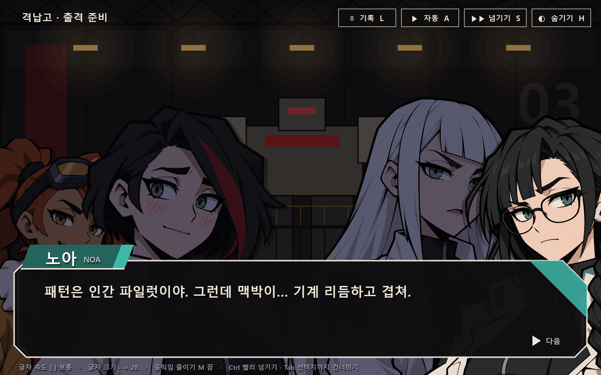

# 캐릭터 대화 시스템

작성일: 2026-10-01 · 테스트 씬 `scenes/dialogue.tscn` (`dialogue_test.cmd`, 로비 → 테스트 씬 → 캐릭터 대화)

거점·브리핑에서 쓸 포트레이트형 대화 기능이다. 지금은 테스트 씬에서만 돈다. 본편 연결(귀환 검사·출격 전 브리핑)은 요청이 오면 한다.
그림은 [카툰 포트레이트 시안](../output/character-dialogue-20261001/README.md) 12장(4명 × 표정 3종)과 [대화 UI 시안](../output/character-dialogue-20261001/dialogue-ui.png)의 배치를 그대로 쓴다.



## 1. 리서치: 최근 게임의 대화 기능

2023~2026년 액션·가챠 게임 중심. **[출처]** 는 아래 링크에서 확인한 내용, **[일반]** 은 플레이 경험 기반이라 원문으로 검증하지 않은 내용이다.

| 게임 | 표현 방식 | 눈여겨볼 기능 |
|---|---|---|
| 젠레스 존 제로 | 엔진 컷신 + 모션 코믹(칸이 차례로 열림) + 메신저 채팅 | 칸을 짧게 끊었다 길게 잡는 컷 리듬, 표정·시선 연기 **[출처]**. 선택지는 오른쪽 세로 나열 **[일반]** |
| 붕괴: 스타레일 | 하단 대사창 + 이름표 | 3.4부터 수동 / 자동 / 로그 / 전체 스킵. **스킵하면 줄거리 요약** **[출처]** |
| 원신 | 하단 대사창, 오른쪽 선택지 | 1.2 자동 재생 — **선택지에서 자동 멈춤**. 지난 대사 다시 읽기(로그) **[출처]** |
| 하데스 II | 큰 일러스트 포트레이트 + 대사창 | 클릭 진행, 옵션으로 자동 진행, 대화 기록 **[출처]**. 표정 교체·옆에서 밀려 들어오는 포트레이트 **[일반]** |
| 페르소나 3 R / 메타포 | 모양 자체가 연출인 대사창 | 메타포는 대사창이 계속 일렁이는데 **끌 수 없어 읽기 어렵다는 접근성 비판** **[출처]** |
| 블루 아카이브 | 스탠딩 + 하단 대사창, 메신저 | 자동·빨리감기 **[출처]**. 말하는 사람만 밝게, 감정 아이콘, 깡총 뛰기 **[일반]** |
| 명일방주 | 스탠딩 + 대사창 | 클릭/Space 진행, 자동, 백로그, 우클릭 텍스트 숨기기, 비화자 어둡게 **[출처: 팬 재현 리더]** |
| 발더스 게이트 3 | 시네마틱 + 번호 선택지 | 선택지 앞 `[설득]` 같은 **꼬리표** **[출처]** |
| 역전재판 | 포트레이트 + 대사창 | 캐릭터별 **글자음(블립)**, 일부러 고르지 않은 출력 속도와 끊어 읽기, 흔들기·흰 섬광을 핵심 단어에 맞춤 **[출처]** |
| 헬테이커 | 검은 배경 + 굵은 카툰 인물 + 최소 UI | 장식을 거의 없앤 UI, 붉은 이름, 2지선다 **[출처: 위키 / 화면 세부는 일반]** |

**공통 기능 (프로토타입 중요도 순)**: ① 클릭/키 진행(출력 중이면 문장 완성) ② 타자기 출력 + 문장부호 멈춤 ③ 이름표 + 화자 강조 ④ 줄마다 표정 ⑤ 다음 표시 ⑥ 선택지(자동은 선택지에서 멈춤) ⑦ 감정 반동(튕김·흔들기·섬광) ⑧ 강조 글자(색·흔들림·물결) ⑨ 글자음 ⑩ 자동 / 넘기기(+요약) ⑪ 백로그 ⑫ UI 숨기기 ⑬ 접근성(글자 크기·속도·움직임 끄기).

**데이터 형식**: 이 프로젝트는 표준(비 .NET) Godot 이라 GodotInk(.NET 필수)·Yarn Spinner C# 판은 못 쓴다. Dialogic 2 는 무겁고 알파, Dialogue Manager 4 는 텍스트 기반 안정판. → **의존성 없는 자체 텍스트 대본 + 작은 진행기**로 시작하고, 분기·조건이 크게 늘면 Dialogue Manager 로 옮기는 것을 검토한다.

출처: [ZZZ 컷신·모션 코믹](https://genshin-builds.com/en/zenless/blog/unveiling-zenless-zone-zeros-cinematic-soul-the-art-of-cutscenes-and-motion-comics) · [ZZZ UX](https://mrifkyudhira.medium.com/enhancing-quest-discovery-ux-game-design-case-zenless-zone-zero-zzz-79673d035cba) · [스타레일 3.4 스킵·요약](https://www.icy-veins.com/honkai-star-rail/news/v3-4-honkai-star-rail-adds-story-skip-summary-and-character-reworks/) · [원신 자동 재생](https://gamewith.net/genshin-impact/article/show/23507) · [원신 스킵](https://esports.gg/news/genshin-impact/dialogue-skip-system/) · [하데스 II](https://kotaku.com/hades-2-early-access-god-mode-autofire-timer-1851461987) · [하데스 II 접근성](https://access-ability.uk/2024/05/03/hades-2-accessibility-preview/) · [메타포 접근성](https://caniplaythat.com/2025/02/24/metaphor-refantazio-accessibility-review/) · [P3R UI](https://personacentral.com/p3r-interview-menu-ui/) · [블루 아카이브](https://bluearchive.gg/blue-archive-detailed-reroll-tutorial/) · [명일방주 리더](https://arknights.timo.beer/story.html) · [BG3 주사위](https://www.pcgamer.com/i-love-that-baldurs-gate-3-makes-you-roll-a-die-for-big-decisions/) · [역전재판](https://moegamer.net/2024/02/18/how-ace-attorney-does-so-much-with-so-little/) · [헬테이커](https://en.wikipedia.org/wiki/Helltaker) · [Godot 대화 도구 비교](https://storyflow-editor.com/blog/best-godot-dialogue-systems/) · [Yarn Spinner Godot](https://github.com/YarnSpinnerTool/YarnSpinner-Godot)

확인 못 한 것: NIKKE 공식 UI 세부, ZZZ 모션 코믹 칸 구성, 헬테이커 출력 속도(즉시/타자기).

## 2. 구현한 기능

| 기능 | 내용 | 참고한 게임 |
|---|---|---|
| 타자기 출력 | 글자 속도 4단계(느림 22 · 보통 40 · 빠름 70자/초 · 즉시). 쉼표 0.1초 · 마침표/!/? 0.22초 · … 0.3초 자동 멈춤(문장 끝은 안 멈춤). `{p}` `{p=1.0}` 직접 멈춤, `{fast}` `{slow}` 구간 속도 | 역전재판 |
| 진행 | 좌클릭 · Space · Enter · 휠 아래. 출력 중이면 문장 완성, 다 나왔으면 다음 줄. 다음 표시 ▶ 가 흔들린다 | 공통 |
| 화자 강조 | 말하는 사람은 밝기 100% · 크기 1.0 · 맨 앞, 나머지는 어둡게(남색 톤) · 0.94배 · 14px 아래. 0.1초 안쪽으로 부드럽게 바뀜 | 블루 아카이브 · 명일방주 |
| 표정 | 줄 앞에 `mira angry:` 처럼 적는다. 바뀔 때 0.14초 교차 전환 + 통통 튐 | 하데스 II |
| 감정 반동 | `mira angry !:` → 그림 흔들기 + 크게 튐. `@shake` 화면 흔들기(효과음), `@flash` 섬광 | 역전재판 |
| 글자 꾸밈 | `{red}` `{cyan}` `{gold}` `{gray}` `{color=#hex}` `{b}` `{big}` `{small}` `{shake}` `{wave}` (RichTextLabel BBCode) | 공통 |
| 글자음 | 2글자마다 짧은 블립. 인물마다 높이·파형이 다르고(미라 300Hz 사각 · 세나 470Hz 삼각 · 노아 390Hz 사인 · 에이린 250Hz 사인) 소리에 맞춰 그림이 살짝 들썩인다 | 역전재판 · 헬테이커 |
| 무대 | 자리 5곳(left2 · left · center · right · right2), 4명까지. 뒷자리는 0.76배. 등장/퇴장은 가까운 화면 밖에서 미끄러짐. 화면 가운데를 보게 좌우 반전(디자인이 비대칭인 미라는 반전 금지) | 블루 아카이브 |
| 그림 없는 화자 | 해설(`>`)은 이름표 없이 기울인 회색, 주인공 `me` · 무전 `radio` 는 이름표만 | 공통 |
| 선택지 | 대화창 위 가운데, 숫자 키 1~4 · 마우스 · 방향키. `<미라>` 꼬리표, `[if 조건]` 조건부, 이미 고른 줄은 흐리게 ✓. 자동·넘기기는 선택지에서 멈춤 | BG3 · 원신 · 헬테이커 |
| 자동 진행 (A) | 1초 + 글자 수 × 0.045초 뒤 다음 줄. 돌아가는 점 표시 | 원신 · 스타레일 |
| 넘기기 (S) | **읽은 대사만** 빨리 넘김, 처음 보는 줄에서 멈춤. Ctrl 을 누르고 있으면 전부 넘김 | VN 공통 |
| 선택지까지 건너뛰기 (Tab) | 다음 선택지(또는 끝)까지 한 번에 넘기고 **지나온 줄거리 요약**(`@summary`)을 카드로 보여 줌 | 스타레일 |
| 기록 (L · 휠 위) | 지난 대사와 고른 선택지 목록. 기록에서는 흔들림·물결을 뺀다 | 원신 · 하데스 II |
| 숨기기 (H · 우클릭) | UI 를 감추고 그림만. 아무 입력이나 되돌림 | 명일방주 |
| 접근성 | 글자 크기 `-` `=` (24~36), 글자 속도 `[` `]`, **움직임 줄이기 `M`**(튐·흔들기·화면 흔들기·섬광·▶ 흔들림 끔). 설정은 씬을 다시 불러도 유지 | 메타포의 교훈 |
| 변수 · 분기 | `@set` (`=` `+=` `-=`), `@if 조건 -> 라벨`, 선택지 `-> 라벨`. 조건: `이름`, `not 이름`, `이름 >= 1` 등 | Ink · Yarn |

배경은 코드로 그린 어두운 격납고(`HangarBackdrop`: 패널 벽 · 트러스 · 정비 기체 실루엣 · 깜빡이는 조명 · 03)이며 인물이 앞에 보이도록 전체를 눌러 두었다.

## 3. 대본 문법 (`data/dialogue/*.dlg`)

```
# 주석
== 라벨
@title 격납고 · 출격 준비          장소 제목
@summary 건너뛸 때 보여 줄 줄거리
@enter mira left confident        등장 (자리: left2 left center right right2, 표정 생략 가능)
@exit mira   /   @exit all        퇴장
@expr mira angry                  표정만 바꾸기
@move mira right                  자리 옮기기
@shake 0.6   @flash   @wait 0.5   화면 흔들기 · 섬광 · 기다리기
@set trust_mira += 1              변수
@if trust_mira >= 1 -> 라벨       조건 점프
-> 라벨                           점프
@end                              끝

mira: 대사                         화자: 대사 (등장 안 했으면 빈 자리에 자동 등장)
mira angry: 대사                   표정 바꾸며
mira angry !: 대사                 표정 + 그림 흔들기
> 해설 문장
* 선택지 -> 라벨                    연속된 * 줄이 한 묶음
* [if trust_mira >= 1] <미라> 조건부 · 꼬리표 붙은 선택지 -> 라벨
```

화자 id 와 표정은 `scripts/dialogue/dialogue_cast.gd` 에 있다 (mira: confident/angry/flustered · sena: joy/angry/surprised · noa: neutral/skeptical/warm · eirin: confident/stern/vulnerable · 그림 없는 me/radio).
없는 화자·표정·자리·라벨은 읽을 때 오류로 잡는다 (테스트가 확인).

## 4. 코드 구조 (`scripts/dialogue/`)

| 파일 | 역할 |
|---|---|
| `dialogue_script.gd` (`DialogueScript`) | 대본 → 명령 목록. 꾸밈 문법 → BBCode + 글자 순번 기준 멈춤·속도 표 |
| `dialogue_runner.gd` (`DialogueRunner`) | 화면 없는 진행기. `said` · `asked` · `cue` · `ended` 신호. 변수·분기·요약. 읽은 줄·고른 선택지는 static 이라 씬을 다시 불러도 유지 |
| `dialogue_view.gd` (`DialogueView`) | 화면 전체: 대화창 · 이름표 · 타자기 · 선택지 · 기록 · 요약 · 자동/넘기기 · 입력 |
| `dialogue_portrait.gd` (`DialoguePortrait`) | 인물 한 장: 자리 · 강조 · 표정 교차 전환 · 튐 · 흔들림 · 들썩임 · 등장/퇴장 |
| `dialogue_voice.gd` (`DialogueVoice`) | 인물별 글자음 합성 |
| `dialogue_cast.gd` (`DialogueCast`) | 인물 표 (이름 · 색 · 표정 그림 · 목소리 · 바라보는 쪽) |
| `hangar_backdrop.gd` (`HangarBackdrop`) | 격납고 배경 |
| `dialogue_main.gd` (`DialogueMain`) | 테스트 씬: F1 격납고 브리핑 · F2 기능 시연 · R 처음부터 · Esc 로비 |

본편에 넣을 때는 `DialogueView` 를 CanvasLayer 위에 올리고 `play(DialogueRunner.new(DialogueScript.load_file(...)))`, `finished` 신호를 받으면 된다 (전투 HUD·입력은 그동안 막아야 한다).

## 5. 검증

- 테스트 `tests/dialogue_check.gd` — 대본 읽기 · 오류 검출 · 꾸밈 문법 · 진행기 분기 · 화면 동작(타자기 · 완성 · 화자 강조 · 표정 · 기록 · 자동 · Tab 요약 · 숫자 선택 · 끝까지 · 퇴장) 30여 항목.
- 자동 플레이: `dialogue_test.cmd --bot` (자동 진행 + 선택지 무작위, 끝나면 `DIALOGUE_DONE` 출력 후 종료). `--script=feature_demo`, `--capture=폴더 --every=1.0 --seconds=40`.
- 캡처: `_capture/dialogue_show.gd` → `output/dialogue-20261001/` (타자기 · 감정 반동 · 4인 · 요약 · 선택지 · 기록 · 흔들림 표정).

## 6. 한계와 다음 후보

- 그림이 `output/character-dialogue-20261001/` 시안 폴더에 있다. 확정되면 `assets/portraits/` 로 옮기고 `DialogueCast.DIR` 만 바꾼다.
- 표정 그림끼리 얼굴 위치가 조금씩 달라 교차 전환 때 살짝 어긋나 보인다 (생성 이미지라 픽셀 정렬 안 됨). 입 모양·눈 깜빡임 분리 레이어는 없다.
- `.dlg` 는 Godot 리소스가 아니므로 내보내기(export) 때 "리소스 외 파일 포함" 필터에 `data/dialogue/*.dlg` 를 넣어야 한다.
- 남은 후보: 메신저형 채팅(ZZZ · 블루 아카이브), 모션 코믹 칸 연출(ZZZ), 실제 음성 연결, 대사 현지화 키, 본편 거점 화면 연결.
