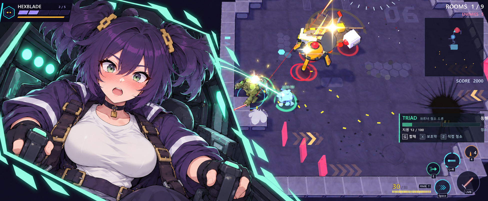
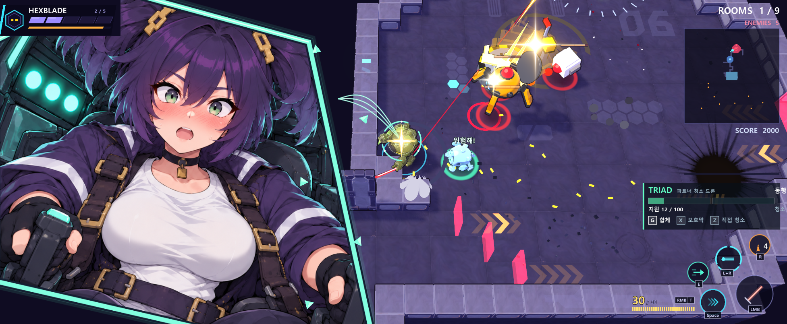

# 드론 조종석 합체 컷인 클로드 인수인계

사용자는 아래 **정면 급가속 조종석 컷인**을 선택했고, 이 스타일로 실제 합체 연출을 만들기 위한 리소스 제작과 인수인계 문서를 요청했다. 이번 작업은 리소스 제작·Godot 리소스 검증까지이며, **본편 연결은 클로드가 담당한다.** 기존 게임 스크립트는 수정하지 않았다.



## 1. 선택안에서 유지할 것

보라 양갈래·금색 직사각 머리핀·초록 눈·보라 작업복·흰 티셔츠·검은 장갑과 하네스. 두 조종간을 잡은 정면 구도, 주인공에게 가까워지는 것을 의식한 **부끄럽고 놀란 얼굴**(크게 뜬 두 눈·볼과 코의 홍조·작게 벌어진 입), 민트색 각진 프레임과 기체 내부의 삼중 점등을 유지한다. 이름은 미정이며 이 원화만으로 새 인물 이름·주인공 외형·동행 서사를 확정하지 않는다.

원화에 찍힌 HUD·메카·적·바닥은 연출의 일부로 게임 위에 덮지 않는다. 새 원화는 소녀와 조종석만 포함한다. 합체 지점의 빛·링·파편은 별도 효과이며 실제 메카 위치에 붙인다.

기존 선택 이미지는 인물/포즈의 편집 대상으로 사용했다. 그림체 기준은 최초 캐릭터 원본 네 장 중 `11_28_25/38/43` 세 장이며, 생성 결과를 새 그림체 기준으로 누적하지 않았다. 제작 과정에서 일부 얼굴·기체 세부는 재표현됐으며 선택 스크린샷의 픽셀을 그대로 잘라낸 결과는 아니다.

## 2. 실제 리소스

공통 경로: `res://assets/vfx/drone_cutin/`. 이미지와 SVG의 `.import`, 셰이더의 `.uid`도 함께 보존한다.

| 파일 | 크기 | 역할 |
|---|---:|---|
| [cockpit_plate_clipped.png](../assets/vfx/drone_cutin/cockpit_plate_clipped.png) | 1024×1024 RGBA | **권장 본체**. 소녀+조종석, 각진 바깥 영역 투명. 프레임 없음 |
| [panel_frame.svg](../assets/vfx/drone_cutin/panel_frame.svg) | 1024×1024 | 본체와 정확히 겹치는 민트/흰색 테두리 |
| [panel_glow.svg](../assets/vfx/drone_cutin/panel_glow.svg) | 1024×1024 | 프레임 발광. 본체 뒤에 놓고 알파를 변화 |
| [cockpit_cutin_ready.png](../assets/vfx/drone_cutin/cockpit_cutin_ready.png) | 1024×1024 RGBA | 본체+프레임+발광을 합친 바로 사용 가능한 대체본 |
| [cockpit_plate.png](../assets/vfx/drone_cutin/cockpit_plate.png) | 1254×1254 | 불투명 정사각형 원본. 조종석/인물 수정용 |
| [panel_mask.svg](../assets/vfx/drone_cutin/panel_mask.svg) | 1024×1024 | 같은 각진 폴리곤 알파 마스크 |
| [panel_clip.tres](../assets/vfx/drone_cutin/panel_clip.tres) / [panel_clip.gdshader](../assets/vfx/drone_cutin/panel_clip.gdshader) | — | 원본 PNG를 런타임에서 마스킹하려는 경우의 선택 경로 |
| [lock_ring.svg](../assets/vfx/drone_cutin/lock_ring.svg) | 256×256 | 3개의 분절 원호·삼각 잠금·3점 발광. 합체 지점 중심 |
| [dock_flash.svg](../assets/vfx/drone_cutin/dock_flash.svg) | 256×256 | 흰/금색 접속 별빛. 짧은 1회 팝 |
| [sync_streak.svg](../assets/vfx/drone_cutin/sync_streak.svg) | 256×32 | 오른쪽으로 밝아지는 연결 광선. 3개를 배치/회전 |
| [triangle_shard.svg](../assets/vfx/drone_cutin/triangle_shard.svg) | 96×96 | 민트 파편 한 개. 5~7개를 회전/이동시켜 사용 |
| [bashful_ticks.svg](../assets/vfx/drone_cutin/bashful_ticks.svg) | 128×128 | 얼굴 주변의 분홍 강조선. 선택적으로 1회 사용 |
| [layout.json](../assets/vfx/drone_cutin/layout.json) | — | 폴리곤 좌표·배치·색·권장 타이밍·효과·기존 음향 정의 |

**사용 방식은 하나만 고른다.** 권장 경로는 `clipped PNG + glow SVG + frame SVG`이다. 간단히 연결할 때는 `ready PNG` 하나로 동일 패널을 보여줄 수 있다. ready PNG 위에 frame/glow를 또 얹으면 테두리가 중복된다. 불투명 plate PNG를 사용할 때만 마스크 머티리얼이 필요하며, 이미 투명한 clipped PNG에 추가 마스킹은 필요 없다.

원화 내부의 소녀와 조종석은 한 장이다. 양손·얼굴이 따로 움직이는 리그나 표정 교체 프레임은 포함하지 않는다. 이번의 짧은 컷인은 패널 전체의 진입·스케일·떨림과 프레임/빛/파편의 독립 움직임으로 구현한다. 따라서 손이나 얼굴을 따로 움직이려고 이 PNG를 잘게 자를 필요가 없다.

## 3. 정렬과 화면 비율

1024 좌표의 공통 마스크 꼭짓점:

```text
(16,156) → (300,16) → (825,160) → (1008,1008) → (16,780)
```

본체·프레임·발광은 **같은 부모 Control, 같은 위치·크기·피벗**을 사용한다. 셋을 따로 종횡비에 맞추거나 테두리만 잘라내면 틀어진다. 정사각형 비율을 유지한다.

```gdscript
var viewport_size: Vector2 = get_viewport_rect().size
var side := minf(viewport_size.y * 1.22, viewport_size.x * 0.51)
var panel_size := Vector2.ONE * side
var panel_position := Vector2(-side * 0.025, -side * 0.05)

# TextureRect는 먼저 최소 크기를 해제한 뒤 텍스처/크기를 지정한다.
rect.expand_mode = TextureRect.EXPAND_IGNORE_SIZE
rect.texture = preload("res://assets/vfx/drone_cutin/cockpit_plate_clipped.png")
rect.stretch_mode = TextureRect.STRETCH_SCALE
rect.size = panel_size
```

이 값은 시작점이다. 넓은 화면에서는 얼굴이 크게 나오고 일부 머리/패널 끝은 화면 밖으로 나간다. 16:10 등 좁은 화면에서는 너비 51%로 제한되어 메카와 오른쪽 HUD 공간을 남긴다. 실제 카메라에서 합체 지점이 패널과 겹치면 패널 너비를 더 줄이거나 시작 위치를 왼쪽으로 조정한다.

권장 순서:

```text
CanvasLayer (권장 layer 9)
  Root Control (마우스 입력 통과)
    Panel Control
      Glow TextureRect
      ClippedPlate TextureRect
      Frame TextureRect
      Optional BashfulTicks
    Streaks / Ring / Flash / Shards
```

현재 `scripts/hud.gd`의 HUD layer는 10, 기존 `GattaiFX`는 60이다. 컷인을 layer 9로 시작하면 체력·미니맵·스킬 HUD가 위에 남는다. 실제 적용 시 동시 작업으로 바뀐 HUD 구조를 다시 확인한다. 모든 연출 Control은 `MOUSE_FILTER_IGNORE`이며 기존 이동·공격 입력을 가로채지 않는다.

현재 플래시 PNG/SVG는 2D UI용이다. 월드 바닥의 충격파와 주변 조명은 기존 `FX`/드론 효과를 재사용한다. 2D 링을 바닥 데칼처럼 왜곡해서 사용할 필요는 없다.

## 4. 클로드가 연결할 코드 위치

작성 시 확인한 현재 코드:

- [partner_drone.gd](../scripts/drone/partner_drone.gd) `_begin_recall(fast := false)`: Q 합체 시작, `GATTAI_TIME = 0.22`, `_go(St.RECALL)`.
- 같은 파일 `_recall(dt)`: 비행이 끝나면 `St.DOCKED` 전환, `_gattai_impact()` 호출, 게이지가 충분하면 휠윈드.
- 같은 파일 `_gattai_impact()`: 현재 `GattaiFX.play(main, cam.unproject_position(c), "합체!!")`와 기존 월드 효과/히트스탑/사운드를 호출.
- [gattai_fx.gd](../scripts/drone/gattai_fx.gd): 현재 거대한 집중선·톱니 말풍선·합체 글자·레터박스, layer 60.
- [drone_sound.gd](../scripts/drone/drone_sound.gd): 코드 합성 음향 등록.

**스크린샷의 G는 이전 키 표시다. 현재 실제 합체 키는 Q다.** 게이지는 휠윈드 비용 30이며, 게이지가 모자라면 합체 자체는 실행된다. 새 컷인도 두 경우 모두 보여야 한다.

클로드 구현 제안: 새 `scripts/drone/cockpit_cutin.gd`를 만들어 begin/notify_dock/cancel API를 둔다. 이번 패키지에는 이 게임용 컨트롤러가 구현되어 있지 않다.

1. `_begin_recall(fast=true)`에서 소유자별 컷인 인스턴스를 만들고 진입을 시작한다.
2. `_gattai_impact()`에서 같은 인스턴스에 실제 합체 완료를 알린다.
3. 새 컷인 재생 시 기존 `GattaiFX.play`의 대형 글자/톱니 말풍선은 중복 재생을 생략한다. 기존 월드 충격파·메카 스프링·히트스탑·휠윈드 동작은 연결 과정에서 유지한다.
4. 죽음·RECALL 취소·씬 종료·드론 제거 시 인스턴스와 Tween을 정리한다. 반복 Q로 컷인이 쌓이지 않게 한다.
5. 자동 복귀 등 `fast=false` 호출은 기존 짧은 접속 효과를 유지하고, 기본적으로 이 큰 컷인은 재생하지 않는다.

실제 완료 이벤트에 붙여야 한다. 타이머로 0.22초 뒤에 “완료”를 강제로 만드는 방식은 게임 슬로우나 취소 상황에서 틀어진다.

## 5. 연출 타이밍 제안

| 단계 | 시간 기준 | 움직임 |
|---|---|---|
| 진입 | 합체 시작부터 0~0.16초 | 패널 왼쪽 밖에서 진입, 알파 0→1, scale 0.98→1.03 |
| 정착 | 0.16~0.22초 | scale 1.03→1, 프레임 발광 증가 |
| 잠금 | **실제 합체 완료 이벤트** | 접속 별빛 0.09초, 삼중 링 0.26초, 3개 광선 수렴, 7개 이하 파편 |
| 얼굴 유지 | 실제 완료 후 0.27초 | 눈맞춤/홍조를 읽을 짧은 유지, 패널 흔들림 급감 |
| 퇴장 | 유지 뒤 0.18초 | 왼쪽으로 빠지며 알파 1→0, 광선/파편 소멸 |

현재 빠른 비행이 그대로라면 약 **0.67초**의 컷인이다. 새로 긴 정지나 전체 게임 슬로우를 추가하는 것을 기본으로 삼지 않는다. 화면 전체를 지속적으로 하얗게 덮지 말고, 얼굴을 읽는 유지 구간에는 접속 별빛을 이미 꺼 둔다.

실제 시간은 `Time.get_ticks_usec()` 같은 단조 시간으로 계산한다. 현재 게임의 히트스탑은 `Engine.time_scale`을 바꾸므로 게임 dt만 사용하면 얼굴 컷인도 느려진다. 게임을 실제 일시정지하면 컷인을 숨기거나 취소하도록 처리하며, time_scale 0에서 dt를 나눠 시간을 만드는 방식은 쓰지 않는다.

프레임/원화를 함께 변환할 부모의 피벗은 얼굴 근처 `side * Vector2(0.48,0.35)`를 시작점으로 한다. 텍스처별 피벗을 따로 두지 않는다.

## 6. 합체 지점과 효과 배치

현재 함수의 기준점을 유지한다:

```gdscript
var world_at := player.global_position + Vector3(0,1.1,0)
if not camera.is_position_behind(world_at):
    var dock_screen := camera.unproject_position(world_at)
```

카메라와 UI가 같은 Viewport 좌표계를 쓰도록 하고 매 프레임 갱신한다. 스크린샷의 51% 위치를 게임 코드에 하드코딩하지 않는다. 카메라 줌 펀치/히트스탑 동안에도 메카 등에 남아야 한다. 카메라가 유효하지 않거나 기준점이 뒤에 있으면 효과를 숨기거나 취소한다.

- 패널 측 시작점: `panel_position + panel_size * Vector2(0.88,0.30)`.
- 광선 3개: 시작점은 조금 벌리고 끝은 같은 dock_screen에 모은다. 곡선이면 Line2D/직접 draw_polyline, 직선이면 sync_streak.svg를 회전/늘려 사용한다. **광선 길이만** 늘리고 패널은 정사각형으로 둔다.
- 800px 높이 기준 잠금 링 지름 약 132px. 0→1 팝·짧은 회전·페이드.
- 접속 별빛 지름 약 88px. 0.09초 이내 감소.
- 파편 크기 18~30px, 5~7개, 짧은 외향 이동. 얼굴·HUD 위를 오래 가리지 않는다.
- 색/크기 무작위 값을 정적 Pal/Build 캐시에 넘기지 않는다. 기존 지침대로 단계화하거나 동일 텍스처의 modulate/scale만 바꾼다.

## 7. 음향과 리소스 로딩

기존 `DroneSound.ensure()`가 이미 합성한 `drone_hop`, `drone_dock`, `drone_burst`와 `launch`/`boom`을 재사용한다. 현재 코드가 합체 시작/완료에 이미 재생하므로 새 UI 컨트롤러에서 동일 사운드를 다시 겹치지 않는다. 이번 작업은 별도 음성 녹음이나 새 사운드 파일을 요구하지 않는 연출 리소스 패키지다.

본편에서는 `preload/load`로 PNG/SVG를 Texture2D로 읽는다. 검증 스크립트의 `Image.load_from_file`은 재생성 직후 새 PNG와 output 참고 이미지를 검사하려는 도구 전용이다. 이 로딩 방식을 export용 게임 코드에 복사하지 않는다.

PNG/SVG는 현재 손실 없는 임포트이며 알파를 유지한다. 일반 UI 필터는 linear, 반복 없음. 기본 크기로 쓰는 프레임과 본체는 mipmap 없이 충분하며, PC 이동 시 원본·임포트 파일을 같이 가져간다.

## 8. 검증 자료와 재현



- [1280×800](../output/drone-cutin-resources-20261004/preview_1280x800.png), [1280×720](../output/drone-cutin-resources-20261004/preview_1280x720.png).
- 좁은 화면 프리뷰의 배경은 최초 참고 스크린샷을 비율 유지/레터박스로 넣은 것이다. 실제 게임 카메라/현재 HUD의 이 해상도 캡처가 아니다. 컷인 크기와 프레임 정렬을 확인하는 용도다.
- [엔진 검증](../output/drone-cutin-resources-20261004/engine_validation.json): 바깥 알파 0·얼굴 알파 1, 8px 격자의 PNG/마스크 알파 불일치 0, 리소스 로드/배치 오류 0. 불투명 내부 11,092개 샘플에서 원화와 마스크 출력의 RGB 최대 차이는 1/255(8비트 한 단계)다.
- [제작 프롬프트](../output/drone-cutin-resources-20261004/art_prompt.txt), [입력 경로](../output/drone-cutin-resources-20261004/references.json).
- [파일 목록·SHA256](../output/drone-cutin-resources-20261004/asset_manifest.json): 리소스 27개(원본·PNG/SVG·설정·임포트·UID 포함). 선택 원화 복사본은 사용자 첨부와 SHA256이 같다.
- [리소스 재생성/프리뷰 도구](../_capture/drone_cutin_pack_preview.gd). 본편에 자동으로 붙지 않는다.

```powershell
powershell -File tools\godot.ps1 wait --headless --import
powershell -File tools\godot.ps1 wait --rendering-method gl_compatibility --resolution 1953x805 -s res://_capture/drone_cutin_pack_preview.gd
powershell -File tools\godot.ps1 wait --headless --import
```

프리뷰 도구는 원본 plate와 SVG를 Godot로 렌더해 clipped/ready PNG 및 세 프리뷰를 다시 만든다. SVG 좌표나 원화를 바꾸면 이 순서로 재생성하고 이후 .import를 함께 갱신한다. Compatibility와 본편이 사용하는 Forward+에서 모두 독립 프리뷰 검사 `issues=0`을 확인했다. 마지막 PNG/프리뷰는 Forward+로 생성했다. 본편 렌더러 설정은 변경하지 않았다. Forward+로 재현하려면 위 명령의 `gl_compatibility`를 `forward_plus`로 바꾼다.

셰이더는 기본 `COLOR`의 알파에 마스크만 곱한다. CanvasItem fragment의 `COLOR`에는 이미 원본 텍스처 색이 들어 있으므로 텍스처를 다시 곱하면 색이 어두워진다. 이 문제를 수정한 뒤 위 RGB 검사를 통과했다. [Godot 공식 COLOR 설명](https://docs.godotengine.org/en/stable/tutorials/shaders/shader_reference/canvas_item_shader.html#color-and-texture).

최종 고정 Godot 4.7.2 검증: **전체 35종 PASS, ERROR/SCRIPT ERROR 0**([전체 로그](../output/drone-cutin-resources-20261004/regression_final.log)). [Forward+ 프리뷰](../output/drone-cutin-resources-20261004/preview_forward_verified.log)와 [최종 임포트](../output/drone-cutin-resources-20261004/import_forward_final.log)도 ERROR/SCRIPT ERROR 0이다. 프리뷰에는 새로 내보낸 파일을 검사하는 `Image.load_from_file`의 export 경고 1개가 있으며, 본편에서는 위의 Texture2D 로딩 방식을 사용한다. 최초 전체 검사의 `FloorVac` 로드 실패는 임포트 후 두 항목 재검사 및 최종 전체 재검사에서 해소됐다. 상세 이력은 [NOTES](../output/drone-cutin-resources-20261004/NOTES.txt)에 보존했다.

## 9. 클로드 적용 후 확인할 것

- 전체 `run_tests.cmd` 통과 및 바꾼 `drone.tscn --bot`, 본편 `--bot --dronebot`에서 ERROR/SCRIPT ERROR 0.
- 게이지 30 이상/미만 모두 컷인, 분리 Q에는 대형 컷인 없음, 반복 입력 중복 없음.
- 실제 Q 비행→등 부착→잠금 효과→퇴장, 얼굴을 읽을 유지 시간이 확보되고 휠윈드가 정상 시작.
- 실제 1280×800/1280×720/넓은 화면에서 HUD·플레이어·합체 지점 가독성, 클릭/키 입력 통과.
- 슬로우/히트스탑에서 컷인 수명 정상, 일시정지/사망/씬 전환에서 잔류 없음.
- 재시작·반복 합체 후 노드/고아 노드/텍스처 또는 정적 캐시가 계속 늘지 않음.
- 원본/새 PNG/SVG/.import/.uid를 같이 관리하며 커밋·푸시는 사용자 요청 때만.

본편 연결이 완료되기 전에는 **실제 게임 적용 완료로 표시하지 않는다.** 현재 패키지의 검증은 리소스와 독립 프리뷰에 대한 것이다.

> 2026-10-04 Claude: 본편 연결 완료 — [drone-cockpit-cutin.md](drone-cockpit-cutin.md) 참고.
