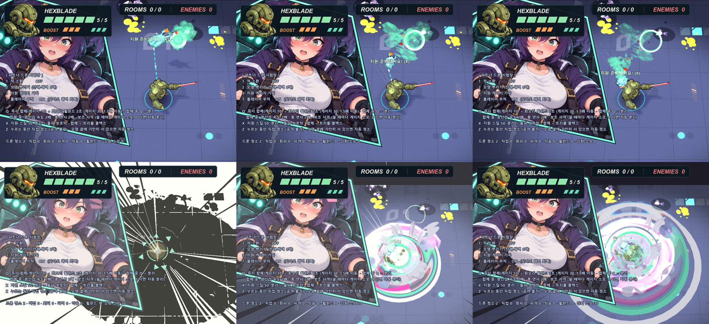
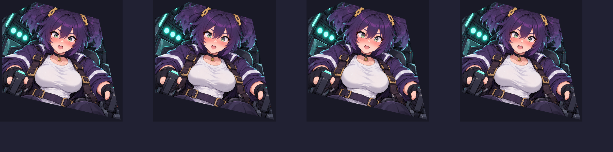

# 드론 조종석 합체 컷인 (본편 연결 · Claude)

> **2026-10-05: 폐기 예정 보관본.** 기본 컷인은 [사선 DOCKING 컷인](diagonal-docking-cutin.md)으로 바뀌었다. 이 컷인은 `--cutin=cockpit` 또는 허수아비 시험장 0 키로 계속 볼 수 있고, 사용자가 사선 컷인을 확정하면 정리한다.

리소스·규칙은 Codex 인수인계 [drone-cockpit-cutin-claude-handoff.md](drone-cockpit-cutin-claude-handoff.md) 기준. 이 문서는 실제 게임 연결과 **가슴 흔들림(모핑)** 구현 기록이다.

## 연결

| 위치 | 하는 일 |
|---|---|
| `scripts/drone/cockpit_cutin.gd` (`CockpitCutin`, CanvasLayer 9) | 컷인 컨트롤러. `begin(main, drone)` · `notify_dock()` · `cancel()` |
| `scripts/drone/cutin_jiggle.gdshader` | 원화 한 장의 가슴 영역 UV 변형 (흔들림) |
| `PartnerDrone._begin_recall(fast=true)` | 소유자당 컷인 하나 생성 (남아 있던 것은 즉시 삭제) |
| `PartnerDrone._gattai_impact()` | 실제 등 부착 순간 `notify_dock()`, `GattaiFX.play(..., lines_only=true)` |
| `PartnerDrone._exit_tree()` | 드론이 사라지면 컷인도 삭제 |
| `GattaiFX.compact` | 컷인과 함께일 때 layer 8 에서 집중선·레터박스만 (흰 전체 섬광·톱니 말풍선·글자·별 조각 생략) |

- Q 즉시 합체만 컷인을 띄운다 (게이지 30 미만이면 Q 합체 자체를 거절). 휠윈드 끝 자동 분리·보통 합체(`toggle_link`, fast=false)에는 컷인 없음.
- 합체 전에 비행(`St.RECALL`)이 끊기거나, 1.2초 안에 합체가 안 오거나, 메카가 쓰러지면 빠르게 퇴장. 씬 종료 때는 Main 자식이라 같이 사라진다.
- 기존 월드 충격파·메카 squash·히트스탑·휠윈드·효과음은 그대로. 컷인과 함께일 때 HUD 흰 섬광만 0.6→0.3 (얼굴을 덮지 않게).
- 실행 인자 `--cutin=off` 면 예전 GattaiFX 전체 연출.

## 화면 배치 · 타이밍

- 크기 `side = min(높이×1.05, 너비×0.45)`, 위치 `(-0.05, -0.04)×side`. 문서 시작값(1.22 / 51%)은 1280×800 에서 화면 가운데의 메카·합체 지점을 덮어서 줄였다.
- 진입 0.16초(왼쪽 밖 -0.9 side → 0, 크기 0.98→1.03, 알파) → 정착 0.06초 → **실제 합체 이벤트**에 잠금(별빛 0.09초 · 삼중 링 0.26초 · 광선 3개 수렴 · 파편 7개 · 홍조 강조선) → 얼굴 유지 **0.36초**(문서 제안 0.27 → 흔들림이 두세 번 보이게 늘림) → 퇴장 0.18초. 합체 비행이 0.22초라 전체 약 0.76초.
- 시간은 `Time.get_ticks_usec()` 실제 시계 (프레임 사이 최대 1/20초로 자름). 히트스탑(time_scale 0.06)에도 제 속도. `get_tree().paused` 면 숨김. 캡처·테스트는 `CockpitCutin.fixed_dt` 로 고정 시간.
- 합체 순간 패널이 쿵 내려앉았다 튀어 오르고(스프링) 살짝 기운다.

## 가슴 흔들림 (2D 모핑)

원화를 조각내거나 Live2D 같은 별도 리그 없이, **셰이더로 UV 를 국소 변형**한다 (Live2D 의 "변형 디포머" 를 셰이더 하나로 흉내 낸 것).

1. 원화 1024 좌표에서 가슴 두 개에 기운 타원 영향 영역(중심 UV (0.386,0.635)/(0.567,0.655), 반경 0.135/0.14, 기울기 -0.18rad). 가슴보다 조금 크게 잡아 외곽선(티셔츠 실루엣)이 같이 움직인다.
2. 무게 `(1-d²)²` — 가장자리에서 0 이라 주변(멜빵·팔·배경)은 이어진 채 그대로. 위쪽(가슴 뿌리) 35%, 아래 끝 100% 로 매달린 느낌.
3. 역매핑 `uv -= w·(변위 + (uv-c)·(-sq/2, sq))` — 변위만큼 밀고, 세로로 늘었다 눌린다(부피 유지). 변위 최대 30px 에서 접힘(fold) 없음.
4. 스프링: 좌우 가슴 각각 2D 감쇠 스프링(가로 4.6Hz · 세로 5.8Hz, 감쇠비 0.13, 오른쪽은 1.08배 빠르고 0.035초 늦게) — **패널 가속도의 반대 방향으로 끌린다(관성)**. 진입 감속 때 앞으로 쏠리고, 합체 충격으로 패널이 내려앉으면 위로 튀었다 출렁, 퇴장 가속 때 뒤로 남는다. 합체 순간에는 위쪽 충격도 직접 더한다. 가로 최대 20px · 세로 30px, 1/240초로 쪼개 적분.
5. 위로 튈 때 세로로 눌리고, 아래로 처질 때 늘어난다 (`sq` ±0.12).

(왼쪽부터 기본 · 위 · 아래 · 좌우 엇갈림. `_capture/cutin_jiggle_poses.gd`)

원화를 바꾸면 셰이더 uniform `c_l/c_r/r_l/r_r/tilt` 만 새 좌표로 맞추면 된다. 수치 조정은 `CockpitCutin` 의 `JIG_*` 상수.

## 확인

- 테스트 `tests/cockpit_cutin_check.gd` (23항목): 컷인 1개 · layer 9 · 입력 통과 · 실제 합체에 잠금 · GattaiFX compact · 휠윈드 유지 · 흔들림 변위 8~30px 가 셰이더에 들어감 · 실제 시간 0.77초에 사라짐(히트스탑 포함) · 반복 Q 무중첩 · 게이지 30 미만 · 분리/보통 합체 무컷인 · 비행 끊김 퇴장 · 드론 제거 정리.
- 캡처 `_capture/cockpit_cutin_show.gd` → `output/cockpit-cutin-20261004/` (`ingame_sheet.png`, `capture_log.txt` — 프레임별 단계·좌우 가슴 변위).
- 남은 것: 실제 1280×720·넓은 화면에서 손으로 보는 확인, 좌상단 HUD 카드가 머리 윗부분을 조금 가림(HUD 가 위라서 의도대로).
