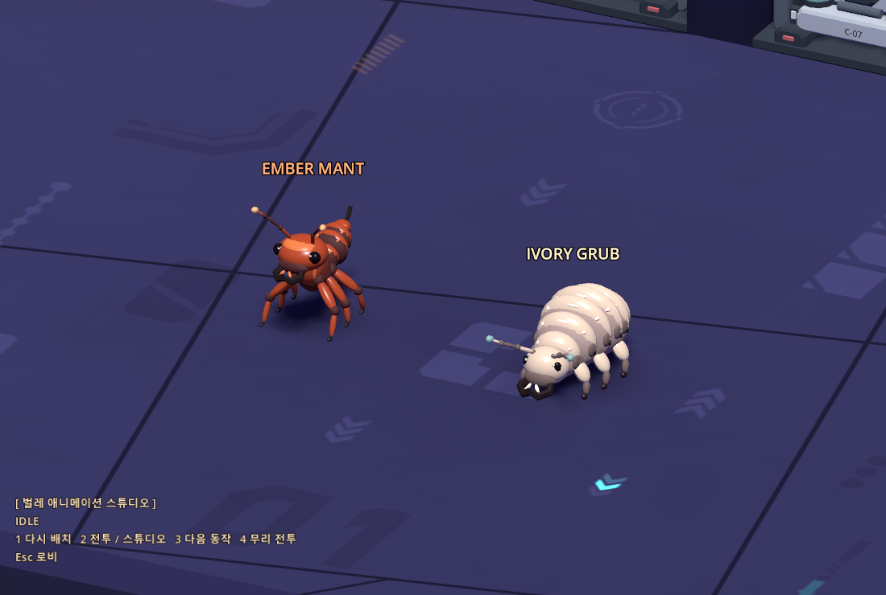

# 벌레형 괴생명체 2종

사용자 참고 이미지의 붉은 개미와 아이보리색 유충을 바탕으로 Blender에서 직접 제작했다. 외부 모델·텍스처 없이 색 재질과 메시로 만든다. 모델 편집은 Blender, 애니메이션 재생은 Godot에서 한다.



| | 붉은 개미 척후병 · EMBER MANT | 아이보리 굼벵이 · IVORY GRUB |
|---|---|---|
| 형태 | 높은 머리, 큰 턱, 가는 허리, 뾰족한 배, 긴 더듬이 | 굵은 몸마디 6개, 옆 기문, 작은 머리, 짧은 다리 |
| 움직임 | 여섯 다리를 두 삼각 지지조로 교대, 배와 머리의 지연 흔들림 | 몸마디별 시차를 둔 수축 파동, 짧은 다리의 연속 디딤 |
| 전투 | 빠른 추적 → 턱을 벌리고 힘 모으기 → 짧은 물기 돌진 | 느린 추적 → 앞몸을 숙여 압축 → 육중한 덮치기 |
| 메시 삼각형 | 13,464 | 20,616 |
| 게임 배율 | 원본의 0.78 | 원본의 0.90 |
| 체력 | 기본 4 × 기존 공통 2.5 = 10 | 기본 8 × 기존 공통 2.5 = 20 |

## 바로 실행

`insect_battle.cmd` 또는 로비 **테스트 씬 → 벌레형 괴생명체**. 시험장의 플레이어는 무적이며, 적 둘을 처치하면 다시 배치한다.

- **1**: 다시 배치.
- **2**: 실제 전투 ↔ 애니메이션 스튜디오.
- **3**: 스튜디오의 다음 동작.
- **4**: 두 마리 ↔ 여섯 마리 무리 전투.
- **Esc**: 로비.

본편 방 탐색과 섹터 런에서도 등장한다. `Main._fill_queue`가 드론 몫 중 개미 12%, 굼벵이 10%를 배정한다. 반올림 잔여분을 다음 방으로 이월하며 전체 적 수와 기존 요격기·포탑·크롤러 비율은 유지한다. 보스·심연처럼 자체 소환기를 쓰는 씬에는 따로 배치하지 않았다.

## 제작 파일

| 용도 | 파일 |
|---|---|
| Blender 재생성 원본 | `models/src/insect_ant.py`, `models/src/insect_grub.py` |
| 공통 모델링 도구 | `tools/blender/insect.py` |
| 게임 모델 | `assets/models/insect_ant.glb`, `assets/models/insect_grub.glb` 및 `.import` |
| Blender 편집 파일 | `output/models/insect_ant/insect_ant.blend`, `output/models/insect_grub/insect_grub.blend` |
| 재사용 적 씬 | `scenes/enemies/insect_ant.tscn`, `scenes/enemies/insect_grub.tscn` |
| 애니메이션 | `scripts/insects/insect_motion.gd` (`InsectMotion`) |
| Enemy 계약·AI | `scripts/insects/insect_enemy.gd` (`InsectEnemy`) |
| 시험장 | `scripts/insects/insect_lab.gd`, `scenes/insects.tscn` |
| 검사 | `tests/insect_check.gd` |
| 최종 미리보기 | `output/insects-20261002/insect-animation.gif`, `animation-sheet.png`, `concepts-ingame.png` |

`.blend`와 `.glb`는 관절이 분리된 중립 모델이며 **베이크한 애니메이션 클립은 들어 있지 않다**. 선택한 애니메이션 도구는 Godot이다. 게임용 적 씬에는 아래의 9개 동작이 연결되어 있으며, 원본 GLB만 다른 프로젝트로 옮길 때는 드라이버도 함께 이식해야 한다.

## 동작과 관절

`idle`(호흡·더듬이 탐색), `walk`(속도에 맞춘 발 교대·몸 파동), `windup`(턱 벌림·몸 압축), `attack`(전방 타격), `recover`(복귀), `hurt`(피격 반동), `stagger`(패링 경직), `death`(다리 오므림·옆으로 쓰러짐·제거), `emerge`(땅 아래에서 등장).

양쪽 더듬이는 각각 `antenna_l/r_0 > _1 > _2`의 3관절. 머리·턱·몸마디와 독립적으로 회전하며, 멈췄을 때도 탐색하고 이동과 회전 때 끝이 뒤늦게 따라온다. 다리는 `leg_l/r0~2_hip > _knee > _foot`, 접지점 `pt_foot_*`. `pt_mouth`는 턱 앞, `pt_target`는 피격·조준 참고점이다. 모델 정면은 Blender +Y → Godot -Z, 단위는 미터다.

`InsectMotion`은 자세만 처리한다. 걷는 발의 지지 구간은 월드 좌표에 붙잡고, 이동 구간은 들어 올려 다음 자리로 옮긴다. 2관절 IK가 발목을 풀고 발끝 마커를 지형 높이에 맞춘다. 너무 가파른 단차는 `Main.push_out_feet`로 막는다. 임의 지형의 모든 접촉을 보증하는 물리 다리 시스템은 아니며, 발이 도달할 수 없는 자리에서는 정상 위치로 다시 디딘다.

AI는 예고 → 확정된 방향으로 공격 → 복귀 순서. 공격 1회에 물기 판정 1번이며, 피격·패링·대상 숨음·플레이어 사망은 진행 중 공격을 취소한다. 기존 `Enemy`의 총·검·레이저·미사일 피격과 락온, 체력바, 처치 보상·방 진행 계약을 사용한다. 사망은 생물형 쓰러짐이며 기존 로봇의 폭발·절단 조각 연출 대신 해당 동작을 쓴다.

## 재생성·검증

```powershell
powershell -ExecutionPolicy Bypass -File tools\blender.ps1 model models\src\insect_ant.py --size=600
powershell -ExecutionPolicy Bypass -File tools\blender.ps1 model models\src\insect_grub.py --size=600
powershell -ExecutionPolicy Bypass -File tools\godot.ps1 wait --headless --import
.\run_tests.cmd
powershell -ExecutionPolicy Bypass -File tools\godot.ps1 wait --fixed-fps 60 res://scenes/insects.tscn -- --bot --seconds=30
powershell -ExecutionPolicy Bypass -File tools\godot.ps1 wait --fixed-fps 60 res://scenes/insects.tscn -- --bot --insectstudio --seconds=24
```

Blender 5.2.2 / Godot 4.7.2의 프로젝트 고정 실행기를 사용한다. 검사에서 GLB 관절·더듬이, 다리 접지·들림, 모든 동작의 유한 변환, 공격 취소, 경직, 한 번의 처치 집계, 사망 노드 제거, 본편 소환 비율을 확인한다. 2026-10-02 전체 회귀 **21종 PASS**. 실제 Forward+ 스튜디오 캡처와 전투 봇 검증 결과는 `output/insects-20261002/validation.json`에 기록한다.

프레임 덤프는 `.gitignore`로 제외하며, `tools/insect_preview.py`가 최종 시트·GIF를 조합한다. 기존 다른 작업의 `bug_ant` / `bug_pillbug` 파일은 별도 결과물이며 이 작업에서 덮어쓰거나 제거하지 않았다.
