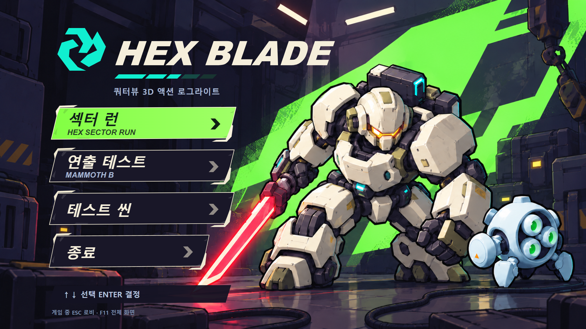
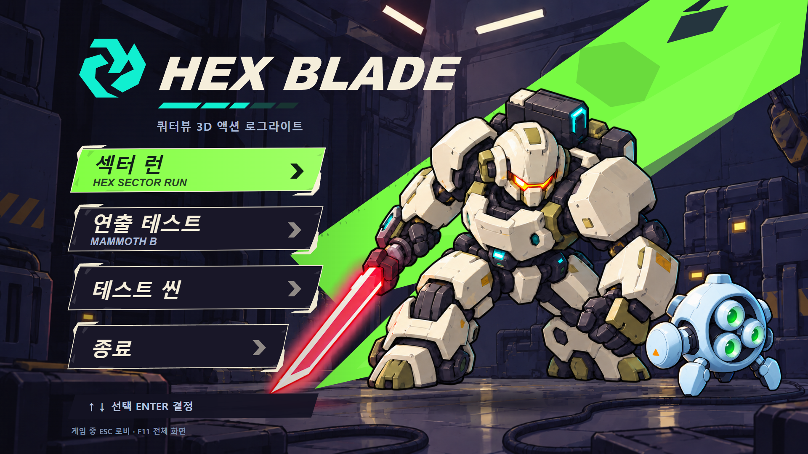

# HEXBLADE 로비 업그레이드 — Claude 인수인계

작성: 2026-10-07 · 제작: Codex · 단계: **리소스 제작·배치 미리보기 완료, 게임 적용은 다음 작업**

사용자 요청: “이전에 잡았던 이 로비컨셉으로 우선 로비를 업그레이드 하자. 여기에 필요한 리소스를 먼저 쭉 생성해주고, 클로드에게 인수인계 md 문서 작성해줘.”

## 진행 우선순위

**사용자 요청(2026-10-07): 이 로비 업그레이드는 빠른 시일 안에 실제 로비에 적용해야 한다.** 리소스 제작은 완료됐으므로 다음 로비 작업에서 우선 진행한다. Claude는 완성 배경01 + 실제 메뉴 UI의 1차 적용부터 시작하고, 기존 진입·복귀를 유지한 실제 Godot 화면과 조작 검증까지 마친다.

## 바로 시작하기

1. 사용자가 제공한 [기준 콘셉트](../output/lobby-upgrade-kit-20261007/reference/approved_concept.png)와 아래 적용 미리보기를 먼저 본다.
2. **1차 적용은 `01_keyart_clean.png` + 실제 버튼/Label** 구성을 권장한다. 원안의 기체·드론·검 반사광·붓질을 가장 가깝게 유지한다. 이미지에 메뉴 글자는 없다.
3. 리소스 폴더에서 필요한 파일을 `assets/ui/lobby/`로 복사하고, `scripts/lobby.gd`의 화면 구성과 표현을 교체한다. 기존 게임 진입·복귀 함수와 씬 경로는 유지한다.
4. 현재 설정은 1280×800이므로, 로비 안에서만 1920×1080 디자인 좌표를 비율 유지 축소·중앙 정렬한다. 프로젝트 전체 해상도/늘이기 설정은 이번 디자인 때문에 변경하지 않는다.
5. 기존 테스트·실제 로비 조작·전투 진입/복귀를 검증하고 AGENTS.md 기록을 갱신한다. 커밋·푸시는 사용자 요청 때만 한다.



이 이미지는 **로컬 HTML에서 리소스를 합성한 적용 미리보기**다. 현재 게임 로비 캡처가 아니다. 이번 작업에서는 `scripts/lobby.gd`, `scenes/lobby.tscn`, 게임 코드, 프로젝트 설정, 기존 실행기 등을 수정하지 않았다.

## 디자인 기준

- 어두운 남보라 정비 격납고, 위쪽의 크림색 조명, 서비스 상자와 크레인, 젖은 바닥과 케이블.
- 오른쪽에 웅크린 크림색 중장갑 기체: 올리브색 보조 장갑, 주황 바이저, 청록 전원부, 붉은 에너지 검. 오른쪽 아래에는 연하늘색 3안 청소 드론.
- 기체 뒤를 가로지르는 라임색 사선 그래픽. 굵은 검정 외곽선, 셀 명암과 거친 페인팅 질감.
- 왼쪽 상단 민트색 육각 마크와 기울어진 크림색 `HEX BLADE`; 왼쪽 아래 네 개 메뉴.
- 선택 메뉴는 라임색 면/검은 글자, 나머지는 남보라 면/크림 테두리/크림 글자. 주 선택 색은 라임, 로고 색은 민트로 역할을 나눈다.
- 배경 글자·기체의 브랜드 인쇄·벽의 표어는 제거했다. 기능 안내와 메뉴 문구는 런타임 UI로 그린다.

배경은 사용자 첨부를 직접 참조한 내장 `image_gen.imagegen` 편집이다. 기체/드론 분리는 AI 재작화를 수반하므로 원안과 관절·장갑·렌즈의 세부 차이가 있다. 새로운 주인공 설정이나 기존 게임 모델 교체 승인이 아니다. 로고 마크·스킨·사선 그래픽은 코드로 만든 벡터이며, 원안의 픽셀 단위 추출본은 아니다.

## 패키지와 파일

프로젝트 상대 경로: **`output/lobby-upgrade-kit-20261007/`**. 이 폴더는 `.gdignore`로 Godot 자동 임포트에서 제외했다. 실제 게임이 쓸 파일만 리소스 폴더로 복사한다. 출력 폴더의 `.gdignore`를 제거해서 참고 이미지와 미리보기 전체를 임포트하지 않는다.

| 파일 | 실제 규격 | 용도 |
|---|---|---|
| `png/01_keyart_clean.png` | 1672×941 RGB | 메뉴/문자 없는 완성 원화. 기체·드론·라임 그래픽·바닥 반사광 포함 |
| `png/02_hangar_plate.png` | 1672×941 RGB | 캐릭터/그래픽 없는 격납고. 아래 전경 케이블·상자와 크레인은 포함 |
| `png/03_mech_cutout.png` | 1672×941 RGBA | 기체와 붉은 검. 반투명 발광 포함, 바닥/드론 없음 |
| `png/04_drone_cutout.png` | 1254×1254 RGBA | 청소 드론 하나, 투명 여백 포함 |
| `ui/01_logo_mark.svg` | 192×192 | 글자 없는 민트 육각 마크 |
| `ui/02_menu_normal.svg` | 640×128 | 기본 메뉴 스킨 |
| `ui/03_menu_focus.svg` | 640×128 | 마우스 호버·키보드 포커스 공용 라임 스킨 |
| `ui/04_menu_pressed.svg` | 640×128 | 눌린 상태 스킨 |
| `ui/05_menu_disabled.svg` | 640×128 | 비활성 스킨. 기본 네 메뉴에 적용할 필요는 없음 |
| `ui/06_focus_corners.svg` | 640×128 | 선택 테두리 추가 강조용. 스킨 자체에도 귀퉁이가 있으므로 선택적으로 사용 |
| `ui/07_arrow_cream.svg`·`08_arrow_ink.svg` | 각각 48×48 | 기본/선택 화살표 |
| `ui/09_diagonal_backdrop.svg` | 1920×1080 | 분리 구성의 라임색 사선 레이어 |
| `ui/10_logo_underline.svg` | 336×18 | 로고 아래 민트 분절선 |
| `ui/11_hint_plate.svg` | 640×72 | 하단 조작 안내 밑판 |
| `ui/12_drawer_panel.svg` | 760×820 | 테스트 씬 목록 패널 밑판. 목표 영역에 늘여 사용 |
| `ui/13_badge_plate.svg` | 144×48 | 테스트 목록 보조 배지용 선택 리소스 |
| `ui/14_left_readability.svg` | 1920×1080 | 왼쪽 글자 가독성 보정, 분리 구성에 사용 |
| `ui/15_contact_shadow.svg` | 512×128 | 분리 구성의 기체/드론 접지 그림자 |
| `ui/16_sword_floor_light.svg` | 512×128 | 분리 구성의 약한 검 바닥 발광 |
| `ui/17_title_wordmark.svg` | 761×90 | `HEX BLADE` 글자를 벡터 윤곽으로 변환, 수신 PC의 영문 폰트 불필요 |

**독립 디자인 리소스 21종 = 생성 PNG 4장 + 네이티브 SVG 17종.** `ui_png/`에는 SVG 17종의 같은 크기 RGBA PNG 대체본도 있다. 디코딩 검사 대상은 대체본 포함 총 38개다. 같은 그래픽의 SVG/PNG를 둘 다 그리지 않는다.

- `manifest.json`: 실제 크기, 알파 기준 유효 영역, SHA256, 역할, PNG 대체본 출처.
- `layout.json`: 디자인 좌표·문구·색·분리 이미지 배치와 기존 함수 연결.
- `prompts.json`: 내장 imagegen의 실제 프롬프트 5회분(기체 여백 수정 1회 포함). `sources.json`: 원본 생성 경로.
- `reference/approved_concept.png`: 첨부 사본. `reference/mech_cutout_initial.png`: 여백 수정 전 참고본, 적용 금지.
- `preview.html`: 브라우저에서 열면 완성 배경/분리 레이어 전환, 메뉴 포커스와 테스트 목록을 확인할 수 있다. 실제 게임 실행 기능은 없다.
- `preview_*.png`: 완성/분리 구성과 여러 비율의 합성 캡처, 테스트 목록 캡처.
- `validation.json`, `engine_validate.log`, `engine_stdout.log`: 검증 결과.
- `build_kit.py`, `build_wordmark.ps1`, `render_preview.cjs`, `engine_validate.gd`, `pack_kit.py`: 재현·검증·포장 도구. 게임에 복사할 코드가 아니다.

SVG를 그대로 임포트하거나 `ui_png/`를 사용할 수 있다. 얇은 UI 선을 확대할 계획이면 SVG를 원하는 해상도로 임포트하고, 고정 크기 UI에는 PNG 대체본도 충분하다. 캐릭터 PNG는 알파를 보존한다. 로비에서 축소할 PNG는 밉맵과 선형 필터를 고려하되 실제 화면에서 테두리를 확인한다. `.png.import`/`.svg.import`는 원본과 함께 관리한다.

## 두 가지 구성을 섞지 말 것

### A. 완성 배경 — 1차 권장

`01_keyart_clean.png` 하나를 배경으로 둔다. 그 위에 로고 마크·워드마크·밑줄·한국어 부제·네 개 메뉴·조작 안내를 올린다. **배경 안에 기체/드론/사선 그래픽/그림자/검 바닥 발광이 이미 있으므로 별도 분리본을 추가하지 않는다.**

처음 사용자에게 확인받을 결과는 이 구성으로 만든 실제 Godot 로비 캡처가 적합하다. 캐릭터 전체가 들어 있는 그림을 약하게 이동하면 UI는 고정하고, 화면 끝의 빈틈은 큰 어두운 배경으로 덮는다. 큰 카메라 움직임은 피한다.

### B. 분리 레이어 — 애니메이션이 필요할 때



아래에서 위로 격납고 → 라임 그래픽 → 기체 접지 그림자/검 바닥 발광 → 기체 → 드론 접지 그림자 → 드론 → 왼쪽 가독성 보정 → UI 순서다. `layout.json.layered`의 전체 이미지 사각형을 사용한다.

투명 PNG는 원래 캔버스에서 **여백과 크기가 바뀌었다**. 첨부의 원래 위치를 그대로 넣거나 두 이미지를 같은 캔버스 크기로 늘이면 잘못 배치된다. `manifest.json`의 `bounds_alpha16`과 `layout.json`의 `rect`가 실제 최종 이미지 기준이다.

| 레이어 | 1920×1080 디자인 기준 전체 TextureRect: x, y, w, h |
|---|---|
| 격납고/라임/가독성 | `0, 0, 1920, 1080` |
| 기체 그림자 | `865, 917, 716, 86` |
| 검 바닥 발광 | `541, 935, 324, 53` |
| 기체 | `135.889, 125.370, 1569.973, 883.579` |
| 드론 그림자 | `1511, 911, 373, 48` |
| 드론 | `1498.551, 599.520, 391.711, 391.711` |

기체의 큰 빈 왼쪽 여백 때문에 전체 사각형의 x가 작다. 눈에 보이는 기체/검 영역은 디자인 기준 약 `(619,208)`부터 오른쪽에 배치된다. 이 표의 숫자는 **초기 합성 배치**이며 엔진 캡처를 보고 미세 조정 가능하다. 크레인·케이블은 격납고에 구워져 있으므로 사선 그래픽이 원안과 다른 부분을 덮는다. 분리 구성은 원안과 픽셀 단위로 같지 않다.

모션 수치는 `layout.json.motion_suggestion`의 제안값일 뿐 구현/사용자 확정이 아니다: 배경 패럴랙스 2px, 기체 4px, 드론 6px, 드론 수직 1.5px/3초, 메뉴 포커스 이동 6px/0.12초. 접지 그림자는 발 밑에 고정한다. 움직임 감소 설정/비활성 창에서는 정지, 씬 종료 시 Tween·연결을 정리한다. 별도 스프라이트 애니메이션/관절 리깅/3D 모델은 이 패키지에 없다.

## 로비 UI 배치

디자인 캔버스는 1920×1080. 뷰포트 크기를 `V`라고 하면 `s = min(V.x/1920, V.y/1080)`, `offset = (V - Vector2(1920,1080)*s)/2`. 로비 전용 부모에 이 배율과 오프셋을 적용하고 그 안은 고정 디자인 좌표를 쓴다. 예: 1280×800에서 1280×720 아트 + 위아래 40px의 어두운 여백. 1920×800에서는 좌우 여백이 생긴다. 단순 cover 크롭으로 검끝/드론/메뉴를 자르지 않는다.

| 항목 | x, y, w, h |
|---|---|
| 로고 마크 | `170, 74, 192, 192` |
| 워드마크 | `375, 132, 726, 86` |
| 민트 밑줄 | `375, 242, 336, 18` |
| 한국어 부제 | `372, 282, 670, 36` |
| 섹터 런 | `157, 344, 624, 125` |
| 연출 테스트 | `157, 484, 624, 125` |
| 테스트 씬 | `157, 624, 624, 125` |
| 종료 | `157, 764, 540, 125` |
| 조작 안내 | `161, 933, 600, 66` |
| 추가 안내 | `169, 1013, 760, 34` |
| 테스트 목록 패널 | `166, 334, 760, 650` |

버튼 제목 49px/굵게/기울임, 영문 부제 25px, 일반 부제 27px. 제목은 버튼 왼쪽에서 57px, 부제 있는 항목은 위에서 20px, 없는 항목은 위에서 38px. 영문 부제 y=78px. 화살표 48px는 오른쪽 59px/위 39px. 미리보기의 글꼴은 맑은 고딕 기반이며 Godot의 같은 폰트가 완전히 같은 폭이라는 보장은 없다. 다음 PC까지 글꼴을 고정할 필요가 있으면 프로젝트에서 사용 허가한 CJK 폰트를 별도로 검토한다. 이번에는 폰트 파일을 새로 내려받거나 재배포하지 않았다.

일반색 `#f5eedb`, 보조 글자 `#a7b8d5`, 라임 `#82ff43`, 선택 글자 `#102019`, 바탕 `#191728`, 로고 민트 `#10efd0`. 포커스는 색+면+화살표로 함께 표시한다. 최초 포커스는 섹터 런. 모든 클릭은 실제 `Button`이 받게 하고 장식 `TextureRect`/Label은 `MOUSE_FILTER_IGNORE`로 둔다. 사선 스킨을 `StyleBoxTexture`로 쓸 때 네 귀퉁이가 깨지지 않게 margin/stretch를 실제 크기로 확인한다. 어려우면 버튼 안에 전체 스킨 TextureRect를 늘여 깐다.

## 기존 코드의 연결점과 보존할 계약

확인한 파일: `scripts/lobby.gd` / `scenes/lobby.tscn` / `project.godot` / README. 현재 `Lobby`는 런타임에 중앙 VBox/ScrollContainer와 육각 배경을 만든다. 새 디자인에서는 이 레이아웃·배경만 교체하고, 다음 경로를 그대로 연결한다.

| 메뉴/동작 | 현재 코드 |
|---|---|
| 섹터 런 | `Lobby._start_run()` → `/root/Run.new_run()` |
| 연출 테스트 · MAMMOTH B | `Lobby._go(Lobby.DEATH_TEST_SCENE)` → `res://scenes/mammoth_death_lab.tscn` |
| 테스트 씬 | `Lobby._toggle_tests()`에서 현재 `TEST_SCENES` 전체를 스크롤 목록/패널로 보여줌 |
| 테스트 목록의 항목 | 현재 `TEST_SCENES[i].scene` → `Lobby._go(scene)` |
| 종료 | `get_tree().quit()` |
| 게임에서 복귀 | `Lobby.back(tree)`의 time_scale=1, physics ticks=60 복구 + 실제 로비 씬 변경 |
| 자동 플레이 | `_route_cmdline()`의 로비 건너뛰기, `--test`는 main.tscn / 그 외는 run.tscn |

`RUN_SCENE` 상수만 보고 섹터 런을 `change_scene_to_file`로 직결하지 않는다. 새 런 초기화가 필요하므로 기존 `new_run()`을 유지한다. `_leaving` 중복 진입 방지도 유지한다. 기존 Sfx `charged`/`ready`/`lock`/`tink` 호출을 재사용하고 새 음원/BGM은 이번 범위에서 만들지 않았다.

테스트 목록은 확인 당시 **13개**. `test_scene_data.js`는 그때 `lobby.gd`에서 읽은 미리보기용 스냅샷이다. 게임 적용에서는 스냅샷을 새 진실로 삼지 말고 **현재 `Lobby.TEST_SCENES`**를 사용한다. 특히 `mammoth_death_lab.tscn`과 목록 안의 `lab_mammoth_b.tscn`은 서로 다른 항목이므로 합치지 않는다. 오래된 설명의 G/X/Z 표시는 현행 README/입력 코드와 대조해서 UI 설명만 정정한다.

테스트 패널은 메뉴 영역에 겹쳐 열고 뒤쪽 주 메뉴의 포커스/입력을 끈다. 목록은 긴 한국어 제목을 줄바꿈하고 세로 스크롤한다. ↑↓/Enter, 마우스, Tab으로 접근 가능해야 한다. 닫기 버튼/Esc는 패널만 닫고 테스트 씬 버튼에 포커스를 돌린다. 목록을 다시 열면 선택 항목이 화면 안에 오도록 스크롤한다. 테스트 메뉴 때문에 화면 전체 높이가 늘어나거나 기체가 밀리지 않게 한다.

구현 구조 제안: `scripts/presentation/lobby_art.gd` 등에 배경/이미지 배치·포커스 시각·선택적 Tween만 모으고, `Lobby`가 기존 진입 함수를 호출한다. 이 새 모듈은 아직 작성하지 않았다. 이 프로젝트는 Godot HEXBLADE이며 SlimeForge 전용 `artist-presentation` 규칙을 가져오는 작업이 아니다.

## 검증 결과와 다음 작업의 완료 기준

이번에 수행한 검증:

- PNG 4장 디코딩, 실제 크기·채널·SHA256·알파 확인. 투명 두 장의 알파 범위 0~255, 네 모서리 0. 드론 경계 최대 알파0, 기체는 경계에 알파1/255 흔적이 일부 남아 있지만 유효 실루엣/검 발광은 캔버스 안에 들어 있다. 원본 알파를 임의로 지우지 않았다.
- SVG 17종 XML 파싱 및 RGBA PNG 대체본 렌더링. 워드마크는 외부 폰트 참조 없는 벡터 path.
- 로컬 HTML: 1920×1080, 1280×800, 1280×720, 1920×800. 메뉴 화면 내부·이미지 로드·↑↓ 포커스 이동 PASS, JS 예외0. 분리 구성 및 테스트 목록13개 렌더링 확인. 이는 Godot UI 조작 검증은 아니다.
- `tools/godot.ps1` 경유 **4.7.2-stable**, `engine_validate.gd`: **38 loaded, 0 failed**, 종료코드0. 이번 검사는 `Image.load`로 원본 파일을 직접 디코딩하므로 게임 폴더로 복사한 뒤의 임포트/Texture2D 검증과는 다르다.
- 최초 엔진 시작에서 상대 로그 경로 때문에 `Could not create directory: user://C:`가 추가로 나왔다. 로그를 프로젝트 안의 절대 경로로 바꿔 재검증한 최종 실행은 `Failed to read the root certificate store` 환경 ERROR **1건**, 리소스 실패0/SCRIPT ERROR0/종료코드0이다. 최종 로그를 동봉했고 엔진 실행 전체의 ERROR0이라고 주장하지 않는다.

다음 구현 후에는 고정 실행기만 사용한다:

```powershell
# 필요한 리소스를 assets에 복사한 뒤 임포트
powershell -File tools/godot.ps1 wait --headless --import

# 전체 회귀 테스트 (현재 다른 작업의 상태와 실패를 먼저 구분)
powershell -File tools/run_tests.ps1

# 로비 bypass 및 기존 섹터 런의 자동 플레이
powershell -File tools/godot.ps1 wait --fixed-fps 60 res://scenes/lobby.tscn -- --bot --seed=1 --seconds=30
```

`--bot`는 로비를 건너뛰므로 **로비 외형/입력 검증을 대신하지 않는다.** `HEXBLADE.exe` 또는 고정 실행기로 인자 없이 실제 로비를 열어 최초 포커스→↑↓→Enter, 각 버튼/호버, 테스트 패널 열기/스크롤/닫기, 허수아비 진입→Esc 복귀, 연출 테스트 진입/복귀, F11 전환, 종료를 확인한다. 1280×800/1280×720/1920×1080/가로로 긴 창에서 검끝·발·드론·메뉴가 잘리지 않는 실제 Godot 캡처를 남긴다. 반복 진입에서 노드/Tween/사운드 중복이 없어야 한다.

작업 시작 시 다른 도구의 미커밋 변경이 있었다: 패링/허수아비/보스/실행기/README/AGENTS.md 등. 작업 중 `output/lancaster-burst-20261007/`와 `_capture/lancaster_burst_show.gd`도 추가됐다. 이번 리소스 작업과 별개이며 건드리지 않았다. 이전 인수인계에는 컷인 보이스 MP3 누락으로 `diagonal_cutin_check` 7항목 실패가 기록돼 있으므로, 다음 전체 테스트에서 같은 원인인지 먼저 확인하고 로비 변경과 구분한다. 이번 작업에서 전체 게임 테스트/본편 bot는 실행하지 않았다.

완료 기준: 실제 Godot 로비가 위 합성 미리보기의 구성·색·가독성을 재현하고, 네 메뉴와 현재 테스트 목록 전부가 기존 동작으로 연결되며, 원화와 임포트 파일·코드·기록이 함께 남는 것. 현재는 이 적용 단계가 남아 있다.
