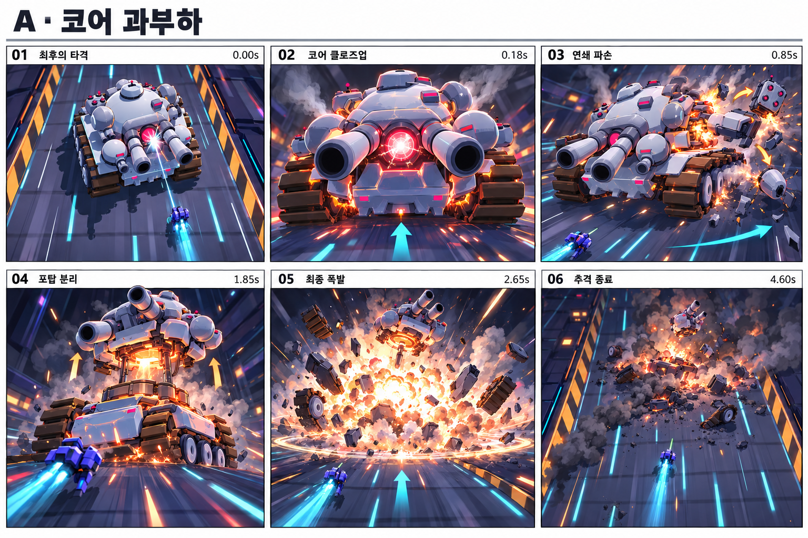
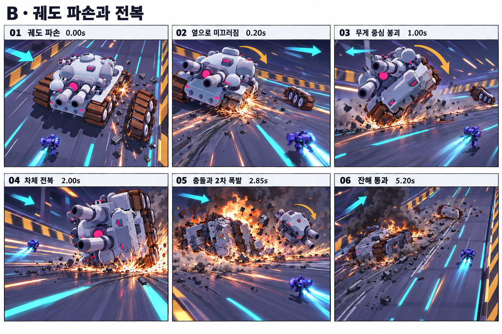
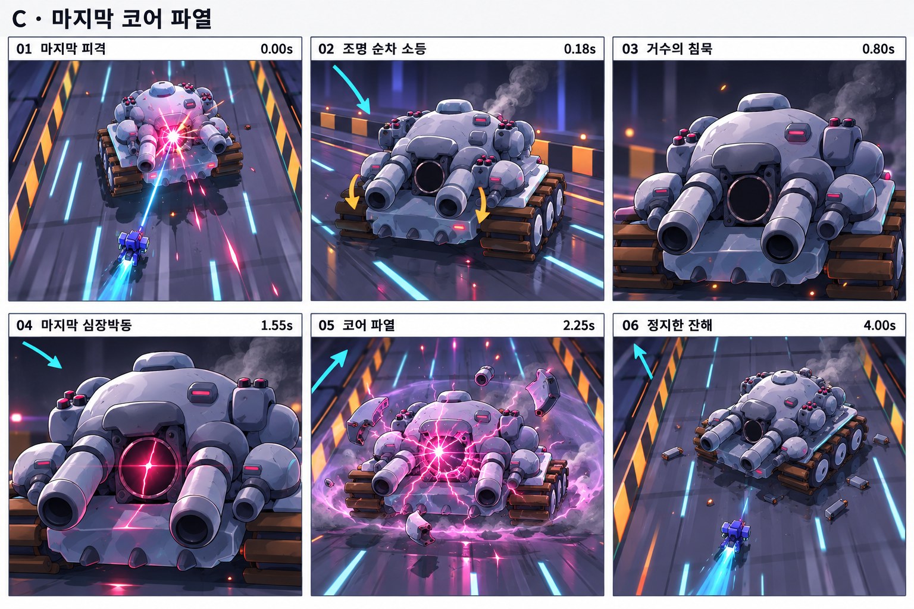

# 맘모스 보스 죽음 연출 기획과 기능명세서

맘모스의 마지막 피격을 시작으로 카메라가 보스의 파손 원인과 붕괴를 보여 주고, 플레이어와 도로를 다시 한 화면에 담아 추격 종료를 전달한다. 기존 은회색 쌍포 중전차, 붉은 코어, 청록색 도로와 작은 파란 로봇의 디자인을 유지한다. **A안 코어 과부하를 기본 추천**한다. 현재 연쇄 폭발과 분리 가능한 부품을 활용하면서 카메라 구도와 폭발 리듬을 크게 개선할 수 있다.

작성일 2026년 9월 30일. 대상은 현재 작업 폴더의 Godot 프로젝트 Neon Arena Claude와 `scenes/boss.tscn`이다. 이 문서는 기획 및 구현 요구사항이며 런타임 코드를 구현한 결과가 아니다. 아래 수치와 성능 예산은 제작 시작값이며 플레이 테스트로 조정한다. 그림은 엔진 캡처를 참고한 콘티로, 최종 렌더 품질이나 실제 구현을 보증하지 않는다.

## 1 기획안 비교

| 안 | 핵심 경험 | 화면상 길이 | 카메라 흐름 | 제작 부담과 적합성 |
| --- | --- | --- | --- | --- |
| A 코어 과부하 | 내부 과열이 부품 파손과 최종 폭발로 이어지는 통쾌함 | 4.60초 | 쿼터뷰 → 코어 접근 → 25도 측면 아크 → 포탑 틸트업 → 빠른 풀백 → 복귀 | 중간. 기존 사망 연쇄 폭발과 부품 이탈을 확장. 기본 추천 |
| B 궤도 파손과 전복 | 고속 주행 중 거대한 질량이 균형을 잃고 무너지는 무게감 | 5.20초 | 궤도 접근 → 측면 트래킹 → 넓은 구도 → 낮은 접지 시점 → 충돌 풀백 → 복귀 | 높음. 전복 피벗, 바닥 간섭 보정, 스크래치와 잔해 경로 필요 |
| C 전원 붕괴와 마지막 파열 | 정적을 거친 마지막 한 번의 코어 파열과 정지한 거수의 실루엣 | 4.00초 | 중간 거리 접근 → 정면 코어 구도 유지 → 짧은 압축 → 파열 풀백 → 복귀 | 중간. 조명 제어 목록, 코어 균열 셰이더, 작은 전기 파열 필요 |

세 안은 각각 독립적으로 선택하는 대안이다. 처음에는 A안을 구현하고 B와 C는 리소스 데이터와 공통 카메라 계약을 공유한다. C의 코어 파열은 어떤 무기로 마무리해도 성립하며, 추가 검 공격이나 플레이어의 별도 피니시 입력을 요구하지 않는다.

## 2 현재 구현에서 확인한 사항

| 확인 지점 | 현재 동작 | 명세에 반영할 사항 |
| --- | --- | --- |
| `boss_enemy.gd`의 `_begin_dying` | 공격 중단, 적 탄 제거, DYING, alive false, 적 그룹 해제, HP 0, 0.2초 히트스톱과 섬광, 격파 점수 처리 | 게임 판정 진입은 이 함수가 계속 소유. 외부 연출 모듈 시작을 이 지점에 연결 |
| `_update_dying` | 게임 시간 3초 동안 빈도가 증가하는 소폭발, 0.8 / 1.6 / 2.3초 부품 분리 | 새 시퀀스에서는 기존 자동 폭발 타이머를 대체. 두 시퀀스의 동시 실행 금지 |
| `_final_blast` | 큰 폭발 5개, 링과 충격파, 포탑과 궤도 분리, visual 숨김, defeated 발행 | 소형 폭발 다섯 개보다 주폭발 하나의 실루엣을 우선. 완료 신호의 시점을 전체 연출 종료에 맞춤 |
| `boss_camera.gd` | OFFSET (0,19,11), 기본 FOV 50도, 플레이어와 보스를 함께 추적 | 평상시 구도를 복귀 기준으로 활용. death 카메라가 추적 계산보다 우선 |
| `boss_enemy.gd`의 `_update_body` | DYING에서도 visual의 높이와 회전, 모델 스케일, 코어 맥동을 갱신 | 연출이 소유한 속성은 이 함수에서 덮어쓰지 않도록 분기 |
| `boss_tank.gd`의 build 반환값 | hull, turret, treads, cannons, sponsons, missile_pods, core 참조 제공 | 기존 참조를 활용. 추가로 조명 목록과 연출용 앵커를 등록 |
| `boss_stage.gd` | 배경이 +Z로 흐르고, drift와 puff로 잔해와 연기를 이동 | 보스는 실제 장거리 전진을 하지 않는다. 잔해와 도로 스크롤의 이동량을 한 번만 적용 |
| `boss_main.gd`의 `_on_boss_defeated` | defeated 뒤 1.6 게임 초 후 `_win` 호출 | 새 완료 계약에서는 복귀 후 defeated를 받아 `_win`을 즉시 한 번 호출 |
| `run_state.gd`의 `_process` | WIN 감지 뒤 3.2 실제 초 대기, 이후 섹터 처리 | 연출 종료 이전에는 WIN을 설정하지 않음. 런 관찰 로직의 기존 지연을 유지 |
| `Main.hitstop`, `Main.set_slowmo` | Engine.time_scale을 바꾸며 `_process`가 slowmo를 복구 | 시네마틱 장시간 슬로모션을 이 전역 값에 중첩하지 않음 |

프로젝트 메타데이터는 Godot 4.7 Forward Plus를 표기하고 실행 배치 파일은 4.6.3 실행기를 찾는다. 실제 실행기의 버전은 이번 문서 작업에서 확인하지 않았다. 구현 착수 시 실행 버전을 확인하고 기존 4.x API 호환성을 점검한다. 전투 코드는 현재 작업 트리 기준으로 읽었으며 다른 미커밋 변경을 수정하지 않았다.

## 3 콘티 읽는 기준

각 콘티는 위쪽 왼쪽부터 오른쪽으로 읽고, 아래쪽 왼쪽부터 오른쪽으로 이어지는 6컷이다. **청록 화살표는 카메라 이동**, **주황 화살표는 차체와 부품 이동**이다. 그림의 시간은 해당 컷의 대표 순간이다. 기능명세 표의 구간과 종료 시간이 구현 기준이며, 마지막 컷의 시간 표시는 복귀 완료 시점이다.

T=0은 HP가 0으로 확정된 순간이다. 아래 모든 시간은 히트스톱을 포함한 실제 화면 시간이다. FOV는 원근 카메라의 각도, 위치 단위는 Godot 월드 단위인 미터 기준이다.

## 4 A안 코어 과부하 콘티



내부가 달아오르는 원인을 먼저 보여 준 뒤, 부품이 순서대로 버티지 못하고 떨어져 나간다. 작은 폭발을 계속 반복하는 대신 포탑이 들리는 짧은 예비동작과 단 한 번의 큰 폭발로 절정을 만든다.

| 컷 | 실제 시간 구간 | 카메라 동작 | 보스와 VFX | 사운드 |
| --- | --- | --- | --- | --- |
| A01 최후의 타격 | 0.00-0.18초 | 시작 구도 보관, 0.09초 정지 후 접근 준비 | 마지막 피격 지점에 작은 섬광. 공격과 탄을 즉시 중단. 코어는 1회 백색 점등 | 강한 금속 피격과 짧은 저음 |
| A02 코어 클로즈업 | 0.18-0.85초 | 현재 시점에서 정면 3/4로 연속 이동. FOV 50 → 42도 | 코어 붉은빛 → 백색 중심, 에너지 1.8 → 4.0. 뒤 환풍구 연기와 얇은 틈새 발광 | 상승하는 과열음, 아직 대폭발 없음 |
| A03 연쇄 파손 | 0.85-1.85초 | 보스 정면의 같은 쪽에서 25도 아크. 수평선 유지 | 지정된 부품 위치 3곳에서 0.85 / 1.15 / 1.48초 소폭발. 보조 포드와 미사일 포드 이탈 | 좌우가 분리된 금속 파손 3회 |
| A04 포탑 분리 | 1.85-2.65초 | 높이 약 4.5m의 낮은 구도, 올라가는 포탑을 틸트업. FOV 42 → 46도 | 포탑을 1.85초에 분리. 예비 상승 1.2m, 아래 뜨거운 소켓 노출. 2.45-2.65초 폭발음을 잠깐 비움 | 장갑 찢어짐 후 0.20초 짧은 음압 공백 |
| A05 최종 폭발 | 2.65-3.25초 | 0.18초 안에 풀백하여 전체 폭발과 포탑을 담음. FOV 46 → 56도 | 반경 약 7m의 주폭발 1회, 지면 링 반경 11m. 포탑 위로 방출, 덩어리 파편과 뒤로 흘러가는 연기 | 주폭발 1회와 저음 충격파 |
| A06 추격 종료 | 3.25-4.60초 | 최신 플레이어 추적 구도에 0.70초 이상 블렌드. FOV 50도 복귀 | 연기 뒤로 이동, 불씨 감쇠, 도로 속도 10으로 안정. 복귀 완료 후 결과 표시 | 잔향과 금속 낙하 뒤 기존 승리음 |

이탈할 부품이 2페이즈에서 이미 떨어졌으면 같은 위치의 소켓 섬광과 연기로 해당 컷을 채운다. 없는 부품을 다시 생성하거나 중복 분리하지 않는다.

## 5 B안 궤도 파손과 전복 콘티



질량의 방향을 명확하게 보여 주는 안이다. 궤도 한쪽이 먼저 빠지고 차체가 미끄러진 후, 접지한 모서리를 축으로 90도만 넘어진다. 공중에서 여러 번 구르는 동작은 사용하지 않는다.

| 컷 | 실제 시간 구간 | 카메라 동작 | 보스와 VFX | 사운드 |
| --- | --- | --- | --- | --- |
| B01 궤도 파손 | 0.00-0.20초 | 0.09초 정지, 파손측 궤도로 빠르게 접근 | 도로 안쪽 공간이 넓은 방향으로 전복측 선택. 궤도 덩어리 1개 이탈, 접합부 스파크 | 체인 절단과 금속 끊김 |
| B02 옆으로 미끄러짐 | 0.20-1.00초 | 높이 3.2m, 측면 트래킹 약 2m. FOV 48도 | 보스 차체 횡이동 최대 2m, yaw 최대 20도. 하부 접촉점에서 스크래치와 스파크 | 마찰음 상승, 도로 긁힘 |
| B03 무게 중심 붕괴 | 1.00-2.00초 | 약 3m 물러나 전체 실루엣 확보. FOV 52도 | 접지 피벗을 중심으로 roll 0 → 35도. 포탑 반응은 차체보다 0.12초 늦음 | 무거운 철판 뒤틀림 |
| B04 차체 전복 | 2.00-2.85초 | 눈높이 2.2m에서 접지 지점 추적. 카메라 roll 최대 4도 | roll 35 → 90도. 바닥 관통 보정. 2.70초 접지 충돌, 스파크 팬과 낮은 먼지 | 지면 충돌 1회, 0.10초 국소 동작 정지 |
| B05 충돌과 2차 폭발 | 2.85-3.60초 | 폭발 전에 넓게 풀백. FOV 56도 | 뒤집힌 차체의 한 위치에서 반경 약 4m 2차 폭발 1회. 포탑 분리, 검은 연기. 잔해에는 피해 판정 없음 | 압축된 폭발음과 잔해 구름 |
| B06 잔해 통과 | 3.60-5.20초 | 플레이어와 잔해를 담은 높은 쿼터뷰로 복귀 | 시네마틱 중 플레이어를 안전한 반대쪽 차선에 배치. 잔해는 +Z로만 멀어짐 | 마찰 소멸, 엔진과 승리음 |

전복 피벗은 차체 중심에 두지 않는다. 기존 model 아래의 모든 잔존 부품을 연출용 RollPivot 아래로 묶고 접지측 하단 모서리에 피벗을 둔다. 전복 궤적은 키프레임과 바닥 높이 계산으로 고정해 매번 같은 프레임에서 충돌하도록 만든다. 자유 RigidBody3D 시뮬레이션은 기본안에 포함하지 않는다.

## 6 C안 전원 붕괴와 마지막 파열 콘티



폭발의 양보다 대비를 강조한다. 등이 뒤에서 앞으로 꺼지고 포가 처지며 잠시 움직임이 사라진다. 붉은 코어의 마지막 한 번 맥동 뒤 작은 전기 파열을 보여 주고, 죽은 전차의 알아볼 수 있는 실루엣을 남긴다.

| 컷 | 실제 시간 구간 | 카메라 동작 | 보스와 VFX | 사운드 |
| --- | --- | --- | --- | --- |
| C01 마지막 피격 | 0.00-0.18초 | 0.09초 정지, 시작 시점에서 연속 진입 | 작은 코어 섬광. 공격 종료와 코어 비활성화 준비 | 짧은 피격음 |
| C02 조명 순차 소등 | 0.18-0.80초 | 정면 3/4의 중간 거리로 부드럽게 이동. FOV 46도 | 뒤 배기 조명 → 궤도 라인 → 차체 경고등 → 코어 순서로 소등. 포구를 아래로 12도 | 구동음 pitch 하강과 릴레이 차단 |
| C03 거수의 침묵 | 0.80-1.55초 | 코어 구도를 유지하고 shake 0 | 코어 energy 0, 연기만 소량. 일반 코어 맥동과 궤도 진동을 멈춤 | 엔진 정지. 얕은 잔향만 유지 |
| C04 마지막 심장박동 | 1.55-2.25초 | 5% 정도 짧게 밀고 들어감. FOV 44도 | 별도 오버레이로 가느다란 코어 균열 점등. 1.55초와 1.95초의 두 펄스 중 두 번째가 강함 | 코어 심장박동 2회, 두 번째 뒤 공백 |
| C05 코어 파열 | 2.25-2.80초 | 0.20초 풀백. FOV 52도 | 코어 중심 자홍백색 파열 1회, 짧은 전기 가지 최대 8개, 장갑 파편 4개와 낮은 링. 차체는 남음 | 짧고 날카로운 전기 파열과 저음 |
| C06 정지한 잔해 | 2.80-4.00초 | 원래 쿼터뷰로 복귀하고 FOV 50도 안정 | 소등된 쌍포와 궤도 실루엣을 남김. 종료 시 잔해 전용 루트로 옮겨 5초 이내 정리 | 얇은 연기 잔향 뒤 승리음 |

순차 소등용 조명 배열은 현재 build 반환값에 없으므로 등록 작업이 필요하다. 공유 material의 emission을 직접 바꾸면 다른 객체까지 소등될 수 있으므로 인스턴스 파라미터 또는 복제한 전용 머티리얼을 사용한다.

## 7 공통 실행 계약

| 요구사항 | 구현 동작 | 완료 기준 |
| --- | --- | --- |
| DEATH 01 한 번만 시작 | HP 0 판정 뒤 DYING 진입을 원자적으로 확정. begin은 재호출 시 무시 | 같은 프레임의 연사탄과 검이 동시에 맞아도 격파 점수와 시퀀스는 1회 |
| DEATH 02 전투 종료 | 기존 `_abort_pattern`과 탄 제거 수행. 지속 빔, 경고, 패링 오브, 플레이어 공격 입력과 락온 취소. alive는 플레이어에게 유지 | 사망 시작 이후 플레이어 HP, 게이지, 점수에 새 피해나 타격이 생기지 않음 |
| DEATH 03 연출 제어 | 전투 이동 입력을 잠그고 안전한 위치로 유도. 플레이어 부스터 애니메이션은 유지. 루트 재배치는 진행 코드에서 수행 | 살아 있는 플레이어 실루엣과 보스가 지정 구도에 들어옴 |
| DEATH 04 출력 순서 | 연출 시작에는 보스바를 0으로 보이고 0.18초부터 0.20초 페이드. 조준 UI는 숨김. 결과 문구는 복귀 완료 후 | 큰 폭발과 결과 메시지가 겹치지 않음 |
| DEATH 05 완료 신호 | 카메라, 시간과 환경 복원 완료 후 `defeated`를 정확히 1회 발행 | 단독 씬은 WIN 1회, 섹터 런은 WIN 이후 기존 3.2초 관찰 지연 유지 |
| DEATH 06 건너뛰기 | 새 death_skip 입력은 Enter. 0.50초 이후만 허용. 끝 상태를 적용하고 복원, 정상 완료와 동일 경로로 발행 | 스킵으로 보상이 중복되거나 사망 판정이 생략되지 않음 |
| DEATH 07 중단 | F5 재시작, B 씬 전환, Esc 로비 복귀 전 cancel 수행. cancel은 보상을 재발행하지 않음 | 다음 씬에 시간 배율, 숨긴 UI나 카메라 소유권이 남지 않음 |
| DEATH 08 접근성 | 새 화면 흔들림 강도 0 / 0.5 / 1, 섬광 강도 0 / 0.3 / 1 선택. 기존 `--noimpact`와 ImpactFrame enabled도 존중 | 흔들림 0에서 roll, buzz, kick도 0. 섬광 0에서도 파손 원인이 식별됨 |

F5, B, Esc는 현재 입력을 유지한다. R은 전투 중 궁극기이고 결과 화면에서는 재시작이므로 시퀀스 스킵에 사용하지 않는다. 옵션과 Enter 스킵은 신규 구현 요구사항이며 현재 게임에 이미 제공되는 기능이라는 뜻이 아니다.

## 8 시간과 속성 소유권

**연출 전체를 Engine.time_scale 슬로모션으로 재생하지 않는다.** Director의 컷과 카메라는 `Time.get_ticks_usec()` 차이로 실제 경과 시간을 계산한다. 첫 피격 0.09초에는 기존 `Main.hitstop`을 사용하고 카메라·연출용 차체도 정지한다. 이후 화면의 느린 붕괴는 메시에 적용하는 곡선과 속도로 만든다. VFX와 배경은 기본 배율 1에서 재생하므로 4.60초가 실제 4.60초로 끝난다. time_scale은 delta와 타이머에 영향을 준다는 Godot 계약을 따른다. [Engine 문서](https://docs.godotengine.org/en/4.6/classes/class_engine.html#class-engine-property-time-scale)

진입 시 진행 코드가 진행 중인 궁극기 락온과 지속 빔을 먼저 종료하고 `slowmo=1.0`, physics ticks 60을 확정한 후 첫 히트스톱을 요청한다. 복귀 시 취소된 궁극기의 과거 slowmo 값은 되살리지 않는다. 사망 이외 시스템에서 별도 시간 소유자가 추가되면 단일 조정자에 요청하도록 확장한다.

UI 페이드와 복귀 Tween은 `set_ignore_time_scale(true)`로 지정하며 Director에 바인딩한다. pause가 추가되면 SceneTree.paused 동안 실제 경과 시간을 누적하지 않도록 시작점을 보정한다. 종료 안전 타이머가 필요하면 `create_timer(limit, false, false, true)`를 사용하고, 정상 완료는 시간 고정 타이머보다 finished 신호를 우선한다. [Tween 문서](https://docs.godotengine.org/en/4.6/classes/class_tween.html#class-tween-method-set-ignore-time-scale), [SceneTree 문서](https://docs.godotengine.org/en/4.6/classes/class_scenetree.html#class-scenetree-method-create-timer)

| 속성 | 시퀀스 중 소유자 | 다른 쓰기 경로의 처리 |
| --- | --- | --- |
| Camera3D transform, fov, projection, size | DeathCamera adapter | Main의 `_update_camera`에서 death 우선 분기. BossCamera 추적, CameraRig 패링·빔·궁극기 계산과 프리셋 변경을 중지 |
| 보스 visual와 model transform, 코어 energy | DeathDirector | `_update_body`의 높이·회전·스케일·코어 갱신을 DYING에서 차단 |
| stage.speed와 속도선 intensity | DeathStage adapter | BossMain 매 프레임 intensity 쓰기를 death 중 우회. 진행 중인 페이즈2 speed Tween을 종료 |
| Environment와 sun | DeathLighting adapter | 진행 중인 dramatic Tween을 종료. 환경 복제본에서 변경하거나 저장한 원래 값을 복원 |
| HP, alive, 점수, WIN, 플레이어 입력 잠금 | BossEnemy와 BossMain | 연출 모듈은 판정·보상·씬 이동을 직접 처리하지 않음 |

카메라 우선순위는 death, 패링, 빔, 궁극기, 기본 추적 순으로 한다. FOV punch와 kill_punch의 남은 속도, trauma, roll, cine 상태는 death 진입에서 정리하고 복귀 목표는 매 프레임 최신 플레이어 위치로 계산한다.

## 9 카메라 좌표와 블렌드 규칙

모델은 원래 -Z가 정면이며 현재 `boss_enemy.gd`에서 PI 회전하여 월드 +Z로 플레이어를 향한다. 고정 월드 z값으로 정면을 추정하지 말고 **진입 순간의 `model.global_transform`을 복사**한다. 이 프레임은 보스가 전복되거나 포탑이 떨어진 뒤에도 카메라 기준으로 유지한다.

B는 진입 순간 모델 바닥 중심, U는 월드 UP, F는 모델 정면을 수평으로 투영한 단위벡터, R은 진입 모델의 오른쪽 단위벡터다. core_anchor는 `tank.core.global_position`, turret_anchor는 실제 포탑 위치다. eye = B + R*x + U*y + F*z로 눈 위치를 만든다. 아래 eye 수치는 기준 포즈이며 보스 위치 변화와 구도 보정이 더해진다.

| 포즈 | 로컬 eye (x,y,z) | 시선 목표 | FOV | 적용 |
| --- | --- | --- | --- | --- |
| ENTRY | 현재 camera의 월드 Transform | 현재 시선 | 현재값 | 모든 안의 첫 프레임. 갑작스러운 컷 방지 |
| CORE | (4.0,5.8,11.5) | core_anchor와 포방패 중앙 | 42도 | A02. 쌍포와 코어를 함께 담음 |
| ARC END | CORE의 수평 offset을 U축 기준 25도 회전 | B + U*2.8 | 44도 | A03. 시선 축을 넘지 않음 |
| TURRET | (7.0,4.5,14.0) | turret_anchor와 hull 중앙 사이 | 46도 | A04. 분리된 포탑 앵커를 유효할 때만 추적 |
| BLAST WIDE | (9.0,13.0,24.0) | B + U*3.5 | 56도 | A05. 폭발 반경과 높이 확보 |
| TRACK SIDE | (11.0,3.2,10.0) | 파손측 궤도 접합부 | 48도 | B02. 전복 반대쪽으로 필요 시 미러 |
| CONTACT | (12.0,2.2,12.0) | 전복측 접지 지점 + U*1.0 | 52도 | B04. 근거리 전복 실루엣을 담음 |
| QUIET CORE | (3.0,5.5,13.0) | core_anchor | 46도 | C02-C03. 낮은 흔들림과 긴 정지 |
| RETURN | 최신 BossCamera 목표 Transform | 플레이어와 잔해의 혼합 중심 | 원래값 | 원근·직교, fov, size와 옵션을 복원 |

위치는 cubic in-out 곡선 또는 동등한 Hermite 곡선, 회전은 Quaternion slerp로 연결한다. 오비트는 위치만 이동하지 말고 시선을 동시에 갱신한다. 카메라 roll은 A 최대 3도, B 최대 4도, C 0도다. 180도 선을 넘어 보스 진행 방향이 뒤집히는 구도를 만들지 않는다.

근접 시점에서는 코어가 화면의 중앙 60% 안에 위치하고 쌍포가 양쪽 경계를 모두 가리지 않도록 보정한다. 광각 컷에서는 주폭발 반경과 포탑이 화면 중앙 84% 안에 들어오도록 eye를 뒤로 이동한다. 16:10 기본 해상도와 16:9 및 21:9에서 확인한다. 21:9에서는 FOV만 줄이지 말고 수직 구도도 확인한다.

side 구조물은 메시로 생성되므로 물리 레이캐스트만으로 가림을 검출할 수 있다고 가정하지 않는다. DeathCamera의 경로 제한 volume 또는 stage가 제공하는 obstacle bounds로 경로를 검사하고, 가림 시 eye의 높이를 +3m 올리고 2m 뒤로 물러나는 대체 포즈를 사용한다. 끝내 해결되지 않으면 ENTRY 기반의 넓은 구도를 유지한다. near plane 0.1m를 초기값으로 사용하며 전복측 구조물 안으로 eye가 들어가지 않게 한다.

직교 사용자도 연출 구간에는 원근을 사용할 수 있다. 시작 전 projection, fov, size를 저장하고 복귀 끝에서 원래 투영과 동일 화면 크기로 전환한다. 이 투영 전환은 전용 블렌드 구간에서 처리하며 즉시 전환으로 객체 크기가 튀지 않도록 한다. reduced motion 모드에서는 투영 전환과 오비트를 생략하고 ENTRY의 높은 구도에서 효과만 재생한다.

## 10 VFX와 사운드 제작 명세

| 자산 또는 모듈 | 시작값 | Godot 구현과 재사용 |
| --- | --- | --- |
| 코어 과열 | energy 1.8 → 4.0, white center 최대 0.35초, 크기 1.0 → 1.15 | 기존 core의 tint와 energy 인스턴스 파라미터. 부풀어 오르는 구체 크기는 최소화 |
| 소폭발 | A에서 3회, 반경 0.8-1.2m, 발생 간격 0.30 / 0.33초 | `FX.enemy_explosion`은 fire_explosion에 0.6*k를 전달함. 목표 반경으로 k를 역산하여 지정 |
| 주폭발 | A에서 1회, 목표 반경 약 7m, 강한 화염 0.35초, 잔향 연기 1.8초 | `StylizedExplosion.spawn` 또는 `FX.fire_explosion`의 k 약 4.4. 기존 BASE_R 1.6을 기준으로 하되 실제 생성 크기 검증 필요 |
| 충격파 | A 반경 11m, B 6m, C 5m, 지면 y 0.12-0.20m, 수명 0.45초 | MeshInstance3D 링 또는 기존 FX.ring/shockwave. 각 함수 size가 radius인지 diameter인지 확인한 어댑터로 호출 |
| 부품 분리 | 현재 월드 Transform 유지, 수명 4-5초, 장갑 파편 0.4-1.0m | 별도 detached set으로 중복 방지. reparent 후 transform 복구. A 포탑은 연출 루트에서 상승 후 낙하 |
| 스파크 | 접합부 16개, 바닥 마찰 최대 80개 동시, 수명 0.15-0.45초 | 기존 FX.sparks 재사용 또는 GPUParticles3D one-shot. road +Z 방향으로 꼬리 배치 |
| 연기 | 초기 알파 0.35-0.60, 주 실루엣 밖으로 확산 | stage.puff 재사용. 폭발 덩어리 MultiMesh와 별도 투명 연기 레이어를 구분 |
| 코어 균열 | C 전용 1개, 1.55초 점등, 파열 뒤 소등 | 작은 코어에만 붙는 ShaderMaterial 오버레이. 차체 전체 절단 자산 불필요 |
| 전기 파열 | C에서 1회, 가지 6-8개, 길이 1.0-2.5m, 수명 0.16초 | 얇은 ribbon MeshInstance3D 또는 GPUParticles3D. 중복 대폭발 없음 |
| 지면 스크래치 | B 전용 3줄, 길이 최대 5m, 수명 3초 | 얇은 바닥 mesh 또는 Decal. stage.scroll을 기준으로 도로에 붙여 이동 |
| 소등 조명 | 뒤→앞 4그룹, 그룹 간 0.10초, 각 페이드 0.12초 | 신규 lights_by_group 참조. 공용 material 캐시의 emission 직접 변경 금지 |
| 화면 섬광 | 최초 alpha 0.30, 최종 alpha 0.55, 감쇠 0.12초 | hud.screen_flash를 death 강도 옵션과 연결. ImpactFrame 재생 시 after로 겹침 방지 |

흔들림은 최후의 타격과 주충격 때만 크게 쓰고 A03 소폭발은 약하게 쓴다. A 주충격 시작값은 translation 최대 0.12m, angular 최대 1.0도, 감쇠 0.30초다. B 접지 충돌은 0.16m와 1.2도, C 파열은 0.05m와 0.5도다. 이것은 CameraRig.shake 인자의 직접 환산값이 아니며 DeathCamera 출력의 상한이다.

코어와 균열은 **instance uniform으로 선언된 파라미터**만 `set_instance_shader_parameter`로 제어한다. 기존 StandardMaterial3D 조명이면 인스턴스 전용 복제 또는 새 ShaderMaterial로 전환한다. [GeometryInstance3D 문서](https://docs.godotengine.org/en/4.6/classes/class_geometryinstance3d.html#class-geometryinstance3d-method-set-instance-shader-parameter)

SFX는 최후의 타격, 코어 과열 루프, 장갑 이탈, 지면 마찰, 주폭발, 잔해 충돌, 전원 차단, 전기 파열의 8역할로 분리한다. 기존 Sfx의 hit, overload, boom, win은 초기 작업에 활용하고 부족한 마찰·차단음은 신규 제작한다. 죽음 연출 전용 bus 또는 재생 핸들로 루프를 종료할 수 있게 하며 마스터 볼륨을 임의 변경하지 않는다. 코어 강조 시 BGM은 현재값 대비 -6dB로 duck하고 복귀 때 저장값으로 돌린다. 음량 값은 믹싱 시작값이다. Engine.time_scale은 오디오 재생 속도를 자동으로 바꾸지 않으므로 pitch가 필요한 소리는 개별 재생 설정으로 조절한다.

## 11 스크롤과 부품 수명

기준 부품을 촬영하는 동안에는 Director 소유의 연출 루트에서 포즈를 계산한다. 포탑이 올라가는 A04 구간에 stage.drift를 함께 걸면 road 속도가 더해져 화면을 벗어날 수 있으므로, shot이 끝난 후에만 drift로 넘긴다. handoff는 detached set에 등록하고 이전 transform writer를 중지한 뒤 1회 수행한다.

바닥 잔해는 현재 stage.drift의 접지 시 v.z를 speed 쪽으로 보간하는 동작을 활용한다. 추가 `global_position.z += stage.speed*dt`를 별도로 실행하지 않는다. 도로 부착 스크래치는 다른 방식으로 현재 scroll과 생성 scroll의 차이만 적용한다.

도로 속도 초기값은 실제 death 진입 speed를 저장하여 사용한다. A는 0.85초에 42, 2.65초에 18, 종료에 10을 목표로 한다. B는 2.70초까지 진입속도의 75% 이상 유지하고 접지 이후 10으로 감속한다. C는 0.80초에 22, 종료에 10으로 감속한다. 대시 속도선은 속도와 함께 감쇠하며 C03에서는 intensity 0.10 이하로 제한한다. 완료 뒤 `_win`의 speed Tween은 동일한 목표 10으로 합치거나 생략하여 새 가속을 만들지 않는다.

## 12 모듈과 연결 지점

다음 파일과 API는 **신규 제안**이다. 보스의 게임 상태는 기존 파일이 관리하고, 세 시퀀스의 차이는 Resource 데이터와 연출 모듈 내부로 모은다.

| 파일 | 책임 | 필요한 연결 |
| --- | --- | --- |
| `scripts/presentation/mammoth_death_director.gd` | 실제 시간 타임라인, cue 1회 실행, 옵션, 스킵, 완료와 취소 | BossMain이 생성하고 BossEnemy의 death_started를 연결 |
| `scripts/presentation/mammoth_death_camera.gd` | 포즈, 아크, 구도 보정, 블렌드와 흔들림 제한 | Main의 camera update 우선 분기와 저장된 카메라 참조 |
| `scripts/presentation/mammoth_death_fx.gd` | 폭발·소켓·코어·부품과 연기 수명 | 기존 FX와 stage 어댑터를 사용하고 detached set 유지 |
| `scripts/presentation/mammoth_death_profile.gd` | Resource 클래스와 export 조정값 | profiles A/B/C가 공통 데이터 계약 사용 |
| `resources/presentation/mammoth_death_a.tres` | A 컷 시간, 앵커, 카메라와 VFX cue | 기본 프로파일 |
| `resources/presentation/mammoth_death_b.tres` | B 전복 피벗, 접지 pose와 경로 | 접지 보정 추가 |
| `resources/presentation/mammoth_death_c.tres` | C 소등 그룹, 균열과 파열 | 소등 조명 목록 추가 |
| 기존 `boss_enemy.gd` | HP 0 진입과 최종 DEAD, defeated | death_started 신규 signal, `_complete_death` 제안. 기존 죽음 update와 body 쓰기 분기 |
| 기존 `boss_main.gd` | 전투 입력, 시간 정상화, 완료 후 WIN | Director 수명 소유, 완료 once guard, 1.6초 승리 timer 대체 |
| 기존 `boss_tank.gd` | 조명·소켓·궤도 접지 앵커 제공 | build Dictionary에 연출용 키 추가 |
| 기존 `main.gd` | death 카메라 우선권과 씬 이동 cleanup | `_update_camera` early branch, F5/B/Esc 전 cancel |

`run_state.gd`는 WIN 관찰 계약을 유지하므로 기능 변경 없이 확인 대상으로 둔다. `player.gd`에 외부에서 입력·락온·지속 빔을 안전하게 잠그고 종료하는 공개 함수가 없다면 최소한의 cinematic input 계약을 추가한다. 함수가 이미 존재하는지 구현 시 다시 확인하며 private 변수 여러 개를 Director에서 직접 수정하지 않는다.

## 13 프로파일 필드와 이벤트 계약

| 필드 | 형식 | 기본값 또는 제약 |
| --- | --- | --- |
| variant | enum A/B/C | A |
| duration_real | float 초 | A 4.60, B 5.20, C 4.00 |
| entry_hitstop_real | float 초 | 0.09, 최대 0.12 |
| shots | Array Resource | start_time, duration, pose, look_anchor, fov, easing |
| cues | Array Resource | time, type, target_key, values, cue_id. time 오름차순 |
| restore_blend_real | float 초 | 0.70 이상 |
| shake_strength / flash_strength | float | 0-1 |
| reduced_motion | bool | 설정값. true면 아크와 투영 전환 생략 |
| max_chunks / max_large_parts | int | 기본 18 / 8 |
| seed | int | 재현 가능한 파편과 연기. 검증 시 42 |
| fallback_timeout_real | float 초 | duration_real + 1.00 |

시작 context는 boss의 잔존 parts 참조와 snapshot transform, camera, stage, hud, 플레이어 visual anchor, 진행 코드의 combat lock 핸들을 받는다. core 또는 turret가 이미 없으면 hull 중앙을 fallback anchor로 사용한다. cue target이 detached set에 있거나 invalid이면 소켓 FX 또는 skip으로 처리한다.

현재 phase2 분리 부품은 Dictionary에 참조가 남고 stage 아래에서 살아 있을 수 있으므로 `is_instance_valid`만으로 잔존 여부를 판단하지 않는다. begin에서 visual의 실제 하위 노드인지 ancestry를 검사하고, 이미 다른 루트로 넘어간 부품으로 detached set을 초기화한다. 점수용 격파 기록은 현재 `on_enemy_killed` 위치에서 한 번만 실행하고, 전투 시간과 최종 콤보는 HP0 시점에 캐시하여 결과 표시가 시네마틱 길이 때문에 변하지 않게 한다.

외부 계약은 `begin(context, profile)`, `skip()`, `cancel(reason)`과 `finished(reason)`이다. finished reason은 normal, skipped, fallback으로 제한한다. cancelled는 완료 signal 대신 cancel 상태로 끝나며 씬 이동과 보상 처리는 호출자가 수행한다.

```text
HP 0 확정
  → BossEnemy DYING / 공격 종료 / 점수 1회
  → death_started(context)
  → BossMain 전투 잠금 / 시간 정상화
  → Director begin / 카메라 소유권 획득
  → 첫 0.09초 히트스톱 → 선택 프로파일 컷과 cue
  → 카메라와 환경 복원 / 전투 잠금 해제
  → Director finished(normal 또는 skipped 또는 fallback)
  → BossEnemy _complete_death / DEAD / defeated 1회
  → BossMain _win 즉시 1회
  → Run 기존 WIN 관찰 지연 3.2초
```

cue dispatch는 프레임이 지연되어 여러 time을 건너뛰어도 아직 발행하지 않은 cue를 순서대로 한 번씩 처리한다. 반대로 한 프레임에 지나간 모든 작은 스파크를 생성해 부하가 튀는 경우 보조 스파크만 묶어서 줄이며, 구조적 부품 분리와 final cue는 생략하지 않는다. 실제 transform은 누적 delta 대신 현재 T의 절대 곡선에서 계산해 30 / 60 / 144FPS에서 결과를 같게 한다.

## 14 복원과 실패 처리

begin에서 projection, fov, size, 환경·태양 값, HUD visibility, 사운드 duck 값, 카메라 옵션과 입력 잠금 핸들을 저장한다. 취소된 빔과 궁극기는 다시 재생하지 않는다. 정상 복원 목표 시간은 1.0과 60 physics ticks이며 이미 종료된 전투의 옛 hitstop_until을 재사용하지 않는다.

finish, skip, fallback, `_exit_tree`가 공통 cleanup을 호출한다. cleanup은 여러 번 호출해도 같은 결과를 내야 한다. Director가 만든 Tween과 루프음, 로컬 파편 목록, cue 콜백을 종료하고 카메라 소유권을 반납한다. 씬을 떠날 때 글로벌 FX 싱글톤에 이전 노드를 가리키는 참조가 없는지 확인한다.

boss 또는 camera가 삭제되거나 최대 길이를 초과하면 주폭발을 반복하지 않고 terminal pose를 적용한다. 진행 씬이 살아 있고 DYING이면 fallback 완료를 1회 요청한다. 이미 씬 전환 중이거나 LOSE 상태이면 cancel로 끝낸다. HP0와 플레이어 사망이 같은 프레임에 생기면 기존 게임 승패 판정을 우선하며 Director가 임의로 승리로 바꾸지 않는다.

## 15 성능 예산과 품질 단계

아래 예산은 이 죽음 연출이 추가하는 비용의 초기 목표다. 기준 PC가 정해지지 않았으므로 측정 결과나 달성된 성능으로 읽지 않는다. 기본 화면은 1280×800이다.

| 항목 | 기본 | 낮음 | 적용 방식 |
| --- | --- | --- | --- |
| 주폭발 동시 개수 | 1 | 1 | 폭발 수는 유지하고 puff 수 감축 |
| 화염·연기 인스턴스 | death 전체 동시 384 이하 | 192 이하 | 기존 MAX_PUFFS 320은 효과 1개 한도임. 각 spawn 예약 예산을 따로 계산 |
| 보조 파편 / 큰 부품 | 18 / 8 | 8 / 6 | 기존 220 Debris 한도와 별도 관리되는 stage.drifters를 함께 집계 |
| 스파크 동시 개수 | 80 | 40 | 반복 발생 큐를 예산 초과 시 축약 |
| 새 OmniLight3D | 동시에 2 이하 | 1 이하 | 작은 폭발마다 신규 라이트 생성 금지 |
| 전기 가지 | 8 | 4 | C 전용 |
| 로컬 파편 최대 수명 | 5초 | 3초 | 씬 전환 시 즉시 정리 |
| 프레임 시간 증가 목표 | death 전 p95 대비 +3ms 이하 | +2ms 이하 | 개발 PC와 GPU를 기록해 동일 카메라와 시드로 비교 |

기존 explosion_fx.gd가 한 효과마다 MAX_PUFFS까지 예약하므로, 크기 k만 줄여도 메모리와 인스턴스 예산이 줄어드는 것은 아니다. DeathFX가 동시에 활성화하는 폭발 수와 필요 puff 예약량을 제한하는 per-spawn 옵션 또는 죽음 전용 복제 효과를 추가해야 한다. 큰 주폭발과 작은 보조 폭발이 같은 프레임에 모두 신규 생성되지 않게 사전 준비한다.

## 16 구현 순서와 역할

1. 프로그래머는 death_started와 완료 계약, 입력 잠금, old update 우회, 카메라 우선권과 cleanup을 먼저 연결한다. 점수와 WIN의 1회 발행을 로그로 확인한다.
2. 연출 담당은 A 프로파일에서 폭발 없는 회색 박스와 카메라만 먼저 재생한다. ENTRY, CORE, ARC, TURRET, WIDE, RETURN의 가림과 피사체 크기를 확인한다.
3. A의 기존 VFX와 부품 재사용을 연결하고 지정 cue로 교체한다. 주폭발과 섬광, 오디오 공백을 조절한다.
4. B는 RollPivot와 접지 계산, C는 lights_by_group와 균열을 추가한 뒤 같은 완료 계약으로 연결한다.
5. QA는 단독 씬과 실제 섹터 런을 모두 확인하고 낮음 품질 및 reduced motion까지 검증한다.

실제 제작 기간은 자산 확보와 선택안 수에 따라 달라지므로 확정하지 않는다. 추가 비용의 주원인은 B의 전복·접지 보정, C의 조명 그룹 등록이며, A는 현재 코드의 폭발과 모듈형 부품을 가장 많이 재사용한다.

## 17 검증과 승인 기준

| 검증 시나리오 | 통과 조건 |
| --- | --- |
| 총알, 레이저, 검, 관통 일격, 미사일로 마무리 | 선택안이 끝까지 재생. 점수와 defeated, WIN 각각 1회. 신규 피니시 입력 불필요 |
| 2페이즈에서 부품이 이미 떨어진 상태 | invalid 접근, 원래 위치로 되살아남, 이중 drift가 없음 |
| 궁극기 락온·지속 빔·패링 카메라 도중 HP 0 | death 카메라가 우선하며 끝난 뒤 time_scale 1.0과 physics ticks 60 |
| 보스 좌우 끝, 플레이어 근접과 원거리 | 카메라가 구조물에 들어가지 않고 폭발·포탑·플레이어가 지정 컷에서 보임 |
| B 전복 | 차체 바닥 관통 0.10m 이하, roll 90도에서 멈춤, 충돌 1회, 피해 판정 없는 잔해 |
| C 침묵 | 0.80-1.55초 코어 맥동과 shake 0, 파열은 1회, 끝에 잔해 실루엣 유지 |
| 30 / 60 / 144FPS | cue 손실 없음, 완료 길이 프로파일 ±0.10초, transform 최종값 일치 |
| 1280×800, 1920×1080, 2560×1080 | 자막과 HUD 잘림 없음, core 중앙 60%, 주요 폭발 중앙 84% |
| 직교와 원근, 흔들림 0, 섬광 0, --noimpact | 저장한 옵션과 투영 복원. reduced motion에서 오비트와 roll 없음 |
| 0.50초 / 주폭발 직전 / 복귀 중 Enter | 스킵 정상 완료 1회. 카메라와 환경 복원, 결과 표시 가능 |
| 모든 컷에서 F5 / B / Esc | 다른 씬의 시간, 조명, 입력과 HUD에 연출 상태가 남지 않음 |
| 단독 boss.tscn과 실제 섹터 런 | 컷 종료 전에 WIN과 섹터 이동 없음. 정상 WIN 뒤 기존 런 지연 유지 |
| 10회 연속 재시작, 기준 시드 42 | 파편·drifter·음원·Tween 잔존 증가 없음. 예산과 p95 로그 기록 |

검증용 CLI 확장 제안은 `--death-variant=A`, `--death-seed=42`, `--death-preview`, `--death-low`, `--death-reduced-motion`이다. **현재 존재하는 옵션이 아니며** 구현 이후 자동 캡처에 연결한다. 기존 boss.tscn의 `--capture`, `--every`, `--seconds`, `--bot`, `--godmode` 기반으로 실제 HP0부터 복귀 완료까지 녹화한다. 검증 로그 제안은 DEATH_BEGIN, DEATH_CUE, DEATH_FINISH, DEATH_CLEANUP이며 variant, cue_id, real_ms, scene_id를 기록한다.

## 18 근거와 전달 파일

프로젝트 근거는 `project.godot`, `scripts/boss_enemy.gd`, `scripts/boss_main.gd`, `scripts/boss_camera.gd`, `scripts/boss_tank.gd`, `scripts/boss_stage.gd`, `scripts/camera_rig.gd`, `scripts/main.gd`, `scripts/run_state.gd`, `scripts/fx.gd`, `scripts/explosion_fx.gd`, `scripts/impact_frame.gd`다. 캐릭터와 화면 디자인은 `_capture/boss-sheet.png`와 `_capture/bossfight-overview.png`를 참고했다.

공식 API 근거는 Godot 4.6의 Engine, SceneTree, Tween, GeometryInstance3D 문서이며 시간, 타이머, 인스턴스 uniform 규칙 확인에 사용했다. 나머지 컷 구성, 시간, 효과량과 예산은 이 프로젝트를 위한 제안이다.

전달물은 6컷 콘티 PNG 3장, 이 수정 가능한 기능명세서, 전체 콘티와 명세를 묶은 PDF다. 생성 방식은 내장 image_gen이며 각 최종 프롬프트는 `image-prompts.json`에 저장한다. 런타임 구현과 엔진 내 재생 테스트는 이번 요청의 산출물이 아니며 수행하지 않았다.
