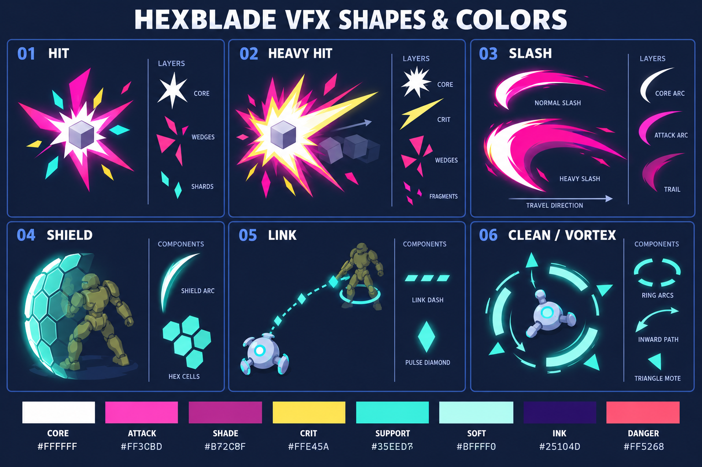
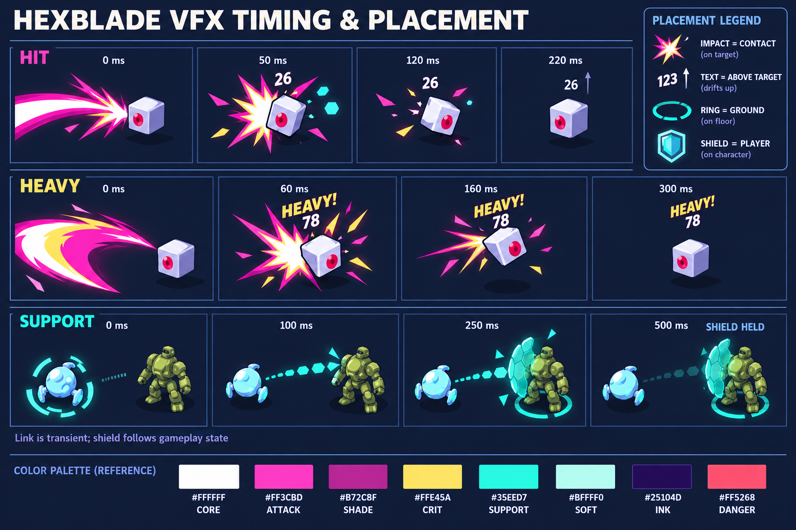

# mo.co 무드의 VFX와 배경 조정 전달 문서

클로드가 아래 컨셉 시트를 실제 게임의 효과와 배경에 적용할 때 사용할 제작 지침이다. 핵심은 **짧고 선명한 마젠타 타격, 민트색 지원 효과, 낮은 채도의 넓은 배경 면**이다. 바닥과 벽 밖 설비를 같은 밝기 배율로 처리하지 말고, 플레이 공간의 경계를 먼저 읽히게 한다.

2026년 10월 4일 현재 파일을 읽어 작성했다. 리서치 기준은 mo.co 자체이며, 프로젝트 코드는 적용 위치와 기존 동작을 확인하는 데만 사용했다. 아래 HEX 색상, 시간, 크기, 조명 변경값은 이 프로젝트를 위한 **제안값**이다. mo.co의 공식 팔레트나 실측 타이밍이 아니다. 이번 전달물은 컨셉과 기술 명세이며 게임 코드 적용 및 실행 검증은 아직 하지 않았다.

## 전달 파일과 확인 순서

| 파일 | 용도 |
|---|---|
| [형태와 색상 시트](../output/moco-vfx-handoff-20261004/01_vfx_shapes_colors.png) | 타격, 강타, 검 궤적, 보호막, 연결, 청소 소용돌이의 형태와 구성 요소 |
| [시간과 배치 시트](../output/moco-vfx-handoff-20261004/02_vfx_timing_placement.png) | 접촉점, 대상 위 숫자, 바닥 고리, 플레이어 보호막의 배치와 변화 |
| [정확한 색상칩](../output/moco-vfx-handoff-20261004/exact_palette.svg) | 그라디언트 없는 sRGB 색상 12개 |
| [색상과 프리셋 JSON](../output/moco-vfx-handoff-20261004/palette_and_presets.json) | 구현 시 옮길 색상과 제안 수치. 실행 설정 파일은 아님 |
| [이전 화면 무드 시안](../output/moco-art-mood-20261004/01_moco_balanced_combat.png) | 배경 면과 캐릭터, 효과의 전체 관계 |
| [강타 화면 시안](../output/moco-art-mood-20261004/02_moco_heavy_hit.png) | 강한 타격의 강조 방향 |
| [지원 화면 시안](../output/moco-art-mood-20261004/03_moco_drone_support.png) | 민트 연결과 보호막의 전체 관계 |

시트는 효과를 잘 보이게 확대한 원화다. 그림의 크기와 발광량을 그대로 화면에 복제하지 말고 아래 표의 크기 제한부터 적용한다. 작은 기체와 드론은 배치 설명용이며 실제 모델 교체 기준이 아니다. 시트의 색상칩에는 생성된 명암이 있으므로 스포이드 대신 SVG 또는 JSON의 HEX 값을 사용한다.





## 색상 역할

| 역할 | 정확한 sRGB HEX | 사용 위치 |
|---|---|---|
| CORE | `#FFFFFF` | 접촉 순간의 작은 심지와 검의 앞날 |
| ATTACK | `#FF3CBD` | 공격 쐐기와 검 궤적의 넓은 면 |
| SHADE | `#B72C8F` | 궤적 뒤꼬리와 타격의 바깥 면 |
| CRIT_ACCENT | `#FFE45A` | 강타의 주요 가시 한두 개와 강조 숫자 |
| SUPPORT | `#35EED7` | 보호막 가장자리, 연결 점선, 청소 고리 |
| SOFT | `#BFFFF0` | 지원 효과의 작은 밝은 테두리 |
| INK | `#25104D` | 피해 숫자 외곽선과 형태 분리 |
| DANGER | `#FF5268` | 실제 적 위험 예고. 아군 일반 타격과 혼용하지 않음 |
| FLOOR_BASE | `#6F7BA4` | 통로 바닥의 새 기본 입력색 |
| WALL_TOP | `#A0A7D1` | 벽 윗면의 기본 입력색 |
| WALL_SIDE | `#68719D` | 벽 옆면의 기본 입력색 |
| SERVICE_BASE | `#26334F` | 벽 밖 설비실 바닥의 기본 입력색 |

색상명 `CRIT_ACCENT`와 시트의 `CRIT`는 노란 강조색을 가리킨다. **색상 사용이 치명타 기능을 뜻하지 않는다.** 강공격에는 `HEAVY!`, 실제 치명타 판정이 존재하고 발생했을 때만 `CRIT!`를 표시한다. 현재 일반 적의 `take_hit` 경로에서 임의 치명타 판정을 확인하지 못했다. 경직 중 피해 2배는 기존 규칙이며 자동으로 치명타라고 부르지 않는다.

Forward+에서 색상 텍스처와 색상 uniform에는 `source_color`를 사용한다. HEX를 sRGB 입력으로 전달하고 셰이더 안에서 선형 색상으로 처리한다. `source_color` 없는 기존 `FX`의 `deep`/`light` 같은 vec3에 넣을 때는 힌트를 추가하거나 명시적으로 선형 변환하는 한 경로를 선택한다. 두 번 변환하지 않는다. 노멀과 거칠기 데이터에는 색상 힌트를 붙이지 않는다. [Godot 색상 uniform 문서](https://docs.godotengine.org/en/stable/tutorials/shaders/shader_reference/shading_language.html#using-source-color)

## 효과별 제작 명세

아래 시간은 효과 발생부터의 경과 시간이다. 월드 크기는 m이며 적 폭은 카메라에서 읽히는 몸체 폭을 기준으로 한다. 크기를 피해량에 비례해 무제한 확대하지 않는다.

| 효과 | 형태와 색상 | 배치 | 시작 수치 제안 |
|---|---|---|---|
| 일반 타격 | 비대칭 6각 별 심지, 마젠타 쐐기 3개, 작은 민트 마름모 3~4개. 흰 심지는 전체 효과 면적의 20% 이하 | 실제 접촉점. 긴 가시가 타격 방향을 따라감 | 지름 적 폭의 0.6~0.9배. 심지 70ms, 큰 면 150ms, 잔광 포함 220ms 내 종료 |
| 강타 | 비대칭 8각 별, 노란 주가시 1~2개, 마젠타 바깥 쐐기, 파편 4~6개. 흰 면적 30% 이하 | 실제 접촉점. 적을 가리는 원형 판 대신 한쪽으로 긴 형상 | 지름 적 폭의 1.2~1.6배. 심지 70ms, 큰 면 160ms, 잔광 300ms 내 종료 |
| 검 궤적 | 속이 빈 초승달. 흰 앞날, 마젠타 몸체, 짙은 마젠타 꼬리 | 실제 검 동작의 평면과 진행 방향. 수평 및 수직 공격을 구분 | 일반 110~150°, 두께/반지름 0.10~0.16, 120ms. 강타 150~190°, 0.16~0.24, 180ms |
| 보호막 | 매우 옅은 곡면과 큰 육각 셀 5~8개. 기본 민트, 맞은 방향만 SOFT로 강조 | 플레이어에 붙임. 실루엣과 무기를 읽을 수 있게 앞쪽 넓은 면을 비움 | 기존 반지름 1.15m를 출발점으로 사용. 전개 250ms. 면 alpha 0.04~0.10, 테두리 0.35~0.55. 피격 강조 100ms |
| 드론 연결 | 가는 점선과 마름모 펄스 2~3개. 노즐에서 플레이어로 진행 | 노즐 월드 위치 → 플레이어 몸체 연결점. 움직이는 양 끝을 매 프레임 갱신 | 폭 0.03~0.06m, 선분 0.18m/빈칸 0.12m, 기본 350ms. 회수 등 기존 호출의 250ms도 유지 가능 |
| 청소와 볼텍스 | 빈 중심, 끊어진 호 3개, 안쪽으로 이동하는 작은 삼각 파편 6~8개 | 일반 청소는 오염 → 노즐. 볼텍스는 바닥의 실제 범위 → 플레이어 중심 | 바닥 `Main.gy(pos)+0.05m`. 고리 두께/반지름 0.015~0.025. 볼텍스 당김 0.75초는 기존 동작 유지 |

별은 안쪽/바깥쪽 반지름을 번갈아 연결한 삼각형 팬으로 만들고, 한두 개 바깥 꼭짓점만 길게 늘린다. 쐐기와 파편은 삼각형 또는 마름모로 분리해 큰 윤곽을 유지한다. 검 궤적은 기존 `_build_arc_mesh`처럼 안쪽과 바깥쪽 반지름을 연결하되, 꼬리 끝의 폭과 alpha가 함께 줄어들게 한다. 흐릿한 연기 텍스처와 큰 흰 원판은 이 시트의 타격 형태에 쓰지 않는다.

청소 소용돌이의 시트 그림은 구조 설명이다. 현재 볼텍스는 반지름 8m이므로 실제 범위 표시 지름은 16m가 된다. **가느다란 바깥 범위 호**와 **중앙의 짧은 흡입 파편**을 나누고, 16m 전체를 불투명 민트 판으로 채우지 않는다. 기존 피해 및 경직 범위는 당김 범위와 다를 수 있으므로 링을 보고 판정을 확대하지 않는다.

### 타이밍 해석

일반 타격 시트의 0/50/120/220ms는 접촉 → 펼침 → 파편 감소 → 타격 소멸을 보여준다. 실제 숫자는 220ms 이후에도 남아 총 550ms 정도 표시한다. 강타 0/60/160/300ms는 효과 강조와 기체 반응의 관계를 보여주며 **모든 적을 300ms에 착지시키라는 지시가 아니다.** 기존 SPIN/LAUNCH 반응은 0.5초이므로 그 동작을 보존한다.

지원 시트의 500ms는 연결이 사라지고 보호막이 남아 있는 상태다. 그림의 희미한 연결 흔적은 설명용이다. 구현의 350ms 연결이 종료되면 선분을 제거한다. 보호막 지속 시간은 기존 `SHIELD_TIME=10.0`과 소모/파괴 상태를 따른다. 500ms에 보호막을 지우지 않는다.

### 셰이더와 겹침

마젠타 몸체는 `unshaded` 색상 면으로, 흰 심지와 작은 밝은 가장자리만 제한된 HDR 강조로 만든다. 넓은 보호막 면은 `blend_mix`로 투명도를 직접 제어하고 작은 테두리에만 별도 발광을 사용한다. 현재 `DroneFX` 보호막은 additive이며 `ALPHA`를 쓰지 않으므로 위 alpha 수치를 옮기려면 셰이더 구조를 함께 바꿔야 한다. `Pal.flat_mesh` 역시 현재 색상 alpha만으로 반투명 면을 만들 수 없다.

월드 VFX는 깊이 검사를 유지한다. `depth_draw_never`는 깊이 기록을 막는 것이며 벽 뒤 효과를 보이게 하는 옵션이 아니다. `depth_test_disabled`를 기본으로 쓰지 않는다. 투명 타격 판은 카메라를 향하게 하되 접촉 위치를 유지하고, 현재 `HitSpark.PULL=0.7m`은 0.10~0.25m부터 재조정해 벽 너머로 튀어나오는지 확인한다. 모든 VFX 메시의 그림자 투사를 끈다. 바닥 호는 경사 지형에 묻히거나 떠 보이지 않게 바닥 높이를 샘플링한다. [Godot spatial 셰이더 문서](https://docs.godotengine.org/en/stable/tutorials/shaders/shader_reference/spatial_shader.html)

원화의 빛 번짐을 재현하려고 효과마다 OmniLight를 추가하지 않는다. 일반 타격과 연결에는 실제 조명 노드를 쓰지 않고 머티리얼과 후처리만 사용한다. 지속 보호막 내부가 하얗게 쌓이면 넓은 면의 additive부터 줄인다.

### 숫자와 상태 텍스트

| 표시 | 색상과 크기 제안 | 수명과 위치 |
|---|---|---|
| 일반 피해 | 흰색 28px, INK 외곽선 2~3px | 550ms. 대상 윗면 월드 앵커를 화면으로 투영한 위치에서 위쪽 24px, 조금 상승하며 소멸 |
| 강타 피해 | 노란 강조 40px 또는 `HEAVY!` 34px + 흰 숫자 | 650ms. 일반 숫자보다 한 단계 강조 |
| 실제 상태 변화 | 민트 34px. 예: 실제 기절 진입 시 `STUN!` | 700ms. 상태 진입 시 한 번만 표시 |

1280×800을 기준으로 화면 높이/800 배율을 적용한다. 일반 숫자는 0.08초 정도의 짧은 합산 창으로 연사 중복을 줄이고 대상당 최대 2개, 화면 전체 최대 16개부터 시작한다. 대상 사망 뒤에는 마지막 유효 위치에서 소멸한다. 카메라 뒤는 숨기고 UI 패널을 가리지 않게 배치한다. 벽에 가려진 대상의 숫자를 숨길지 월드 앵커 가림 검사로 결정한다.

현재 훈련장의 `_damage_number`는 `Label3D`, 큰 외곽선, 깊이 검사 해제를 사용한다. 일반 전투 전체에 같은 숫자가 이미 구현돼 있다고 전제하지 않는다. `HUD.popup`은 처음 위치만 투영하므로 지속 추적이 필요한 피해 숫자는 별도 관리자 또는 매 프레임 앵커 갱신이 필요하다. 훈련장 기록과 일반 표시를 동시에 호출해 두 번 뜨지 않게 한다.

**보호막은 적을 기절시키지 않는다.** 이전 지원 화면 시안의 `STUN!`을 보호막 발동 결과로 연결하지 않는다. 현재 볼텍스 종료 후 살아 있는 일반 적에 호출되는 `stagger(dir,1.1)`처럼 실제 상태 변경이 있을 때만 표시한다. 26과 78은 예시 숫자이며 실제 유효 피해량을 표시한다.

## 현재 코드와 적용 위치

| 현재 파일과 진입점 | 확인한 상태 | 클로드가 적용할 내용 |
|---|---|---|
| `scripts/presentation/hit_spark.gd`의 `spawn` | 주황 방추 여러 겹. 같은 적 최소 간격 45ms, 카메라 방향 보정 0.7m | 일반/강타 프리셋으로 별과 쐐기를 분기. 기존 연사 제한 유지. 대상별 크기 상한 적용 |
| `scripts/enemy.gd`의 `take_hit`, `_hit_spark`, `_hurt` | 실제 피해 확정 및 피격 반응 경로. 경직 중 피해 2배. 피격 반응 RECOIL/TWIST/CRUMPLE/SPIN/LAUNCH 존재 | 확정된 피해와 source로 표시 이벤트를 한 번 발생시킴. 피해 공식, 넉백, 패링 준비 공격의 취소 금지를 보존 |
| `scripts/fx.gd`의 검 궤적 | 호 메시 및 `deep`/`light` 인스턴스 값 사용 | 흰 앞날/마젠타 몸체/짙은 꼬리로 색상과 폭 분리. 실제 공격 범위와 타이밍을 변경하지 않음 |
| `scripts/drone/drone_fx.gd`의 `Shield`, `tether`, `vortex_disc` | 구체 보호막, 매끈한 연결 봉, 온전한 고리 3겹 | 큰 육각 셀, 점선 연결, 끊어진 호로 교체. 현재 격자를 셀 수만 줄여 육각이라고 부르지 말고 실제 육각 마스크나 메시 사용 |
| `scripts/drone/partner_drone.gd` | 보호막/흡입/경직의 실제 판정 관리. 현재 합체 Q, 스킬 X, 직접 청소 Z | 표시를 실제 이벤트에 연결. 키와 게이지, 새로 추가된 Q 길게 누르기 회전 공격은 현행 코드 유지 |
| `scripts/training/training_main.gd`, `scripts/hud.gd` | 훈련장 숫자 및 화면 팝업 구현 | 일반 전투에서 재사용할 표시 관리 경로를 정하고 중복/가림/화면 크기 대응 |

기체의 피격 동작은 기존 5종을 사용한다. 새 VFX 작업으로 `Engine.time_scale`, 기절 시간, 이동 속도, 공격 취소 규칙을 추가 변경하지 않는다. 특히 `parry_committed()` 중 경직과 넉백을 막는 기존 규칙을 통과시켜야 한다. 피해 숫자를 위해 두 번째 `take_hit`를 호출해서는 안 된다.

## 배경을 조정하는 이유와 구조

현재 `BrawlLook`은 바닥과 벽 등 월드 재질에 `WORLD_VALUE=0.6`, `WORLD_SAT=0.5`, 같은 차가운 tint를 적용한다. 이 경로만 밝게 하면 벽 밖 설비도 함께 떠오른다. 변경은 **통로 바닥, 벽의 윗면과 옆면, 벽 밖 설비**를 나누는 방식으로 한다. 기존 방 크기, 벽 높이, 충돌, 카메라, 프랍 배치는 첫 조정에서 유지한다.

아래 값은 적용 전 시작안이다. HEX는 머티리얼 입력색이며 최종 화면 픽셀이 같은 HEX가 되는 것은 아니다. 선형 색상 변환, 조명, 그림자, 톤매핑과 글로우가 화면색을 바꾼다.

| 항목 | 현재 확인값 | 첫 조정 제안 |
|---|---|---|
| 통로 바닥 | 원본 F01 텍스처 × `WORLD_VALUE 0.6`, sat 0.5 | FLOOR_BASE를 새 기본색으로 쓰고 원본 명암을 12% 강도로 압축. 별도 floor_value 0.78 |
| 벽 | 같은 WORLD 배율 | 윗면 WALL_TOP, 옆면 WALL_SIDE. 별도 wall_value 0.80. 기존 붓질은 낮은 강도로 남김 |
| 벽 밖 설비 프랍 | MultiMesh도 월드 배율 0.6 | 별도 service_prop_value 0.38부터 시작. 발광 마스크 유지 |
| 벽 밖 설비 바닥 | 별도 `service_floor.gdshader`, base `(0.165,0.19,0.30)`, 명암 비율 0.45~1.6 | SERVICE_BASE, 디테일 강도 0.10. 거리 어두워짐 `COLOR.r` 유지 |
| 일반 월드 채도 | 0.5 | 역할이 없는 월드 fallback만 0.35. 새 기본색을 만든 바닥에 다시 같은 보정을 중복하지 않음 |
| 해 | energy 1.15, rotation `(-56,-104,0)` | 유지 |
| 환경광 | energy 0.72, color `(0.74,0.76,0.92)` | 유지 |
| 그림자 opacity | 0.62 | 0.50 |
| SSAO | intensity 0.70 / radius 0.70 | intensity 0.45 / radius 0.70 |
| 일반 상태 glow | intensity 0.40 / bloom 0 / HDR threshold 1.1 | intensity 0.25 / bloom 0 / threshold 1.1 |
| 설비 발광 배율 | `LAMP_ENERGY=2.2` | 1.0부터 비교. 마스크 바깥면은 발광하지 않음 |
| 캐릭터 | CHAR_SAT 1.32 / CHAR_VALUE 1.06 / RIM 0.68 | 첫 조정에서 유지 |

### 통로 바닥 셰이더

`scripts/claude_background/bg_floor.gdshader`만 고쳐서는 BrawlLook이 켜진 화면을 바꿀 수 없다. `BrawlLook.convert_one`이 해당 셰이더를 인식해 자체 `FLOOR` 및 `_floor_for` 재질로 바꾸기 때문이다. **실제로 사용되는 `BrawlLook.FLOOR`와 `_floor_for`에 새 uniform과 기본값을 넣는다.** 룩을 끈 상태도 같은 아트가 필요하다면 원본 셰이더 경로를 별도로 맞추되 토글 복원을 유지한다.

현재 F01의 2048×2048 텍스처를 64×64 규칙적 중심점으로 샘플링해 sRGB를 선형으로 변환했을 때 휘도 평균은 약 0.06699였다. 이것은 디테일 압축용 임시 기준이다. 얇은 줄눈을 놓칠 수 있으며 전체 픽셀 정밀 평균이나 실제 화면 밝기가 아니다. [측정 기록](../output/moco-vfx-handoff-20261004/texture_measurements.json)

아래는 기존 fragment의 색상 계산을 교체할 **부분 코드 제안**이다. 완성 셰이더가 아니며 기존 UV, 노멀, LIGHT, roughness 처리를 함께 보존해야 한다.

```glsl
// 선언부에 추가. floor_base의 입력은 sRGB #6F7BA4.
uniform vec3 floor_base : source_color = vec3(0.435294, 0.482353, 0.643137);
uniform float floor_value = 0.78;
uniform float detail_strength = 0.12;
uniform float detail_mean = 0.06699;

// fragment 안에서 기존 world-space UV로 읽은 텍스처 사용.
// albedo_tex에도 기존 source_color 힌트를 유지.
vec3 tex_linear = texture(albedo_tex, uv).rgb;
float luma = dot(tex_linear, vec3(0.2126, 0.7152, 0.0722));
float detail = clamp(1.0 + (luma / max(detail_mean, 0.001) - 1.0)
                     * detail_strength, 0.78, 1.18);
ALBEDO = floor_base * floor_value * detail;
// 기존 WORLD_VALUE / WORLD_TINT / sat 계산을 여기에 다시 곱하지 않는다.
```

월드 XZ 기준 4m 텍스처 반복, 2m 타일 경계, 방마다 쓰는 `offset` 위상을 유지한다. 작은 얼룩은 압축하고 길을 가르는 줄눈은 별도 경계 마스크로 남긴다. 줄눈의 화면 밝기 차이는 바닥 대비 약 0.04~0.06부터 시작하며 카메라 거리에서 점박이처럼 보이면 낮춘다. 벽 옆에 붙은 진한 AO는 먼저 위 표의 SSAO로 줄인다.

### 벽 윗면과 옆면

W01 및 반복 벽 블록은 `ClaudeBgDress`의 `claude_bg` 메타데이터(`blocks_wall`, `blocks_cover`, `blocks_pillar` 등)를 따라 역할을 분류한다. 단순히 크기가 4.5m보다 큰 모든 메시를 벽 팔레트로 바꾸지 않는다. 일반 `MeshInstance3D`와 `MultiMeshInstance3D` 모두 처리한다.

벽 셰이더에서 월드 노멀의 Y 성분을 vertex varying으로 fragment에 전달하고 `smoothstep(0.35,0.80,world_normal.y)`로 윗면 비중을 만든다. WALL_SIDE와 WALL_TOP을 그 비중으로 섞고 별도 wall_value 0.80을 적용한다. 기본색 교체 비중은 0.65부터 시작해, 남은 0.35에 원본 텍스처의 저채도 색을 사용한다. 명암 압축은 벽이 실제 사용하는 UV 영역에서 구한 기준값으로 한다. F01의 0.06699를 벽에 그대로 쓰지 않는다.

W01 아틀라스 전체에는 사용하지 않는 검은 공간이 있어 전체 평균이 실제 벽 면의 밝기를 대표하지 않는다. 해당 아틀라스의 전체 평균 0.08876으로 벽을 정규화하면 잘못된 결과가 날 수 있다. 윗면/옆면 실제 UV 영역 또는 실제 렌더 영역을 따로 측정한다.

### 벽 밖 설비와 어두운 바닥

`ClaudeServiceDress`의 `claude_service` 메타데이터와 `Service_` MultiMesh를 설비 역할로 분류한다. 바닥은 이미 별도 `service_floor.gdshader`를 사용하며 BrawlLook의 F01 교체 분기에 들어가지 않는다. **이 셰이더는 별도로 수정한다.** SERVICE_BASE에 약 10%의 텍스처 명암을 곱하고 기존 `COLOR.r` 거리 감쇠를 마지막에 유지한다. 통로 바닥 공식에 WORLD 배율을 더 곱하는 방식으로 중복 보정하지 않는다.

바닥 Y=-1.0, 설비 배치, 충돌은 유지한다. 배수 격자 비율 `grate_rate`는 0.32에서 0.20으로 낮추는 안부터 비교한다. 배관과 탱크의 큰 실루엣은 남기고 작은 반복 표면 대비를 줄인다. 상태등은 원본 emission 마스크와 민트/노랑 색을 유지하면서 에너지만 낮춘다. 넓은 탱크 표면 전체가 발광하도록 바꾸지 않는다.

### 재질 캐시와 외곽선

`BrawlLook.material_for`는 원본 재질의 `bl_world`/`bl_body` 메타데이터에 변환 재질을 붙이며 캐시가 있으면 즉시 반환한다. 같은 원본을 벽과 설비가 공유하면 단일 world 캐시로는 두 역할을 다르게 칠할 수 없다. 원본 재질에 붙이는 유한한 역할 키(예: `bl_moco_wall`, `bl_moco_service`) 또는 역할별 고정 재질 집합을 사용한다. 새 노드 감시 경로에서도 동일하게 분류한다.

이미 만들어진 캐시는 상수만 바꾸고 `apply`를 다시 호출해도 uniform이 자동 갱신되지 않는다. 튜닝 시 기존 재질의 uniform을 명시적으로 갱신하거나 앱을 다시 시작한다. 토글 복원용 `bl_orig`/`bl_surf`와 원본 메시 재질을 보존한다. `Pal.lit` 등 캐시 키에 무작위 실수를 직접 넣지 말고 고정 팔레트와 크기 단계, 또는 `snappedf`를 사용한다.

월드 재질의 `spec_k=0`, `rim=0`, `out_rough=0.5`는 유지한다. 특히 `ToonOutline`은 roughness 0.42~0.58을 월드 분류에 사용한다. 보기 좋은 물리 거칠기를 넣으려고 0.9로 바꾸면 벽이 캐릭터처럼 외곽선 처리될 수 있다. 이 값은 현재 분류 계약도 겸한다. 이미 별도인 설비 바닥의 거칠기를 통일하기 위해 바꾸지는 않는다.

### 조명과 레이저 암전

`BrawlLook.LIGHT`의 `LIGHT_IS_DIRECTIONAL` 분기를 보존한다. 해만 셀 음영을 사용하고 점광원은 기존 `LIGHT_COLOR × ATTENUATION × clamp(ndl,0,1)` 경로를 유지한다. 점광원 감쇠에 셀 임계값을 적용하거나 입사각을 무시하면 레이저 때 바닥이 넓게 하얘질 수 있다. 림라이트도 해가 꺼지면 같이 약해지도록 현재 directional light 경로를 유지한다.

glow 0.25를 적용할 때 `_grade`와 `base_light`의 복귀값을 함께 바꾼다. `Main.dramatic(false)`가 `base_light`를 사용하므로 한 곳만 바꾸면 레이저가 끝난 뒤 0.4로 돌아간다. 변경하는 모든 Environment 속성은 `_orig` 저장/복원에 포함한다. 매 프레임 일반 조명값으로 덮어쓰면 암전 tween을 깨뜨리므로 사용하지 않는다. BRAWL 카메라 오프셋 `(0,15.9,13.3)`과 FOV 26은 첫 비교에서 유지한다.

넓은 밝은 영역이 번져 형태를 덮으면 발광 재질의 면적과 에너지를 먼저 줄이고 일반 상태 glow를 낮춘다. glow bloom은 0으로 유지한다. HDR threshold는 1.1에서 시작한다. 이 수치는 원본 팔레트와 기체가 보이는 실제 캡처에서 조정해야 한다. [Godot glow 문서](https://docs.godotengine.org/en/stable/tutorials/3d/environment_and_post_processing.html#glow)

## 구현 순서와 통과 조건

1. 같은 seed와 카메라에서 전투 없는 화면을 캡처하고 바닥/벽/설비 재질 역할을 분리한다. 먼저 배경 색상과 SSAO만 조정한다.
2. 일반 타격 한 종류를 새 프리셋으로 교체한다. 대상 폭에 맞춘 크기, 짧은 흰 심지, 벽 가림, 연사 제한을 확인한 후 강타와 검 궤적을 추가한다.
3. 피해 숫자와 상태 표시를 실제 이벤트에 연결하고 훈련장 중복을 제거한다. 기존 피격 5종과 패링 공격 유지 규칙을 확인한다.
4. 보호막, 연결, 청소와 볼텍스를 교체한다. Q/X/Z와 게이지, 보호막 소모, 실제 흡입/피해/경직 범위를 유지한다.
5. 다수 적 전투, 레이저 암전, 룩 토글, 다른 씬, 반복 로드를 검증한다.

비교 캡처는 무효과/일반 타격 최대/강타 최대/보호막 유지/볼텍스/레이저 암전 및 복귀를 포함한다. 1280×800과 사용자의 넓은 화면 비율에서 큰 외곽선과 숫자가 겹치는지 확인한다. 회색 화면에서도 캐릭터 윤곽과 통로/벽 경계가 구분되어야 한다. 실제 접촉점, 기체 몸, HP 바가 동시에 읽혀야 한다.

밝기는 전체 화면 평균보다 같은 위치의 조용한 작은 영역을 비교한다. 화면 sRGB 휘도 근사 `Y=0.2126R+0.7152G+0.0722B`를 비교용으로 쓴다면 이것은 선형 물리 휘도가 아니라는 점을 기록한다. 첫 검토 기준으로 벽 윗면은 인접 바닥보다 Y 약 0.08 이상 구분되고, 벽 밖 설비 바닥은 통로의 65% 이하로 남는지 본다. 캐릭터 가장자리와 바로 옆 배경은 밝기 차이 약 0.10 또는 충분한 색상 차이가 있어야 한다. 이 기준은 제안이며 게임 화면을 보지 않고 통과를 주장하지 않는다.

효과 예산은 전체 동시 타격 묶음 24개, 총 파편 약 96개, 지속 보호막은 해당 플레이어당 1개부터 시작한다. 넘으면 먼 대상 파편과 잔광부터 줄이고 플레이어 근처의 위험 예고는 남긴다. 이 예산은 측정된 성능 한계가 아니며 실제 GPU 프레임 시간과 투명 면 겹침을 확인해 조정한다. 큰 효과 하나에 여러 겹의 전체 화면 투명 판을 쌓지 않는다.

후속 구현 시 프로젝트의 고정 Godot 실행기를 사용한다. 아래는 **클로드가 구현 후 실행할 검증 명령**이며 이번 문서 작업에서 실행한 결과가 아니다.

```powershell
powershell -File tools\run_tests.ps1
powershell -File tools\godot.ps1 wait --fixed-fps 60 res://scenes/main.tscn -- --bot --seed=1 --seconds=60
powershell -File tools\godot.ps1 wait --fixed-fps 60 res://scenes/training.tscn -- --bot --seed=1 --seconds=60
powershell -File tools\godot.ps1 wait --fixed-fps 60 res://scenes/drone.tscn -- --bot --seed=1 --seconds=60
powershell -File tools\godot.ps1 wait --headless --fixed-fps 60 -s res://_capture/leak_probe.gd -- --probe=res://scenes/main.tscn --frames=1200 --loads=5 --bot --godmode --capture= --seconds=9999
```

전체 검사 PASS와 bot의 ERROR/SCRIPT ERROR 0, 실제 렌더의 형태·색상·숫자 가독성, 같은 시점 반복 로드에서 노드/고아/정적 캐시가 계속 증가하지 않음을 함께 확인한다. 변경하는 기능에 필요한 검사만 추가한다. 임포트가 필요한 새 파일은 `.uid`/`.import`도 함께 보존한다.

## 리서치 링크

mo.co의 설정과 게임 화면은 [공식 홈페이지](https://mo.co/), [공식 스토어](https://play.google.com/store/apps/details?id=com.supercell.moco), 아트 자료는 [공식 크리에이티브 허브](https://mo.co/ko/creative-hub/)를 기준으로 확인했다. 이 문서의 마젠타/민트 역할 분리와 수치들은 그 자료를 참고해 제안한 제작 방향이다.

mo.co는 2025년 6월 26일 변경사항에서 붉은 피격 섬광을 줄였다고 명시했다. 이를 가독성 참고로 삼되 공식 문서가 특정 HEX나 이 시트의 별 모양을 규정한 것으로 해석하지 않는다. [공식 변경사항](https://mo.co/en/news/release-notes/xp-improvements/)

이전 리서치의 관찰과 제안 구분, 참조 파일 목록은 [research.txt](../output/moco-art-mood-20261004/research.txt)와 [references.json](../output/moco-art-mood-20261004/references.json)에 있다. 초기 화면 시안에 있던 `CRIT!`/`STUN!`은 연출 제안이었다. 이번 문서의 실제 이벤트 조건이 구현 기준이다.

## 클로드에게 전달할 요청문

> 첨부된 두 VFX 시트와 `docs/moco-vfx-claude-handoff.md`를 기준으로 효과와 배경을 적용해줘. 색상은 그림에서 뽑지 말고 `palette_and_presets.json`의 sRGB HEX를 사용해줘. 일반/강타 임팩트, 검 궤적, 보호막, 연결, 청소·볼텍스의 형태와 시간을 나누고 실제 피해/상태 이벤트에 연결해줘. 바닥·벽·벽 밖 설비를 따로 보정하고 실제 BrawlLook 셰이더 교체 경로와 캐시도 처리해줘. 현재 Q 합체와 기존 피격 5종, 패링 준비 공격 유지, 보호막과 볼텍스 판정, 점광원 감쇠와 레이저 암전 복귀는 보존해줘. 구현 후 같은 seed 캡처와 고정 Godot 테스트/bot/반복 로드로 검증해줘. 문서 수치는 적용 전 시작안이므로 실제 화면을 보고 조정하고 결과를 기록해줘.
