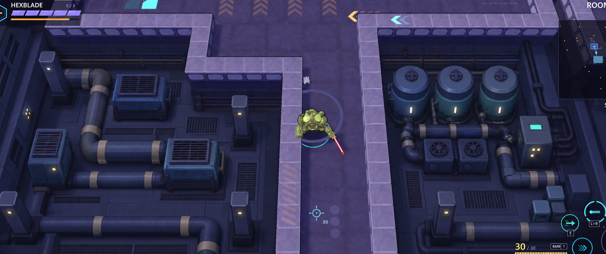
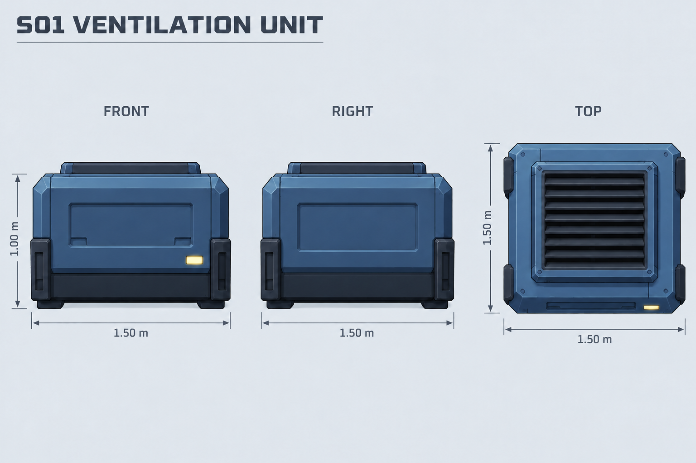
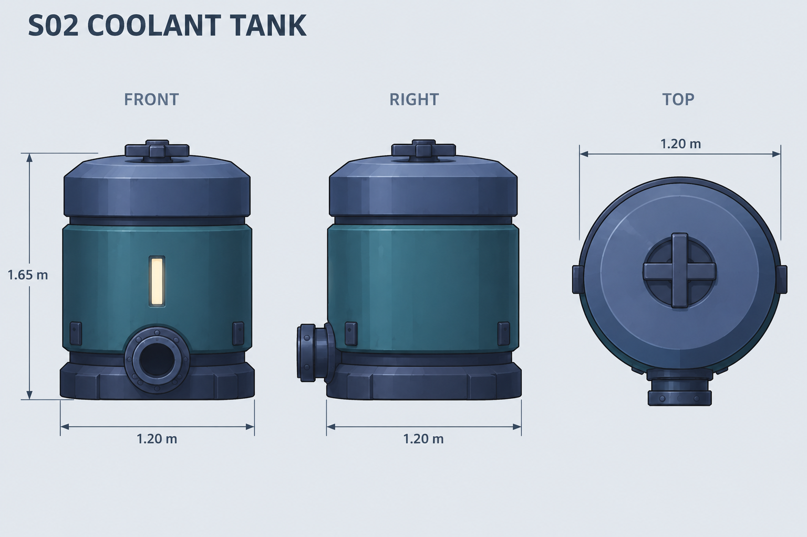
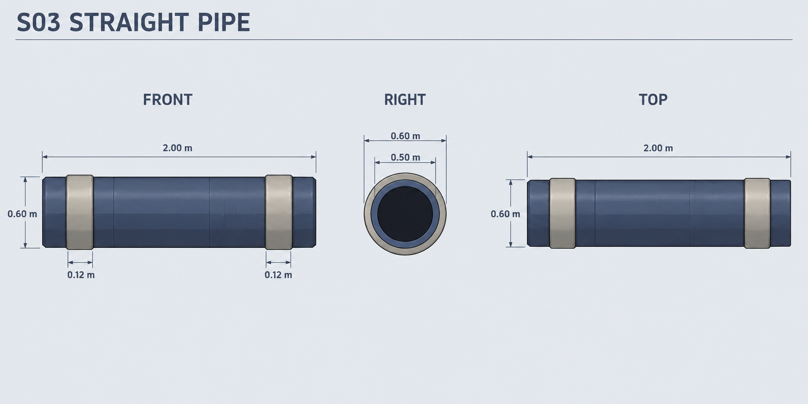
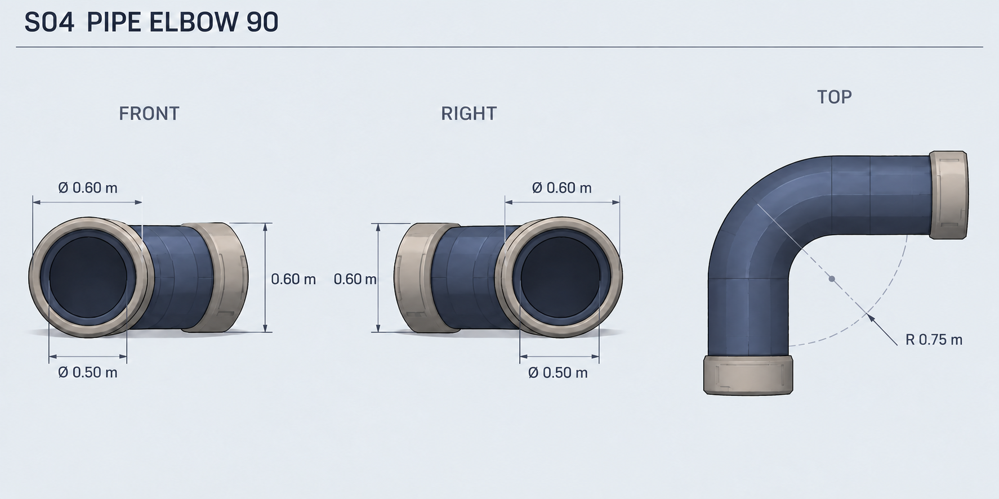
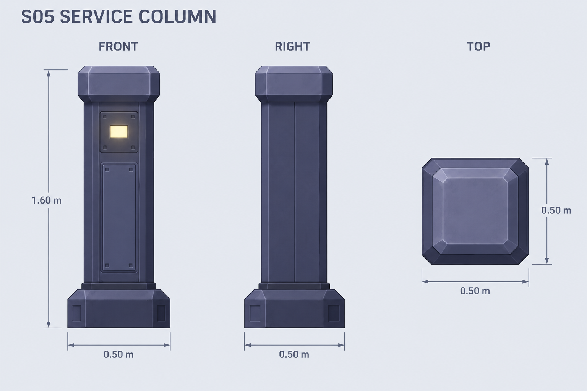

# Claude 인수인계 — 1번 설비실 컨셉과 최소 프랍 5종

작성: 2026-10-04 · 대상: Claude · 저장소 루트의 [AGENTS.md](../AGENTS.md) 규칙을 함께 따른다.

사용자는 실제 게임 화면의 검은 비플레이 공간을 모델링으로 채우는 **1번 배관·설비실 합성안**을 선택했다. 이 분위기를 만들기 위해 신규 프랍은 **5개만** 선별했고, 각 프랍의 정면·우측면·윗면 참고도를 준비했다.

현재 완성된 것은 컨셉 원화, 프랍 목록, 3면도와 이 인수인계 문서다. **이번 요청은 문서 작성이며 모델링·게임 적용은 아직 시작하지 않았다.** 아래 제작 순서는 후속 제작을 위한 기준이다.

## 1. 선택된 컨셉 원화

**공간과 분위기는 아래 원화를 우선 참고한다.** 기존 보라색 통로와 벽은 그대로 두고, 좌우의 검은 영역을 한 층 낮은 설비실처럼 보이게 채우는 방향이다.

- [1번 원화 원본 PNG](../output/dark-space-paintovers-20261004/01_service_machinery.png)
- [합성 전 게임 스크린샷](../output/dark-space-paintovers-20261004/source_screenshot.png)
- [프랍 자료 폴더의 같은 원화 사본](../output/service-machinery-kit-20261004/approved_concept.png)

원화에서 가져올 핵심은 **왼쪽의 사각 환기 장치, 오른쪽의 원통 탱크 3개, 굵은 배관이 연결하는 흐름, 반복되는 설비 기둥**이다. 기계를 조금씩 다르게 만들어 수를 늘리기보다, 같은 모델의 방향과 배치를 바꿔 설비실을 구성한다.

색과 재질은 어두운 남색·파란 회색·보라 회색의 넓은 면, 두툼한 베벨, 적은 패널선으로 정리한다. 탱크의 청록 몸통과 작은 노랑·민트 상태등만 제한적으로 강조한다. 중앙 플레이어와 이동 경로가 계속 가장 잘 보여야 한다.

이 원화는 내장 이미지 생성 도구로 실제 스크린샷을 편집한 컨셉이다. 원본은 3132×1317, 합성 결과는 1933×813이며 미세한 재표현이 있다. 픽셀 좌표나 그려진 배관 길이를 실제 게임 치수로 곧바로 환산하지 않는다.

## 2. 필수 모델 목록 — 총 5개

**5개 모델 / 4개 설비 계열**이다. 배관의 직선과 90도 꺾임은 별도 형상이 필요하므로 각각 한 모델로 계산한다. 연결밴드·밸브·상태등·받침은 각 본체에 포함한다.

아래 크기는 게임 제작을 위한 제안값이며, 스크린샷 실측값은 아니다. 실제 게임 카메라에서 크기를 확인한 뒤 조정한다.

| ID | 프랍 | 제안 치수 (m) | 역할 |
|---|---|---|---|
| S01 | 환기 장치 | 폭 1.50 × 높이 1.00 × 깊이 1.50 | 왼쪽 통풍기와 오른쪽 펌프 덩어리를 공용 모델로 처리 |
| S02 | 냉각 탱크 | 본체 지름 1.20 × 총높이 1.65 | 오른쪽에 반복되는 원통 설비 |
| S03 | 직선 배관 | 길이 2.00 / 몸통 외경 0.50 / 밴드 외경 0.60 | 긴 설비 라인과 벽면 배관 |
| S04 | 90도 배관 | 중심선 반경 0.75 / 몸통 외경 0.50 / 밴드 외경 0.60 | 모서리에서 배관 방향 전환 |
| S05 | 설비 기둥 | 폭 0.50 × 높이 1.60 × 깊이 0.50 | 반복 상태등·간단한 제어함 역할 통합 |

### S01 — 환기 장치

- 두툼한 사각 하우징, 낮은 받침, 상단 수평 격자, 정면의 얕은 점검 패널과 작은 상태등.
- 원화 왼쪽의 큰 장치 3개는 기본 크기로 반복한다. 오른쪽 펌프 2개는 같은 모델을 약 0.8배 **균일 축소**하고 회전해 대신한다.
- 원화의 원형 팬 펌프를 별도 모델로 만들지 않고, 공통 상단 격자로 단순화한다.
- 격자는 수평이다. 정면·측면에서는 상단 프레임의 가장자리가 보이고, 윗면에서 격자 전체가 보인다.
- 높이 1.00m는 발밑부터 상단 격자 프레임까지 포함한다. 그림의 높이 치수선이 본체 상단에 가까워도 프레임 높이를 밖에 더하지 않는다.

### S02 — 냉각 탱크

- 낮고 넓은 원통, 청록 몸통, 남색 상단 캡과 받침, 낮은 십자 밸브, 정면 하부 배관 포트.
- 오른쪽 설비실에 3개를 일정 간격으로 반복한다. 밸브와 포트는 본체에 포함하고 별도 프랍으로 분리하지 않는다.
- 지름 1.20m는 원통 본체 기준이다. 포트의 앞쪽 돌출은 배치 시 별도로 고려한다. 총높이 1.65m에는 낮은 밸브도 포함한다.
- 배관 포트와 S03/S04는 제작 시 중심 높이·접속면·몸통/밴드 지름을 맞춘다. 포트 위치를 시트 픽셀만으로 확정하지 않는다.

### S03 — 직선 배관

- 남색 원통 몸통에 회크림색 연결밴드 2개. 별도 브래킷이나 받침 프랍은 추가하지 않는다.
- 기본 길이 2m 모듈을 반복해 긴 라인을 만든다. 끝단에서 S04와 중심축·접속면이 맞아야 한다.
- 긴 축은 X 방향이다. 정면과 윗면은 길게, 우측면은 원형 끝단으로 보인다.
- 벽면의 얇은 라인은 같은 배관 계열을 약 0.25배 균일 축소해 재사용한다. 축소 라인은 굵은 배관에 직접 접속하지 않는 별도 계통으로 구성한다.

### S04 — 90도 배관

- 바닥의 수평 X/Z 평면에서 휘는 둥근 배관이다. 윗면에서 ㄱ자 곡선이 보이고 정면·우측면은 낮은 높이의 투영이 보인다.
- 몸통과 밴드는 S03과 같은 지름이다. 굽힘 중심선 반경 0.75m를 기준으로 만든다.
- 별도 T자·4갈래 연결구는 이번 목록에 없다. 직선과 90도 회전만으로 원화의 큰 배관 흐름을 구성한다.
- 지름 0.50m는 몸통 **외경**, 0.60m는 밴드 **외경**이다. 그림의 구멍 안쪽을 가리키는 듯한 치수선을 안지름 규격으로 해석하지 않는다.

### S05 — 설비 기둥

- 사각 받침과 베벨 캡, 긴 점검 패널, 작은 상태등이 있는 가느다란 기둥.
- 긴 벽과 코너에 반복한다. 일부 상태등은 재질 변형으로 노랑에서 민트로 바꿔 제어함 느낌을 준다.
- 원화의 큰 사선 제어 콘솔은 이 기둥으로 대체한다. 새 콘솔·스크린·조명 프랍을 추가하지 않는다.

## 3. 모델 수를 늘리지 않는 재사용 규칙

| 원화 요소 | 처리 방법 |
|---|---|
| 통로·벽·벽 상단 | 기존 배경 모델과 경계 유지 |
| 설비실 바닥 | 기존 바닥 모델 재사용, 비플레이 구역용 어두운 재질로 구분 |
| 바닥 배수 격자 | 바닥 텍스처로 표현, 신규 그레이팅 메시 없음 |
| 왼쪽 환기 장치 / 오른쪽 펌프 | S01 반복·회전·균일 축소 |
| 냉각 탱크 3개 | S02 반복 |
| 굵은 배관 / 얇은 벽면 라인 | S03 + S04 조립, 얇은 라인은 같은 계열 축소 |
| 상태등 기둥 / 제어함 | S05 반복과 상태등 재질 변형 |
| 볼트·밴드·밸브·받침 | 본체 모델 또는 텍스처에 포함 |

독립 램프, 케이블 클립, 외곽 벽체, 작은 장식, 별도 연결구와 독립 받침대는 신규 목록에서 제외한다. 남는 공간을 작은 소품으로 전부 메우지 않는다. **최소 목록은 원화의 모든 소품을 개별 모델로 복제하는 계획이 아니다.**

## 4. 게임에서 유지할 조건

- 새 설비는 기존 벽 뒤의 비플레이 영역에 둔다. 통로 폭·이동 경로·벽 경계·전투 판정은 유지한다.
- 오른쪽은 탱크 3개, 왼쪽은 환기 장치 3개를 중심으로 구성한다. 바닥 외곽의 배관과 벽 옆 기둥이 두 공간을 연결하는 인상을 만든다.
- 설비 바닥은 통로보다 낮은 높이로 보이는 방향을 검토하되, 정확한 높이는 현행 지형과 카메라를 확인하고 정한다.
- 배경은 중앙 통로보다 어둡고 저채도로 유지한다. 상태등의 작은 밝은 면과 전체 공간을 밝히는 점광원을 혼동하지 않는다.
- 현재 본편의 배경 드레싱과 BrawlLook 연출을 고려한다. 설비가 기존 벽을 관통하거나, 화면을 덮거나, 카메라 각도에서 플레이어를 가리는 배치는 피한다.
- 정적 배경 장식으로 시작한다. 회전 팬·밸브 조작·문 개폐·파괴·신규 전투 기믹은 이 목록에 포함하지 않는다.

## 5. 제작을 시작할 때의 순서와 파일 경계

1. 최신 `git status`와 [AGENTS.md](../AGENTS.md)를 확인한다. 다른 작업자의 수정·미추적 파일을 보존한다.
2. [Blender 모델링 파이프라인](blender-modeling.md)을 따라 S01/S02/S05의 큰 덩어리와 S03/S04의 공통 접속을 먼저 만든다.
3. 게임 카메라에서 탱크·환기 장치·배관의 크기와 화면 점유를 확인한다. 실루엣을 유지하면서 패널선과 작은 디테일을 줄인다.
4. 넓은 칠한 명암과 베벨을 텍스처에 정리하고, 실제 GLB에 연결된 재질·UV·정상 노멀을 확인한다.
5. 기존 배경과 구분되는 시험 공간에서 5종을 조립한다. 원화와 같은 좌우 구성·명도 관계를 비교한 뒤 적용 범위를 정한다.

후속 제작 파일명은 아래처럼 **기존 `bg_claude_*` 4종과 겹치지 않는 이름**을 권장한다. 아래는 예정 이름이며 아직 만들어진 모델이 아니다.

| ID | 모델 원본 스크립트 | GLB |
|---|---|---|
| S01 | `models/src/bg_claude_service_s01_vent.py` | `assets/models/bg_claude_service_s01_vent.glb` |
| S02 | `models/src/bg_claude_service_s02_tank.py` | `assets/models/bg_claude_service_s02_tank.glb` |
| S03 | `models/src/bg_claude_service_s03_pipe.py` | `assets/models/bg_claude_service_s03_pipe.glb` |
| S04 | `models/src/bg_claude_service_s04_elbow.py` | `assets/models/bg_claude_service_s04_elbow.glb` |
| S05 | `models/src/bg_claude_service_s05_column.py` | `assets/models/bg_claude_service_s05_column.glb` |

Blender는 `tools/blender.ps1`, Godot는 **반드시 `tools/godot.ps1`**로 실행한다. 버전은 각각 루트의 버전 파일을 따른다. Blender +Y 정면은 내보내기 후 Godot -Z 정면이 되고, 위쪽 축은 Blender Z / Godot Y다.

제작 시 단위 1m, 접지·피벗·배관 끝단 접속 정보를 원본 스크립트와 통계에 남긴다. 비균일 스케일로 연결부 지름을 찌그러뜨리지 않는다. 공유 재질을 사용하며 무작위 색·크기를 그대로 정적 캐시 키에 넣지 않는다.

검증은 실제 내보낸 GLB의 크기·축·UV·재질·퇴화면·배관 접속과 게임 카메라에서의 가독성을 포함한다. 임포트 후 `run_tests.cmd`를 실행하고, 씬/코드를 바꾸면 해당 씬의 `--bot` 플레이에서 `ERROR` / `SCRIPT ERROR`가 0인지 확인한다. 새 `.import`/`.uid`는 원본과 함께 보존하며 커밋·푸시는 사용자가 요청할 때만 한다.

## 6. 참고 자료와 현재 상태

- [최소 프랍 목록·치수·재사용 상세](../output/service-machinery-kit-20261004/PROP_LIST.txt)
- [최초 3면도 생성 프롬프트](../output/service-machinery-kit-20261004/prompts.txt)
- [S01/S04 시점 교정 프롬프트](../output/service-machinery-kit-20261004/correction_prompts.txt)
- [S04 평면 치수 주석 교정 프롬프트](../output/service-machinery-kit-20261004/elbow_annotation_prompt.txt)
- [1번 합성안 제작 기록](../output/dark-space-paintovers-20261004/NOTES.txt)

3면도는 외형을 전달하기 위한 생성 이미지이며 CAD 정밀 투영 도면은 아니다. **공간 인상은 1번 컨셉 원화, 단품 외형은 최종 3면도, 치수와 접속 해석은 이 문서와 `PROP_LIST.txt`**를 기준으로 삼는다.

최종 이미지는 버전 접미사가 없는 `S01_ventilation_unit.png`부터 `S05_service_column.png`까지 5장이다. `S01_ventilation_unit_v1.png`, `S04_pipe_elbow_v1.png`, `S04_pipe_elbow_v2.png`는 이전 시점/주석 교정 기록으로 보존한 것이므로 제작 기준으로 사용하지 않는다.

기존 [배경 첫 제작 인수인계](background-first-pass-handoff.md)는 F01/W01/A01/A02의 별도 작업 문서다. 여기의 1번 원화는 **어두운 비플레이 공간을 채우는 설비실 합성안**이며, 이전 문서의 기본 공간 원화 번호와 혼동하지 않는다. 이번 설비 키트를 위해 기존 배경 결과를 덮어쓸 필요는 없다.

다른 PC로 전달할 때는 이 MD와 연결된 PNG·TXT를 함께 전달한다. 현재 자료는 미커밋 상태이며 문서만 복사하면 이미지가 보이지 않을 수 있다. 이번 작성에서 모델링·엔진 실행·게임 코드 수정·커밋·푸시는 하지 않았다.
