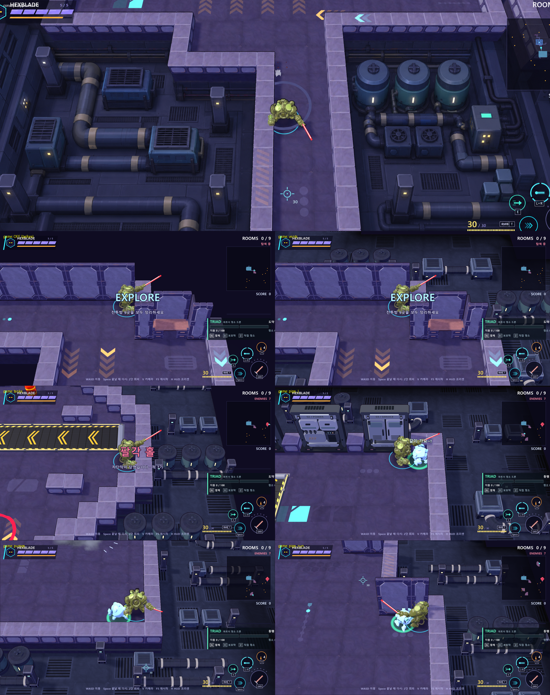

# 1번 설비실 프랍 5종 — Claude 작업 기록

2026-10-04. 기준 문서: [service-machinery-claude-handoff.md](service-machinery-claude-handoff.md) (Codex 작성 인수인계).
공간 인상은 1번 컨셉 원화, 단품 외형은 최종 3면도 5장, 치수·접속은 인수인계 문서와 `PROP_LIST.txt` 를 따랐다.

## 모델 5종

| ID | 원본 스크립트 | GLB | 크기 (Godot X×Y×Z) | 피벗 · 접속 | 삼각형 | 아틀라스 |
|---|---|---|---|---|---|---|
| S01 환기 장치 | `models/src/bg_claude_service_s01_vent.py` | `assets/models/bg_claude_service_s01_vent.glb` | 1.50 × 1.00 × 1.50 | 바닥 중심, 정면 -Z, 높이는 상단 격자 프레임 포함 | 1,912 | 2048 (272px/m) + 발광 마스크 |
| S02 냉각 탱크 | `…_s02_tank.py` | `…_s02_tank.glb` | 지름 1.20 × 1.65 (포트 0.21 돌출) | 바닥 중심, `pt_port` (0, 0.30, -0.80) | 2,612 | 2048 (299px/m) + 발광 마스크 |
| S03 직선 배관 | `…_s03_pipe.py` | `…_s03_pipe.glb` | 2.00 × 0.60 × 0.60 (긴 축 X) | 중앙 아래 바닥, `pt_end_a/b` (±1.0, 0.30, 0) | 1,180 | 2048 (512px/m) |
| S04 90도 배관 | `…_s04_elbow.py` | `…_s04_elbow.glb` | 1.05 × 0.60 × 1.05, R 0.75 | 두 축의 모서리점 아래 바닥, `pt_end_a` (-0.75, 0.3, 0) -X · `pt_end_b` (0, 0.3, 0.75) +Z | 1,432 | 2048 (512px/m) |
| S05 설비 기둥 | `…_s05_column.py` | `…_s05_column.glb` | 0.50 × 1.60 × 0.50 | 바닥 중심, 정면 -Z | 776 | 2048 (512px/m) + 발광 마스크 |

- 배관 규격 공통: 몸통 외경 0.50 · 밴드 외경 0.60(폭 0.12) · 축 높이 0.30(밴드가 바닥에 닿음) · 끝단은 축에 수직인 평면이고 짙은 구멍.
  S04 의 굽힘은 bmesh 로 단면을 중심선에 수직으로 쓸어 만들어 끝단이 S03 과 정확히 맞물린다 (`tools/blender/claude_service.py` `sweep_arc`).
- 칠: 배경 첫 제작과 같은 방식(붓질 원본 → Cycles 베이크, `claude_background_bake.py`). 팔레트 `navy/steel/slate/teal/cream/lamp/deep/void` 를 `claude_background_paint.py` 에 추가했다(기존 종류의 결과는 그대로).
  원통 재질(`*_r`)은 면 방향으로 베벨을 잡는 칠이 몸통 전체에 번지지 않게 베벨 밝은 칠을 낮췄다.
- 상태등: `bake_model(emit=...)` 로 상태등 면만 흰 발광 마스크(`*_emit.png`)를 같은 UV 로 한 번 더 구워 GLB Emission 텍스처로 넣는다.
  색·세기는 게임 코드가 정한다 → 노랑/민트 **재질 변형**(S05 제어함 느낌, 모델 추가 없음).
- 모든 메시는 한 덩어리 · 회전 없는 노드(`svc.finish`) — 게임이 MultiMesh 로 메시만 꺼내 쓰기 때문.
- 미리보기 `output/models/bg_claude_service_*/preview.png`, 통계 `stats.txt`, 베이크 정보 `bake.json`.

빌드: `powershell -File tools\blender.ps1 model models\src\bg_claude_service_s01_vent.py --engine=eevee` (5종 같음) → `tools\godot.ps1 wait --headless --import`.

## 본편 적용 — `ClaudeServiceDress`

코드 `scripts/claude_background/claude_service_dress.gd`, 바닥 셰이더 `service_floor.gdshader`. `ClaudeBgDress.apply` 끝에서 한 줄로 부른다
→ ArenaMap 을 쓰는 모든 씬(방 탐색·섹터 런·전투 테스트·기믹/벌레/배경 시험장)에 적용. **판정·지형·충돌·방 구성은 그대로**(테스트로 확인), 정적 장식만.

| 원화 요소 | 처리 |
|---|---|
| 한 층 낮은 설비실 바닥 | 벽 칸 밖 거리 1~8칸에 Y = -1.0 바닥(벽 블록 밑동과 같은 높이). F01 텍스처의 명암만 빌려 어두운 남색, 2m 타일 32% 에 배수 격자(텍스처, 메시 없음). 바깥 4칸부터 점점 어두워져 원래 어둠으로 녹아든다(외곽 벽체 없음) |
| 왼쪽 환기 장치 · 굵은 배관 | 틀 `vents`: S01 둘을 S03 하나로 잇고 S05 |
| 오른쪽 탱크 3개 | 틀 `tanks`: S02 셋, 포트 앞을 지나는 S03 둘, 배관 양끝은 S05(제어함)로 들어감 |
| 오른쪽 펌프 | 틀 `pumps`: S01 0.8배 **균일 축소** 둘 + S05 |
| ㄱ자 배관 | 틀 `pipe_l`: S05 → S03 → S04 → S01 정면 · 틀 `pipe_run`: 기둥 사이 S03 두 줄 + 펌프 |
| 반복 기둥 · 상태등 | 카메라 쪽·옆으로 드러난 벽면 바로 밖에 4칸마다 S05, 1/3 은 민트 상태등 |
| 얇은 벽면 라인 | 카메라 쪽(+Z)으로 드러난 벽면(바닥 아래 짙은 부분)에 S03 0.25배 한 줄, 밴드가 구슬처럼 보여 남색 단색 재질 변형. 굵은 배관과 접속 없음 |

- 배치: 벽에서 2~4칸 안에 닿는 자리만, 섞인 순서로 겹치지 않게(틀 둘레 1칸 비움), 3m 벽·벽감 뒤 한 줄은 비움. 같은 맵이면 같은 배치(방 중심으로 시드).
  모든 정면(상태등)은 카메라(+Z). 프랍 윗면은 최대 0.65 로 벽 윗면 0.8 보다 낮아 플레이어를 가리지 않는다.
- 그리기: 종류 × 16m 구역마다 MultiMesh(절두체 컬링). 같은 자리 측정(seed 3, 1600×900): 끄기 160k → 켜기 257k 프리미티브, 드로우 +62. 벽면 라인·바닥은 그림자를 드리우지 않는다.
- 정적 캐시(`_meshes`, `_lamp_mats`, 바닥·라인 재질)는 고정 키라 다시 불러도 늘지 않는다 (leak_probe 4회: 리소스 318 일정, 고아 0).
- 끄기: `--service=off` (설비실만) · `--bg=old` (배경 첫 제작 전체).

## 검증

- `tests/claude_service_check.gd` 52항목: GLB 크기·피벗·정면·노드 변환 없음·텍스처/발광 마스크, 배관 접속(S03 끝단 = S04 끝단, S02 포트), 본편 seed 3 배치(설비 칸 안 · 바닥 높이 · 벽보다 낮음 · 겹침 없음 · 5종 모두), 켜고 끄기에 충돌 상자·막힌 칸 동일.
- 전체 28종 PASS. main · training · run · gimmicks 60초 `--bot` ERROR/SCRIPT ERROR 0.
- 캡처 `_capture/service_show.gd` → `output/service-machinery-claude/` (`svc_<틀>_<n>.png`, `svc_off_*.png`, `svc_pair.png`, `compare_sheet.png`).

## 남은 것

- 원화보다 조금 어둡고 채도가 낮다(BrawlLook 월드 보정 + 의도한 저명도). 더 밝게 원하면 `service_floor.gdshader` `base_col` 과 재질 hi 값.
- ㄱ자 배관 틀(5×4 칸)은 좁은 띠에 잘 안 들어가 맵당 수가 적다(seed 3: S04 8개). 원화처럼 굵은 배관 흐름을 더 원하면 틀을 늘린다.
- 벽 칸의 WallProps(다른 작업물)·3m 벽 밑은 설비 바닥까지 내려오지 않는다(카메라 반대쪽이라 거의 안 보임).
- 회전 팬·밸브 조작 등 움직임은 범위 밖(정적 장식).
