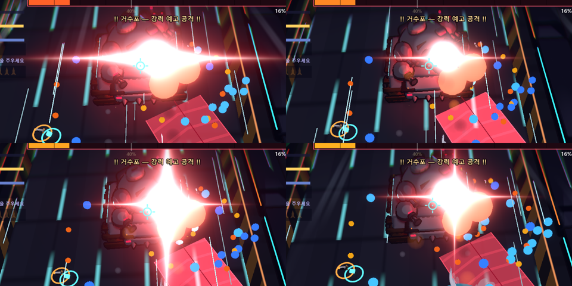
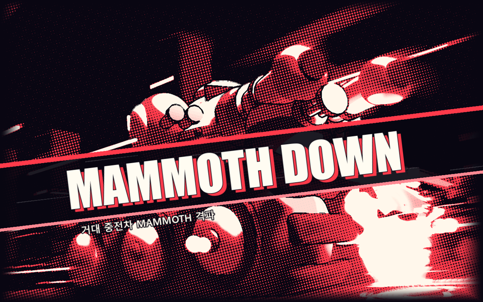
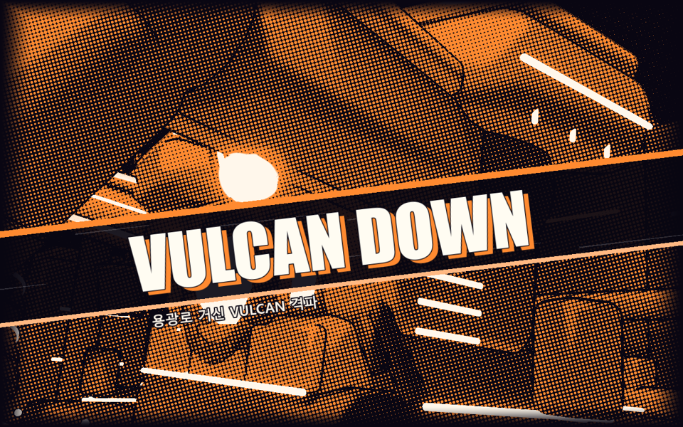
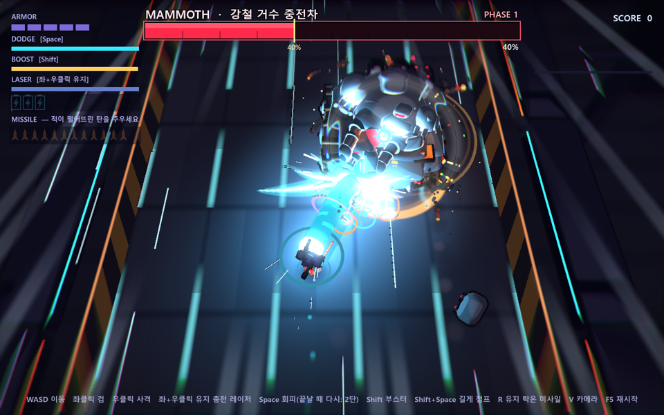
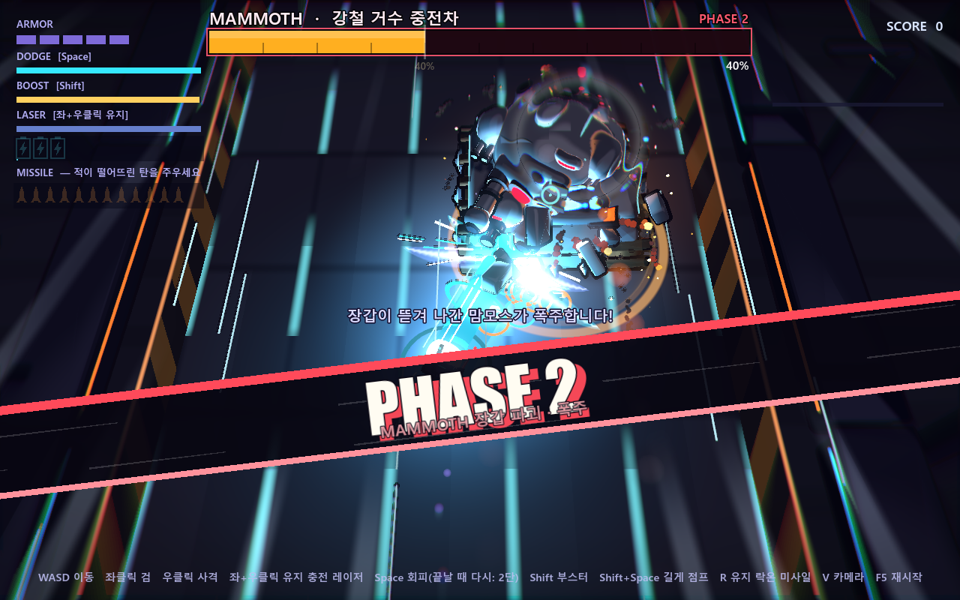

# 젠레스 존 제로식 연출 1차 적용 — 붉은 섬광 · 격파 쇼타임 · 컷인 타이포

작성일: 2026-09-30 · 앞선 분석: [`연출_비교_젠레스존제로.md`](연출_비교_젠레스존제로.md) 의 "우선순위 제안" 1·4·5번(섬광 색 규칙 2종화, 드문 순간의 정지 연출, 2D 그래픽 언어)을 실제로 구현한 기록이다.

> **원칙:** 세 가지 모두 연출 전용 모듈(`scripts/presentation/`)이다. 판정 · 피해 · 보상 · 진행은 바꾸지 않는다.
> 기존 설계 원칙("전투 속도를 끊지 않게 짧게", "패링은 글자 없이")은 유지하고, **게임을 멈추는 연출은 보스 결정타 한 번**으로 한정했다.

| # | 기능 | 새 파일 | 연결한 곳 |
|---|---|---|---|
| 1 | 붉은 섬광 + 퍼펙트 회피 | `scripts/presentation/danger_fx.gd` | `parry_fx.gd` `warn()` (붉은 변형), `striker.gd`, `crawler.gd`, `boss_enemy.gd`, `forge_boss.gd` |
| 2 | 보스 격파 쇼타임 | `scripts/presentation/showtime.gd` | `boss_enemy.gd` · `forge_boss.gd` `_begin_dying()` |
| 3 | 컷인 타이포 | `scripts/presentation/cut_in.gd` | `player.gd` `_start_mega()` · `_phantom_hit()`, 두 보스의 2페이즈 전환, 쇼타임 |
| – | 검증용 인자 | – | `main.gd` `_fast_kill()`, `boss_main.gd` `--fastp2`, `forge_main.gd` |

---

## 1. 붉은 섬광 — "막을 수 없다, 피하라"

### 무엇이 달라졌나
- 지금까지 금빛 십자 별빛은 "패링할 수 있다"는 뜻이었고, 붉은색은 바닥의 **범위 예고**(경고 띠)에만 쓰였다. ZZZ처럼 섬광 색이 **대응 방법**을 알려 주도록 규칙을 둘로 나눴다.

| 섬광 | 뜻 | 플레이어 대응 |
|---|---|---|
| 금빛 (기존) | 패링 가능 | 닿기 직전 Space → 패링 반격 |
| **붉은빛 (신규)** | 패링 불가, 강한 공격 | 범위 밖으로 피하거나 대시 무적으로 뚫고 지나간다 |

### 타이밍 규칙
- 모든 붉은 섬광은 **공격이 닿기 0.4초 전**(`Parry.TRAVEL`)에 뜬다. 패링 공격(알림 → 0.4초 뒤 명중)과 같은 리듬이라, 플레이어는 "섬광을 보고 0.4초"라는 한 가지 박자만 익히면 된다.
- 색만으로 구분하지 않도록 **두 번 맥동**(0.09초 뒤 작은 붉은 별 섬광)하고, 경고음을 금빛보다 낮게(피치 0.62배) 울린다. 색을 구분하기 어려워도 리듬과 소리로 알 수 있다.

| 공격 | 섬광 시점 | 판정 위치 |
|---|---|---|
| 요격기 차지 레이저 | 조준 고정 순간 (`BEAM_TRACK` 끝 = 발사 0.4초 전) | `striker.gd` `_ai` S.CHARGE |
| 크롤러 도약 내려찍기 | 착지 0.4초 전 (웅크림 도중) | `crawler.gd` `_spider` SP.HOP_WIND |
| MAMMOTH 거수포 | 발사 0.4초 전 (충전 2.6초 중 2.2초) | `boss_enemy.gd` `_p_mega` |
| VULCAN 노심 화염 방사 | 방사 0.4초 전 (충전 1.9초 중 1.5초) | `forge_boss.gd` `_p_breath` |

### 퍼펙트 회피 (Vital View 대응)
- 붉은 공격의 판정 범위 **안에 있었는데 대시 무적으로 피해가 들어가지 않은 순간** `DangerFX.evaded()` 가 불린다. 대시 중(`dash_t > 0`)일 때만 인정하고, 피격 후 무적이나 다른 이유의 무적은 제외한다.
- 연출: 0.25배 슬로우(실제 0.12초 유지 → 0.3초에 정상), 청백 잔상 · 별 섬광 · 충격파 2겹 · 불티, 짧은 줌인(FOV −4), 낮은 슬로우 효과음. 글자는 없다.
- 지속 빔은 여러 틱에 걸쳐 판정하므로 0.6초 쿨다운으로 한 번만 재생한다.
- 패링 · 쇼타임이 시간을 쥐면 퍼펙트 회피 슬로우는 바로 손을 뗀다. 궁극기 락온 중에는 재생하지 않는다.
- **보상은 없다.** 판정에 영향을 주는 변경은 하지 않았다(아래 "연계 작업" 참고).

### 조정 지점
`danger_fx.gd` 상단: `RED`, `PULSE_GAP`, `SLOW`, `SLOW_HOLD`, `SLOW_END`, `EVADE_COOLDOWN`.

---

## 2. 보스 격파 쇼타임

| MAMMOTH | VULCAN |
|---|---|
|  |  |

### 흐름 (실제 시간)
| 시각 | 내용 |
|---|---|
| 0.00 | 결정타. 세계 시간 0.04배(거의 정지), 흑백 임팩트 프레임 2장(기존 `ImpactFrame.parry`) |
| 0.07 | **컷 1**: 쿼터뷰 → 보스를 플레이어 쪽에서 낮게 올려다보는 클로즈업(FOV 34, 좌우 무작위, 살짝 기울임, 천천히 밀고 들어감). 화면은 **강조색·먹색 2도 망점 필터**(가장자리 만화 칸 테두리), HUD · 보스 체력바 숨김, 큰 컷인 타이포 |
| 1.05 | **컷 백**: 원래 카메라로 끊고 필터를 걷는다. HUD 복귀, 흰 섬광 · 흔들림 · FOV 펀치 |
| 1.05~1.35 | 세계 속도가 0.3초에 걸쳐 정상으로 복귀 → 기존 연쇄 폭발 · 대폭발 격파 연출이 그대로 이어진다 |

### 설계 메모
- **왜 이 순간만 멈추나:** 보스가 쓰러지는 순간 `_clear_bullets()` 로 탄이 모두 사라지므로 피할 것이 없다. 쿼터뷰를 벗어나도 판독성을 해치지 않는 유일한 순간이다.
- **카메라:** `CameraRig` 가 매 프레임 계산한 자세를 `process_priority = 100` 인 쇼타임이 나중에 덮어쓴다. 끝나면 덮어쓰기만 멈추므로 카메라 상태가 꼬이지 않는다. 직교 투영(C 키) 중이어도 쇼타임 동안은 원근으로 바꿨다가 되돌린다.
- **클로즈업 거리**는 보스 크기에 맞춰 호출 쪽이 정한다: MAMMOTH 13.5m, VULCAN 30m.
- **플레이어**는 쇼타임 동안 무적(`invuln`)이다.
- **충돌 처리:** 궁극기 락온 중이면 쇼타임을 건너뛰고 컷인만 낸다. 패링 슬로우가 겹쳐도 쇼타임이 매 프레임 시간 배율을 다시 쥔다.
- 끄기: 실행 인자 `--noshowtime`.

### 조정 지점
`showtime.gd` 상단: `FREEZE`, `CUT_AT`, `BACK_AT`, `END_AT`, `FOV`, 셰이더 `cell`(망점 크기). 보스별 문구 · 색 · 거리는 각 보스 `_begin_dying()` 의 `Showtime.boss_down(...)` 인자.

---

## 3. 컷인 타이포 (2D 그래픽 레이어)

| FULL BURST | PHASE 2 |
|---|---|
|  |  |

### 구성
- 화면을 비스듬히(−0.12 rad) 가르는 먹색 띠 + 강조색 테두리 두 줄 + 띠 안에서 흐르는 만화 속도선.
- 굵은 기울임 글자(Arial Black 계열 900, 이탤릭)가 **2.4배로 박혔다가**(0.1초, expo) 살짝 넘쳐 제자리를 찾고, 강조색 그림자 글자가 한 박자 늦게 따라온다. 부제(한글)는 띠 아래에 붙는다.
- 들어옴 0.09초 → 머무름(기본 0.34초) → 빠져나감 0.16초. 긴 제목은 화면 폭 70% 안에 들어오게 글자 크기를 줄인다.
- 흑백 임팩트 프레임이 도는 중이면 **끝난 뒤에** 시작한다(`ImpactFrame.after`). 흑백 대비를 덮지 않는다.
- 시간은 연출용 실제 시간(`Parry.now_ms`)이라 히트스탑 · 슬로우 중에도 길이가 같다. 캔버스 층 12(HUD 10 · 보스 바 11 위).

### 어디에 쓰나 (드문 순간만)
| 순간 | 문구 | 비고 |
|---|---|---|
| 최대 충전 레이저 발사 | `FULL BURST` / 최대 출력 지속 레이저 | 에너지 3칸이 필요한 순간 |
| 관통 일격으로 2기 이상 동시 처치 | `PIERCE ×N` / 관통 일격 | 1기면 기존처럼 월드 팝업 |
| 보스 2페이즈 전환 | `PHASE 2` / 보스별 부제 | 가운데 배너는 제목을 빼고 안내 문구만 남김 |
| 보스 격파 | `MAMMOTH DOWN` · `VULCAN DOWN` | 쇼타임용 큰 변형(`CutIn.showtime`) |

**넣지 않은 곳:** 패링 성공(README 방침대로 글자 없음), 일반 처치, 퍼펙트 회피. 자주 나오면 가치가 떨어진다.
끄기: 실행 인자 `--nocutin`.

---

## 검증

모두 `--fixed-fps 60` 프레임 캡처와 로그로 확인했다. 캡처는 커밋하지 않았고, 대표 장면만 `docs/zzz-presentation/` 에 넣었다.

| 실행 | 확인한 로그 · 장면 |
|---|---|
| `boss.tscn -- --godmode --fastp2 --fastkill=20 --seconds=44` | `DANGER_WARN` (거수포) · `CUTIN FULL BURST` · `CUTIN PHASE 2` · `SHOWTIME MAMMOTH DOWN` · `WIN`. 쇼타임 약 1초, 컷 백 뒤 기존 격파 연출 이어짐 |
| `forge.tscn -- --godmode --fastp2 --fastkill=16 --seconds=40` | `DANGER_WARN` (화염 방사) → 봇이 빔을 대시로 통과 → `PERFECT_EVADE` · `SHOWTIME VULCAN DOWN` · `WIN` |
| `main.tscn -- --crawlershow` | 크롤러 도약 121회 모두 `DANGER_WARN` (착지 0.39초 전) |
| `main.tscn -- --bot --seconds=90 --seed=7 / 11` (헤드리스) | 요격기 차지 레이저 `DANGER_WARN`, `CUTIN PIERCE ×2`. 새 스크립트 오류 없음 |

- 방 탐색 봇 실행에서 나오는 `!is_inside_tree()` 오류(`toon_gun_fx.gd:466`, 크롤러 도탄 경로)는 **이번 변경 전에도 같은 수(90회)로 나온다.** 이번 작업과 무관한 기존 문제다(아래 연계 작업 9).
- 캡처로 확인하지 못한 것: 퍼펙트 회피를 **요격기 레이저 · 크롤러 · 거수포**에서 실제로 성공하는 장면(봇이 그 타이밍에 대시하지 않음). 판정 경로는 화염 방사와 같은 `DangerFX.evaded()` 다. 사람이 직접 플레이해 확인이 필요하다.

---

## 연계된 나머지 작업

앞 분석 문서의 우선순위와 이번 구현에서 드러난 후속 작업을 합쳤다. 위에서부터 권장 순서.

### A. 이번 작업의 바로 다음 단계

1. **퍼펙트 회피 보상 (기획 판단 필요)**
   ZZZ는 퍼펙트 회피 뒤 회피 반격 · Vital View 로 보상한다. 후보: 대시 쿨다운 초기화, 다음 검을 관통 일격으로(패링과 같은 보상), 짧은 반격 입력 창. 판정 · 밸런스가 바뀌므로 기획 결정 뒤 `DangerFX.evaded()` 에서 `Player` 쪽 보상 함수를 부르도록 연결한다.
2. **붉은 섬광 적용 범위 확정**
   지금은 "대시 없이는 크게 맞는" 4종에만 붙였다. MAMMOTH 레인 포격 · 추적 폭격, VULCAN 내려찍기 · 분출 같은 **범위 예고형 공격**에 붙일지는 정하지 않았다. 기준 제안: "예고 띠 + 한 번에 2칸 이상 피해" 또는 "대시로만 피할 수 있는 공격"만 붉은 섬광.
3. **플레이어 발밑의 붉은 타이밍 신호**
   패링은 발밑 금빛 링이 조여들며 타이밍을 알려 준다. 붉은 공격에는 아직 적 쪽 섬광만 있다. 같은 링을 붉은색으로 재사용하면(`parry.gd` `_update_cue`) 화면 어디를 보고 있어도 타이밍을 읽을 수 있다.
4. **쇼타임 확장**
   - 섹터 런은 보스 칸에서 같은 `boss.tscn` · `forge.tscn` 을 띄우므로(`run_state.gd`) 이미 적용된다. 다만 마지막 섹터의 **런 클리어** 순간에 쇼타임 뒤 정산 화면으로 넘어가는 흐름(대기 시간 · 컷인 문구 "RUN CLEAR")은 따로 다듬어야 한다.
   - 컷을 2컷(클로즈업 → 반대 앵글 or 플레이어 뒷모습)으로 늘리고, 보스별 앵글을 데이터(리소스)로 분리.
   - 정예 적 · 방 마지막 적 처치에 짧은 변형(0.3초, 필터 없이 줌만)을 둘지 검토. 자주 나오면 가치가 떨어지므로 신중히.
5. **컷인 전용 사운드와 폰트 번들**
   - 컷인 · 쇼타임에 전용 효과음(글자 박힘 "쾅", 컷 전환 스윕)이 없다. `sfx.gd` 합성음으로 먼저 추가한다.
   - 제목 폰트가 시스템 폰트(Arial Black/Impact)에 기대고 있어 다른 PC에서 모양이 바뀔 수 있다. 라이선스가 맞는 굵은 폰트를 프로젝트에 넣는다.
6. **설정 토글**
   컷인 · 쇼타임은 실행 인자로만 끌 수 있다. 임팩트 프레임(I) · 카툰(O)처럼 키 토글이나 로비 설정으로 노출한다. 광과민 · 멀미 대비로 망점 필터 · 섬광 세기 옵션도 함께 둔다.

### B. 분석 문서의 구조 과제 (규모 큼)

7. **개체별 시간 척도** (`local_time_scale`)
   체인 공격식 "세계는 멈추고 한 캐릭터만 움직이는" 연출의 전제. 지금은 `Engine.time_scale` 하나를 모두가 쓰고, `_process`/`_physics_process` 가 56곳이다. 쇼타임도 지금은 세계 전체를 0.04배로 늦춘다. `Main` 에 계층형 시간 척도를 두고 개체가 `dt * scale` 을 받도록 단계적으로 옮긴다.
8. **연출 시퀀서**
   쇼타임 · 패링 · 퍼펙트 회피가 모두 "실제 시간 타임라인 + 코드 분기"로 따로 구현되어 있다. 카메라 키 · 시간 배율 · FX 호출 · 사운드를 한 트랙에 적는 데이터 형식(Godot `AnimationPlayer` 메서드 트랙 또는 자체 리소스)으로 모으면, 아티스트가 코드 없이 타이밍을 고칠 수 있다.
9. **기존 오류 정리:** `toon_gun_fx.gd:466/469` 가 트리 밖 노드의 `global_transform` 을 읽는다(크롤러 도탄 · 미사일 · 레이저 경로, 봇 90초에 60~90회). 이번 변경과 무관하지만 로그를 가리므로 따로 고친다.
10. **2D 그래픽 언어 확장:** 이번 컷인 띠 · 망점 필터를 기준으로 HUD · 로비 · 섹터 지도 · 결과 화면까지 같은 그래픽 톤(비스듬한 띠, 굵은 이탤릭, 강조색 그림자)으로 통일한다.
11. **사운드 파이프라인:** 음악 · 버스/믹서 · 녹음 효과음. 쇼타임 순간의 음악 덕킹(볼륨을 잠깐 낮춤)이 특히 효과가 크다.
12. **골격 애니메이션 도입:** 캐릭터 "연기"(과장 포즈 · 스미어 · 결정 포즈)의 전제. 쇼타임 클로즈업에 플레이어 결정 포즈를 넣으려면 필요하다. 절차 스프링은 가산 레이어로 유지한다.
13. **(기획) 캐릭터 교체:** ZZZ 연출의 핵심(지원 난입 · 체인 공격 선택)이지만 게임 디자인 결정이 먼저다. 현재 기획서는 로봇 1종.
