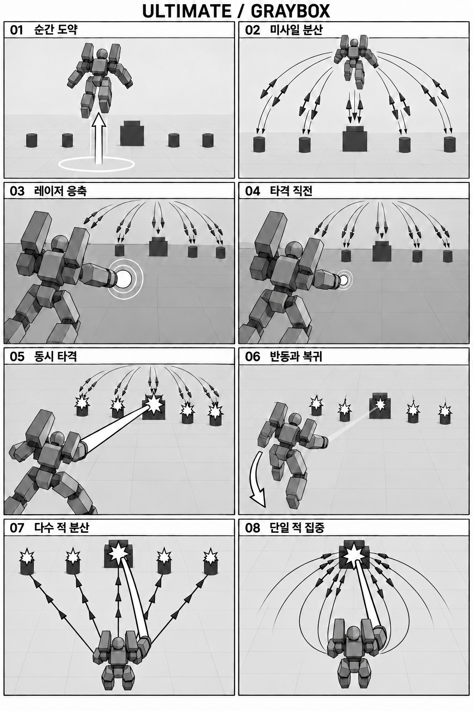

# 궁극기 콘티 — 공중 포화와 동시 레이저

2026-10-01 · 1차 연출 기획 · 게임 미구현

**순간 도약 → 대량 미사일 분산 발사 → 착탄 전 레이저 급속 응축 → 미사일 타격과 초강력 레이저 동시 발사.** 시작 순간부터 카메라는 초광각으로 전환하며 플레이어 뒤편으로 이동한다. 공중의 플레이어, 넓게 펼쳐진 미사일, 가장 강한 적으로 꽂히는 레이저를 한 화면에 담는다.

그레이박스 판독 기준: 회색 블록 인간형은 플레이어, 짙은 원기둥은 일반 적, 큰 계단형 상자는 최강 적이다. 가는 선과 삼각형은 미사일 진행 방향, 굵은 흰 띠는 레이저, 흰 별 모양은 타격을 나타낸다. 미사일 표시는 배분 설명을 위한 축약이며 실제 발사 수가 아니다. 07은 배분을 읽기 쉽게 직선으로 표시했고, 실제 비행 궤적은 02처럼 펼쳐진다.

[기존 컬러 연출 콘티](../output/ultimate-storyboard-20261001/ultimate-storyboard.png) · [그레이박스 생성·수정 프롬프트](../output/ultimate-storyboard-20261001/graybox-prompts.txt)

콘티는 왼쪽에서 오른쪽, 위에서 아래로 읽는다. **01~06은 시간 순서, 07~08은 적 수에 따른 같은 공격의 비교**다. 이미지의 기체·전장 외형은 연출 검토용이며 실제 게임 모델 확정안은 아니다. 정확한 미사일 수와 배분은 아래 규칙을 따른다.

## 기본 흐름

아래 시간은 실제 시간 기준 약 3.4초의 **초기 제안**이며, 연출 검토 후 조정한다.

| 컷 | 제안 시간 | 액션 | 카메라와 빛 |
|---|---|---|---|
| 01 도약 | 0.00~0.25초 | 플레이어가 하늘로 순간 도약. 부스터 잔상과 지면 충격파로 출발점을 남긴다. | 발동 즉시 후방으로 이동하며 초광각 전환. 상승 방향으로 짧고 강한 흔들림. |
| 02 미사일 개화 | 0.25~0.80초 | 공중에서 미사일을 대량 발사. 여러 갈래 궤적이 주변 적들에게 넓게 퍼진다. | 후방 추적으로 플레이어와 전장을 함께 잡는다. 발사마다 작은 반동, 푸른 궤적이 화면을 펼친다. |
| 03 급속 응축 | 0.80~1.25초 | 미사일이 비행하는 동안 가장 강한 적을 겨누며 레이저를 빠르게 최대 출력까지 모은다. | 주변 광량을 낮추고 총구·장갑 테두리를 밝힌다. 에너지 고리와 입자는 총구의 작은 점으로 빨려든다. |
| 04 타격 직전 | 1.25~1.55초 | 미사일은 목표 바로 앞까지 접근하고, 레이저는 최대 응축 상태에 도달한다. | 플레이어 뒤편 구도 유지. 흔들림을 잠깐 줄여 팽팽한 정적을 만든다. |
| 05 동시 타격 | 1.55~2.35초 | 미사일들이 여러 적에게 타격되는 순간 초강력 레이저를 최강 적에게 발사한다. | 백색 중심·청록 외곽의 빔과 주황 폭발이 동시에 전장을 밝힌다. 큰 후방 반동 후 짧은 진동으로 위력을 강조한다. |
| 06 잔광과 복귀 | 2.35~3.40초 | 빔 잔광, 휘어진 미사일 연기, 파편이 남는다. 플레이어가 하강하며 전투에 복귀한다. | 흔들림과 조명을 감쇠시키며 원래 쿼터뷰로 부드럽게 돌아간다. |

## 타깃 배분

- **다수의 적 — 컷 07:** 사거리 안의 유효 적들에게 미사일을 순환 배분한다. 적별 배정 수 차이는 최대 1발. 레이저는 그중 가장 강한 적 한 기에게 집중한다. 예를 들어 30발과 적 5기라면 각각 6발씩 맞고, 최강 적은 레이저까지 함께 맞는다. 30발은 설명용 예시다.
- **단일 적 — 컷 08:** 모든 미사일과 레이저가 같은 적에게 집중된다. 양옆으로 펼쳐진 미사일 궤적이 한 점으로 모이도록 한다.
- **강한 적 선정 제안:** 보스 → 정예 → 일반 순으로 우선하며, 같은 등급에서는 최대 체력이 높은 적을 고른다. 동률이면 가까운 적을 선택한다. 이는 확정된 게임 규칙이 아니다.
- **동시 타격 제안:** 미사일의 거리·발사 순서에 따라 경로와 속도를 조정해 공통 착탄 시점에 맞춘다. 레이저는 그 시점에 발사되어 시각적으로 같은 박자에 타격한다. 가까운 적에게 미사일이 응축 완료 전에 닿지 않도록 한다.

## 연출의 핵심

초광각은 단순 줌아웃이 아니라 **가까운 플레이어와 먼 전장의 크기 차이**를 크게 보여주는 후방 구도다. 시작과 함께 전환하고, 도약·발사·응축·타격 동안 플레이어와 주 목표를 계속 읽을 수 있게 한다. 수평 시야각 100~110°를 초기 제안으로 삼되 실제 화면비에서 조정한다.

조명은 **넓게 번지는 미사일의 빛 → 총구 한 점에 모이는 빛 → 전장 전체를 터뜨리는 빛**으로 대비를 만든다. 응축 중에는 어둡게, 동시 타격에는 가장 밝게 하되 플레이어 실루엣과 적 위치는 남긴다. 셰이킹은 도약의 상승 충격, 연속 사출의 작은 떨림, 빔 발사의 큰 후방 반동으로 방향과 강도를 구분한다.

발동 키·자원·미사일 총량·피해량·무적 여부, 대상이 없거나 도중에 사라졌을 때의 처리, 기존 락온 궁극기 교체 여부는 구현 전에 결정한다. 이번 산출물은 콘티와 기본 흐름이며 게임 코드는 변경하지 않았다.

이미지: 내장 `image_gen`으로 생성. [최종 생성 프롬프트](../output/ultimate-storyboard-20261001/prompts.txt).
