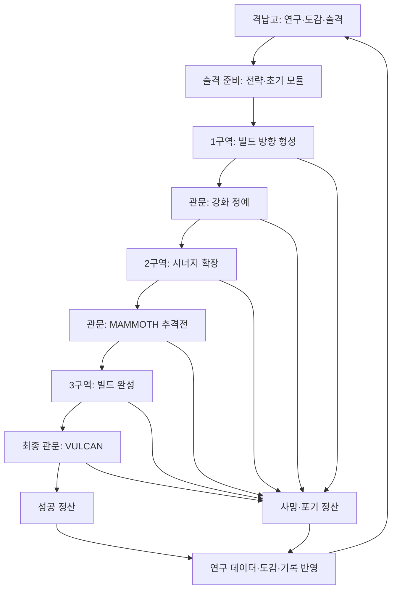

# 헥스 블레이드 — 로그라이크 메인 플로우 기획서

작성일: 2026-09-29 · 버전: 0.1 · 상태: 첫 구현을 위한 제안

> **출격할 때 전투 방향을 정하고, 보상이 보이는 경로를 선택하며 검·레이저·미사일 빌드를 완성한 뒤, 최종 보스를 쓰러뜨리고 다음 출격의 선택지를 해금한다.**

이 문서는 현재 Godot 프로젝트의 전투를 게임 한 판으로 묶는 기획이다. 사용자가 요청한 《젠레스 존 제로》 제로 공동 「로스트 보이드」의 진행 구조를 주된 참고 대상으로 한다. 아래의 이름·방 수·수치·보상·해금 조건은 헥스 블레이드용 제안이며, 원작의 정확한 수치를 옮긴 것이 아니다. 구현은 아직 진행하지 않았다.

## 1. 핵심 결정

| 항목 | 제안 |
|---|---|
| 장르 | 쿼터뷰 3D 액션 로그라이트. 매번 빌드를 새로 만들고 영구 해금은 남는다 |
| 한 사이클 | 격납고 → 출격 준비 → 3개 구역 탐사 → 최종 보스 → 정산 → 해금 → 재출격 |
| 목표 플레이 시간 | 익숙한 플레이어 기준 18~25분. 첫 플레이는 설명을 포함해 25~35분 예상 |
| 플레이 캐릭터 | 현재 로봇 1종. 검·연사·레이저·미사일·대시·패링을 모두 사용 |
| 경로 구조 | 매 단계 2~3개의 목적지 중 하나만 방문. 구역 끝의 관문에서 합류 |
| 성장 구조 | 전투 방식을 바꾸는 **모듈** + 같은 계열을 모아 모듈을 성장시키는 **칩** |
| 생존 자원 | 체력 5칸 유지. 일반 방 클리어 시 자동 회복 제거 |
| 런 종료 | 최종 보스 격파 / 체력 0 / 포기. 각각 정산 후 격납고로 복귀 |
| 영구 진척 | 연구 데이터로 출격 전략 해금, 도감과 클리어 기록 축적 |
| 첫 구현 목표 | 준비·분기·성장·상점·회복·보스·실패·해금·재출격까지 실제로 연결 |

핵심 재미는 **“이 보상을 얻으러 위험한 길을 갈 것인가?”와 “이번에는 어떤 공격이 주력이 될 것인가?”**다. 기존 액션 조작감은 이 선택을 전투로 확인하는 기반이다.

## 2. 로스트 보이드에서 가져올 구조

### 2.1 참고 기준과 확인 범위

로스트 보이드에는 업데이트로 여러 파생 모드가 추가되었다. 이 초안은 **기본 탐사인 Battlefront Purge의 구조를 중심**으로 삼는다. 이후의 Tactical Prism Programs·보조 에이전트 등은 필수 전제로 섞지 않는다.

확인한 핵심은 출격 전 탐사 전략 선택, 무작위 지도의 경로 선택, 전용·일반 기어와 레조니움 수집, 동일 계열 레조니움을 통한 일반 기어 성장, 탐사 밖의 전투 잠재력·수집 진척이다. 이 구성은 [로스트 보이드 가이드의 Battlefront Purge 및 Combat Potential 설명](https://www.icy-veins.com/zenless-zone-zero/hollow-zero-lost-void)을 참고했다. 가이드의 표시된 최종 수정일은 2025-10-15이며, 2026-09-29에 열람했다. 최신 모든 변형 모드의 재현을 주장하지 않는다.

| 참고 구조 | 헥스 블레이드에 적용할 방식 | 대응 정도 |
|---|---|---|
| 출격 전 탐사 전략 | 보상·경제·생존에 영향을 주는 출격 전략 1개 선택 | 역할 유지 |
| 기어와 레조니움 | 전투 모듈과 계열 칩의 두 층 성장 | 핵심 관계 유지 |
| 전용 기어의 스킬 변화 | 캐릭터 1명의 검·레이저·미사일 변화로 통합 | 현재 전투에 맞게 변경 |
| 무작위 지도와 목적지 선택 | 보상·위험을 표시하는 연결된 노드 경로 | 역할 유지 |
| 복합 구역 | 전투 뒤 상점 등 두 콘텐츠를 묶는 방 | 후속 확장 |
| 탐사 밖 성장과 수집 | 연구 데이터, 전략 해금, 도감 | 규모 축소 |

**가장 가깝게 가져올 부분은 ‘출격 준비 → 선택형 탐사 → 기어·버프 성장 → 전투 검증 → 탐사 밖 진척’의 연결이다.** 원작의 파티 편성, 고유 명칭, 서사, 주간 보상 체계는 현재 게임에 맞는 형태로 바꾼다. 이하 상세 규칙은 독자 설계다.

### 2.2 현재 프로젝트와의 차이

| 현재 확인된 상태 | 한 사이클을 위해 필요한 변화 |
|---|---|
| 시작 방과 전투방 9개를 절차 생성하며 모든 전투방 정리 시 승리 | 선택한 방만 진행하고 구역 관문을 넘어가는 구조 |
| 방이 연결된 자유 이동 지도와 미니맵 | 런의 경로 지도와 방 내부 이동 지도를 구분 |
| 방을 정리하면 체력 +1 | 정비소·상점·이벤트를 통한 회복 선택 |
| 추격 MAMMOTH / 용광로 VULCAN이 별도 실행 장면 | 같은 런의 중간·최종 관문으로 연결 |
| 각 장면에서 플레이어를 새로 생성 | 장면을 넘어 체력·칩·모듈·재화를 승계 |
| 검·연사·레이저·미사일·2단 대시·패링 구현 | 공격 방식을 바꾸는 성장 효과 연결 |
| 승패 메시지와 장면 재시작 | 결과 정산, 연구, 다음 출격으로 연결 |

확인 근거: `scripts/main.gd`, `scripts/map.gd`, `scripts/player.gd`, `scripts/parry.gd`, `scripts/boss_main.gd`, `scripts/forge_main.gd`, `scripts/hud.gd`, `project.godot`. 코드 기준으로 확인한 상태이며 이번 기획 작업에서 게임 실행 검증은 하지 않았다.

## 3. 전체 흐름



### 3.1 격납고와 출격 준비

격납고는 처음에는 하나의 메뉴 화면으로 만든다. 캐릭터 이동이 가능한 별도 거점은 후속 작업이다.

1. **출격**을 선택한다. 이어갈 런이 있으면 ‘계속하기’를 함께 표시한다.
2. 출격 전략 1개를 고른다. 잠긴 전략에는 해금 비용과 효과를 표시한다.
3. 초기 모듈 3종 중 1개를 고른다. 해당 계열의 칩 후보 3개 중 1개를 추가로 받는다.
4. 구역 구성과 최종 보스가 표시된 출격 요약을 확인하고 시작한다.

초기 모듈 선택은 무기 장착 제한이 아니다. 어떤 모듈을 골라도 모든 기본 공격을 쓸 수 있다. 초기 칩은 첫 전투부터 작은 차이를 만들고, 모듈은 이후 수집 목표를 만든다.

출격 시 체력 5/5, 부스터 100%, 미사일 게이지 60%, 런 재화 0으로 시작한다. 미사일 초기값은 현재 프로토타입에 맞춘 제안이다.

### 3.2 방 단위 흐름

**목적지 선택 → 입장 → 콘텐츠 해결 → 보상 선택 → 빌드 반영 → 다음 목적지 선택**을 반복한다.

- 전투 입장 시 차단막이 닫힌다. 적과 대기 중인 증원이 모두 없어지면 완료된다.
- 마지막 적이 죽으면 적탄·위험 장판·예약 공격을 정리하고 전투 타이머를 멈춘다.
- 자동 지급 재화가 반영된 뒤 선택 보상을 제시한다.
- 보상을 확정하면 모듈 단계 변화를 즉시 보여 주고 다음 출구를 연다.
- 보상 선택·지도·상점 화면에서는 전투가 정지한다. 닫는 입력으로 공격이 발동하지 않게 한다.
- 전투에서 성공한 뒤 보상까지 처리한 상태가 ‘방 완료’다. 같은 방의 보상은 다시 받을 수 없다.

## 4. 한 런의 구성

### 4.1 첫 구현: 3구역 × 5단계

플레이어는 총 **15개 노드**를 방문한다. 각 단계에 여러 후보가 있어도 하나만 선택하므로 방문 수는 변하지 않는다. 출격 준비·보상창·결과창은 노드 수에 포함하지 않는다.

| 단계 | 1구역: 외곽 침투 | 2구역: 수송로 돌파 | 3구역: 노심 진입 |
|---|---|---|---|
| 1 | 칩 전투 | 칩 전투 | 칩 전투 |
| 2 | 재화 전투 / 이벤트 | 재화 전투 / 도전 / 이벤트 | 재화 전투 / 도전 / 이벤트 |
| 3 | 모듈 전투 | 모듈 전투 | 집중 칩 전투 |
| 4 | 상점 / 정비소 | 상점 / 정비소 | 상점 / 정비소 |
| 5 | 강화 정예 관문 | MAMMOTH 추격 보스 | VULCAN 최종 보스 |

같은 종류의 목적지도 서로 다른 보상 계열과 적 조합으로 2개 후보를 만들 수 있다. 단계 5는 고정 관문이다. 단계 4에서는 재화가 0이어도 무료 정비소를 선택할 수 있다.

| 구역 | 플레이 목표 | 시간 배분 목표 | 종료 보상 |
|---|---|---|---|
| 1 | 주력 모듈과 칩 관계를 이해하고 첫 강화 달성 | 4~6분 | 칩 선택 1회 + 연구 데이터 적립 |
| 2 | 주력 강화와 보조 모듈 사이에서 선택 | 5~7분 | 칩 선택 1회 + 연구 데이터 적립 |
| 3 | 생존과 빌드 완성 사이에서 마지막 선택 | 6~8분 | 런 성공 정산 |

준비·보상 확인·정산에 약 3~4분을 배정한다. 시간은 측정 전 목표이며, 조정할 때 적 체력만 늘려 분량을 맞추지 않는다.

### 4.2 경로와 공간의 관계

**지도는 어디로 갈지를 정하고, 3D 공간은 선택한 장소에서 싸우는 곳이다.**

- 런 지도는 현재 구역 5단계, 연결선, 방 종류, 보상 계열, 위험도, 관문을 보여 준다.
- 현재 노드에서 연결된 다음 단계만 선택할 수 있다. 선택하지 않은 후보는 방문할 수 없다.
- 첫 구현은 모든 후보가 다음 단계의 모든 후보로 이어지는 단순 구조다. 이후 좁은 연결과 합류 지점을 추가할 수 있다.
- 클리어한 방의 출구에 다음 후보 2~3개를 포털처럼 배치한다. 출구 표식과 지도는 동일한 목적지 데이터를 사용한다.
- 포털 가까이 가면 상세 설명을 표시하고 **Enter 또는 UI 클릭**으로 확정한다. 이동 중 우연히 넘어가지 않게 한다.
- 선택이 확정되면 다른 출구를 잠그고 목적지 장면으로 이동한다. 이동 연출은 1~2초를 목표로 한다.
- 기존 8종 방 형태와 통로 생성 자산은 목적지 내부 공간으로 재사용한다. 첫 구현에서는 노드 하나당 전투방 하나를 사용한다.
- 구역 선택은 일방 진행이다. 이미 클리어한 방으로 돌아가 재화나 회복을 반복 획득하지 않는다.

### 4.3 경로 생성 보장

- 칩 전투에서는 선택한 초기 모듈 계열 목적지를 최소 하나 제시한다.
- 1·2구역의 모듈 전투와 모든 구역의 정비 경로는 고정 보장한다.
- 이벤트·상점·도전 등 선택 노드의 콘텐츠는 런 시드로 결정한다.
- 도전 콘텐츠가 특정 행동을 요구하면 해당 행동을 수행할 수 있는 적·환경을 함께 배치한다.
- 1구역은 적 종류를 차례로 소개하고, 후반 구역은 조합과 공간 제약을 강화한다.
- 지도 재추첨과 복합 구역은 후속 범위다. 첫 버전의 재현 가능한 경로부터 완성한다.

## 5. 노드 콘텐츠와 보상

아래 수치는 모두 첫 플레이테스트용이다. ‘칩 1개’는 후보 3개 중 1개 선택을 뜻한다.

| 노드 | 해결 조건 | 보상 및 선택 |
|---|---|---|
| 칩 전투 | 적 전멸 | 표시 계열 칩 1개 + 스크랩 40 |
| 재화 전투 | 적 전멸 | 스크랩 100. 칩 없음 |
| 모듈 전투 | 강화 적 포함 전멸 | 모듈 후보 중 1개 + 스크랩 40 |
| 집중 칩 전투 | 강화 적 포함 전멸 | 표시 계열 칩 선택을 2회 + 스크랩 40 |
| 도전 | 전멸과 추가 목표 시도 | 기본 칩 1개 + 스크랩 40. 목표 성공 시 칩 선택 1회 추가 |
| 이벤트 | 비용과 결과가 표시된 선택지 1개 확정 | 칩·스크랩·회복 중 효과 1회 |
| 상점 | 원하는 상품 구매 후 출구 선택 | 스크랩을 칩·수리로 교환 |
| 정비소 | ‘체력 +2칸’ 또는 ‘미사일 100% 충전’ 선택 | 무료, 노드당 한 번 |
| 1구역 관문 | 강화 정예 격파 | 칩 1개 + 스크랩 80 + 연구 20 |
| 2구역 관문 | MAMMOTH 격파 | 칩 1개 + 스크랩 80 + 연구 30 |
| 최종 관문 | VULCAN 격파 | 성공 보너스 연구 60. 런 내부 강화 보상 없음 |

도전 예시는 ‘60초 안에 전멸’ 또는 ‘피격 1회 이하로 전멸’이다. 추가 목표 실패만으로 런을 끝내지 않는다. 기본 전투 완료 보상은 받되 추가 칩만 놓친다. 피격 기준은 체력 피해가 실제로 발생한 횟수이며, 무적 회피나 피해를 완전히 막은 보호막은 포함하지 않는다.

이벤트 3종을 우선 만든다.

| 이벤트 | 선택 A | 선택 B | 제약 |
|---|---|---|---|
| 폐기된 병기고 | 스크랩 60 지불 → 지정 계열 칩 1개 | 해체 → 스크랩 30 | 구매 재화가 없으면 A 비활성 |
| 불안정 동력로 | 체력 1 지불 → 지정 계열 칩 1개 | 차단하고 진행 → 효과 없음 | 체력 1일 때 A 비활성 |
| 수리 드론 | 체력 1 회복 | 부품 회수 → 스크랩 40 | 체력이 가득 차면 회복 비활성 |

이벤트의 계열과 비용은 선택 전에 표시한다. 첫 버전에는 결과가 숨겨진 확률 도박을 넣지 않는다.

## 6. 모듈과 칩: 런 내부 빌드

### 6.1 두 층의 역할

**모듈은 공격의 형태를 바꾸고, 칩은 세부 효과를 더하며 모듈 단계를 올린다.**

- 모듈은 절단·포격·추적 3계열이며 각각 하나씩, 최대 3개 보유한다.
- 초기 모듈은 1단계다. 해당 계열 칩 **2개에 2단계, 4개에 3단계**가 된다.
- 동일 계열 칩을 뒤늦게 모듈보다 먼저 얻어도 개수를 누적하고, 모듈 획득 즉시 단계를 계산한다.
- 모듈 미보유 상태에서도 칩 자체 효과는 적용된다.
- 모듈 보상은 미보유 모듈을 우선 제시한다. 보유 모듈 계열을 택하면 중복 장착 대신 해당 계열 칩 1개를 고른다.
- 첫 버전은 모듈마다 한 가지 성장 경로를 사용한다. 강화 시 다른 갈래를 선택하는 진화는 후속 확장이다.

### 6.2 모듈 3종

각 단계의 효과는 이전 단계 위에 추가된다. 수치는 조정 가능하지만, 공격 방식이 변한다는 역할은 유지한다.

| 모듈 | 1단계 | 2단계: 계열 칩 2개 | 3단계: 계열 칩 4개 |
|---|---|---|---|
| 절단 — 잔광 블레이드 | 검 뒤에 사거리 6m의 잔광 참격 1회 발생 | 관통 일격 경로에 0.25초 뒤 잔광 피해 1회 추가 | 패링 성공 시 관통 일격 준비. 기존 2단 대시 조건과 병행 |
| 포격 — 분광 노심 | 충전 레이저 폭 +20% | 최대 충전 레이저 종료 시 경로에 잔열 피해 1회 | 최대 충전 빔에 양옆 보조 광선 추가. 각 광선은 본체 피해의 20% |
| 추적 — 군집 탄두 | 궁극기 미사일 18발 → 22발 | 미사일 명중 지점에 반경 1.5m 폭발, 주 대상 외 적에게 원 피해의 25% | 한 번의 궁극기 종료 0.5초 후 보조 미사일 6발 발사 |

잔광의 기본 피해는 검의 정예·보스용 직접 피해의 30%, 잔열은 레이저 기본 틱 피해 2회분을 초기값으로 삼는다. 모듈의 추가 타격은 일반 적에게도 즉사 판정을 상속하지 않는다. 보조 탄두는 새 궁극기 사용으로 취급하지 않아 재발사나 게이지 환급을 재귀적으로 일으키지 않는다.

### 6.3 칩 풀: 첫 버전 18종

칩은 각 1회만 획득하며, 같은 칩 중복 획득은 없다. 희귀도와 칩 자체 레벨은 첫 버전에서 사용하지 않는다.

| 계열 | 칩 | 효과 제안 |
|---|---|---|
| 절단 | 가속 검날 | 검 돌진 속도 +15% |
| 절단 | 확장 궤적 | 검 판정 너비 +15% |
| 절단 | 추격 연산 | 검 돌진 탐색 거리 +1m |
| 절단 | 균열 분석 | 정예·보스 대상 검 직접 피해 +15% |
| 절단 | 반격 축전 | 패링 성공 시 미사일 게이지 +10%p. 내부 쿨다운 3초 |
| 절단 | 잔광 집중 | 잔광 계열 추가 피해 +25%. 모듈 미보유 시 ‘모듈 획득 후 활성’ 표시 |
| 포격 | 급속 충전 | 최대 충전 소요 시간 -15% |
| 포격 | 안정 조준 | 최대 충전 빔 회전 속도 +20% |
| 포격 | 방열 구조 | 레이저 재사용 대기시간 -15% |
| 포격 | 노심 증폭 | 레이저 직접 피해 +12% |
| 포격 | 연장 방사 | 최대 충전 빔 지속 +0.3초 |
| 포격 | 예광 축전 | 연사 15회 명중 후 다음 레이저 직접 피해 +20%. 1회 사용 후 소모 |
| 추적 | 회수 신호 | 처치 시 미사일 게이지 획득량 +2%p |
| 추적 | 자동 장전 | 전투 중 미사일 자연 충전 속도 +15% |
| 추적 | 표적 확장 | 궁극기 최대 락온 수 +2 |
| 추적 | 집속 탄두 | 미사일 직접 피해 +12% |
| 추적 | 복구 탄두 | 궁극기 사용 후 5초간 피해 1칸을 막는 보호막. 내부 쿨다운 20초 |
| 추적 | 재유도 | 미사일 표적이 죽으면 살아 있는 적으로 재지정. 적이 없으면 소멸 |

원래 존재하는 검 처치 시 쿨다운 초기화, 2단 대시 뒤 관통 일격은 기본 성능으로 남긴다. 이미 가능한 행동을 새 강화 효과처럼 다시 제시하지 않는다.

### 6.4 보상 후보와 빌드 완성 보장

- 계열이 표시된 보상은 해당 계열의 미보유 칩 중 3개를 제시한다.
- 공통 보상은 초기 모듈 계열 칩을 최소 1개 포함하고 나머지는 미보유 칩에서 추첨한다.
- 초기 계열의 칩 후보가 남아 있는 한, 해당 계열을 고를 수 있는 경로를 모든 구역에서 보장한다.
- 남은 칩이 1~2개면 그 수만 제시한다. 해당 계열을 모두 모으면 다른 계열 칩으로 전환하며 이유를 표시한다.
- 모든 칩을 모았으면 칩 보상 대신 스크랩 50을 지급한다.
- 선택 보상에 무료 재추첨은 없다. 보상 확정 전까지 닫았다 열어도 후보는 바뀌지 않는다.

초기 칩 1개, 구역 첫 칩 전투 3회, 1·2구역 관문 칩 2회, 3구역 집중 칩 2회로 **추가 도전·구매 없이도 칩 8개**를 얻는다. 한 계열에 집중하면 2구역 초반부터 3단계를 만들 수 있고, 분산하면 여러 2단계 모듈을 운용할 수 있다.

### 6.5 효과 충돌 규칙

- 같은 종류의 퍼센트 피해 증가는 더해서 적용한다. 개별 효과를 연속 곱하지 않는다.
- 게이지 증가는 100%를 넘지 않는다. 보호막은 중첩되지 않고 같은 효과 재발동 시 지속시간만 갱신한다.
- 추가 타격은 패링·궁극기 사용·칩 추가 타격 조건을 다시 발생시키지 않는다. 처치 보상은 실제 적 사망당 한 번이다.
- 크롤러의 닫힌 장갑 등 기존 무적 규칙은 성장 효과로 우회하지 않는다.
- 일반 적의 검 즉사와 정예·보스용 피해 계산을 구분한다. 새 정예는 검 한 번에 즉사하지 않는다.
- 플레이어가 실행한 기본 공격의 피해와 모듈 추가 피해를 분리해 기록한다.

## 7. 경제·체력·휴식

### 7.1 두 재화

| 자원 | 용도 | 획득 | 런 종료 시 |
|---|---|---|---|
| 스크랩 | 상점에서 칩·수리 구매 | 전투·이벤트 | 전량 소멸, 영구 재화로 환전하지 않음 |
| 연구 데이터 | 격납고에서 전략 해금 | 완료한 전투와 관문, 성공 보너스 | 사망·포기해도 이미 적립한 분량 보존 |

적 하나마다 스크랩을 주지 않고 노드 완료 시 지급한다. 콤보 점수도 구매 재화로 환전하지 않는다. 전투 연출이나 소환 패턴에 따른 무한 파밍을 피하고 경로 보상을 예측할 수 있게 한다.

### 7.2 상점

- 칩 3개를 각각 80 스크랩에 판매한다. 방문 시 미보유 칩에서 고정 추첨한다.
- ‘체력 1칸 수리’를 50 스크랩에 1회 판매한다. 체력이 가득 차면 비활성이다.
- 각 상품은 한 번만 살 수 있으며 새로고침은 없다.
- 잔액이 부족해도 그냥 나갈 수 있다. 구매 자체를 방 완료 조건으로 삼지 않는다.
- 최소 전투 경로는 구역 1에서 상점 전 80 스크랩을 확보하므로 칩 1개 또는 수리 1회를 살 수 있다.

경제 선택 예: 체력 3/5, 스크랩 100일 때 상점에서는 칩 1개 또는 체력 1칸만 구매할 수 있다. 정비소를 고르면 무료로 2칸을 회복하지만 이번 상점은 포기한다.

### 7.3 자원 승계와 대기 방지

- 일반 방·관문·보스 사이에 체력은 그대로 이어진다. 구역 전환만으로 회복하지 않는다.
- 부스터·미사일 게이지도 승계한다. 부스터는 전투 밖 이동 중 자연 회복해도 되지만 미사일은 전투 중에만 자연 충전한다.
- 지도·상점·보상·정비 화면에서는 게이지와 재사용 대기시간이 진행되지 않는다.
- 새 전투 시작 시 일반 공격·대시의 짧은 쿨다운과 일시적 공격 동작을 초기화한다. 미사일 게이지는 초기화하지 않는다.
- 전투 중 일시 보호막, 관통 일격 준비, 충전 중인 레이저는 방을 넘기지 않는다.
- MAMMOTH의 무한 부스터는 해당 보스전만의 규칙이다. 입장 직전 부스터 값을 보관하고 종료 후 복원한다.
- 첫 버전에는 부활이 없다. 방에서 기다려 미사일을 채우는 행동보다 정비 선택이 유효하도록 한다.

## 8. 관문과 보스

### 8.1 1구역: 강화 정예

새 대형 보스를 만들기보다 기존 요격기 기반의 강화 정예 1기와 보조 드론으로 구성한다. 외형 발광·크기·상단 체력바로 일반 적과 구분한다. 검 즉사를 제거하고 정예용 피해를 적용한다.

패링 가능한 공격과 회피해야 하는 공격을 함께 배치한다. 첫 관문은 기본 행동과 초반 강화의 차이를 익히는 구간이며, 목표 전투 시간은 60~90초다.

### 8.2 2구역: MAMMOTH

기존 추격 보스전을 중간 관문으로 사용한다. 무한 부스터와 추격 연출을 유지하되 런의 체력·모듈·칩이 적용되어야 한다. 근접 빌드도 약점 노출 동안 검을 맞힐 수 있는 접근 거리와 판정을 확인한다. 목표 전투 시간은 90~150초다.

격파 후에는 기존 독립 승리 화면 대신 구역 완료 보상과 3구역 진입 화면으로 넘어간다.

### 8.3 3구역: VULCAN

기존 용광로 보스전을 최종 관문으로 사용한다. 팔 약점, 노심 노출, 좁아지는 발판이 완성한 빌드의 시험대다. 목표 전투 시간은 120~180초다.

최종 보스가 죽으면 피해 처리를 먼저 멈추고 격파 연출을 재생한다. 같은 프레임에 플레이어와 최종 보스가 함께 죽으면 성공을 우선하는 규칙으로 통일한다. 다른 방·중간 관문에서의 동시 사망은 실패다.

보스 직전 정비 경로는 보장하지만 체력 완전 회복은 보장하지 않는다. 강화 선택의 결과와 생존 자원 관리가 끝까지 남아야 한다.

## 9. 정산·영구 해금·재도전

### 9.1 종료 처리

| 상황 | 결과 | 다음 행동 |
|---|---|---|
| VULCAN 격파 | 성공 보너스를 더해 정산 | 연구 / 같은 준비로 새 런 / 격납고 |
| 체력 0 | 완료 노드까지의 연구와 도감 기록 정산 | 같은 준비로 새 런 / 격납고 |
| 메뉴에서 런 포기 | 완료 노드까지 정산, 진행 중 노드 보상 없음 | 격납고 |
| 일시 중단 | 정산하지 않고 현재 런 유지 | 계속하기 |

‘같은 준비로 새 런’은 전략·초기 모듈 선택만 유지하고 지도 시드·체력·칩·재화는 새로 시작한다. 실패한 방에서 그대로 재개하는 기능은 아니다.

결과 화면은 성공 여부, 도달 구역, 전투 시간, 최종 모듈 단계, 획득 칩, 점수·최대 콤보, 연구 데이터 내역, 새 도감 기록을 보여 준다. 다음 해금까지 필요한 연구량도 표시한다.

### 9.2 연구 데이터 산식

- 관문을 제외한 전투 노드 완료: 각각 5.
- 1구역 관문: 20, 2구역 관문: 30.
- 최종 보스: 성공 보너스 60. 일반 전투의 5를 중복 합산하지 않는다.
- 이벤트·상점·정비소: 0.
- 최소 경로의 비관문 전투는 6회이므로 성공 시 30 + 20 + 30 + 60 = **140**.
- 각 구역 단계 2에서 전투를 골랐다면 최대 3회가 추가되어 **155**.
- 전투 방 2개와 1구역 관문을 마친 뒤 실패했다면 **30**.

방 완료 기록은 런 ID와 노드 ID로 한 번만 적립한다. 정산 화면을 다시 열거나 저장 데이터를 재개해도 재지급하지 않는다.

### 9.3 첫 영구 해금

| 출격 전략 | 해금 | 효과 |
|---|---|---|
| 전투 조사 | 기본 개방 | 각 구역 첫 칩 전투 완료 시 스크랩 +20 |
| 회수 작전 | 연구 60 | 런 시작 스크랩 +80 |
| 안전 작전 | 연구 60 | 매 구역 정비소의 체력 회복량 +1칸 |

전략은 하나만 장착한다. 첫 구현에서는 공격력·최대 체력의 반복 구매를 넣지 않고 플레이 방식의 선택지를 늘린다. 한 번 실패해도 몇 차례 탐사로 해금에 접근할 수 있어야 한다.

도감은 획득한 모듈·칩과 격파한 관문을 기록한다. 난이도는 첫 버전에서 1개로 고정한다. 이후에는 기본 클리어를 조건으로 추가 위협 옵션을 해금하되, 새로운 모드보다 현재 루프의 재미를 먼저 검증한다.

### 9.4 중단과 이어하기

- 방 완료·보상 확정·상점 구매·경로 확정 때 저장한다.
- 전투 도중 종료했다면 동일 시드의 해당 방을 **입장 당시 체력·게이지·빌드**로 다시 시작한다. 적 개별 상태까지 저장하지 않는다.
- 보상 선택 전 종료하면 같은 후보를 다시 표시한다. 확정한 보상은 다시 고를 수 없다.
- 이미 생성한 상점 상품과 이벤트는 저장해 재실행으로 바뀌지 않게 한다.
- 로컬 싱글플레이 첫 버전에서는 강제 종료를 이용한 같은 방 재시도를 허용한다. 별도의 재시도 방지 시스템은 만들지 않는다.

## 10. 화면 구성

| 화면 | 반드시 전달할 정보 | 주요 행동 |
|---|---|---|
| 격납고 | 연구 잔액, 다음 해금, 진행 중 런 | 출격·계속하기·연구·도감 |
| 출격 준비 | 전략 효과, 초기 모듈과 성장 조건 | 전략·모듈 선택, 출격 |
| 런 지도 | 현재 구역, 연결된 목적지, 보상 계열·위험 | 목적지 선택·닫기 |
| 전투 HUD | 체력, 기존 전투 게이지, 구역/단계, 스크랩 | 기존 전투 조작 |
| 빌드 요약 | 모듈 단계, 계열 칩 수, 다음 단계 조건 | 상세 보기 |
| 보상 | 후보 3개, 효과, 계열, 선택 후 단계 변화 | 하나 선택·확정 |
| 상점·정비 | 가격·잔액, 회복량, 구매/선택 가능 여부 | 구매·정비·나가기 |
| 결과 | 성공/실패, 빌드, 연구 획득 내역 | 연구·새 런·격납고 |

보상 카드 예시:

```text
[절단] 균열 분석
정예·보스에게 검 직접 피해 +15%

절단 칩 3 → 4
잔광 블레이드 2단계 → 3단계
새 효과: 패링 성공 시 관통 일격 준비

[선택]
```

색과 아이콘 외에 텍스트로 계열과 위험을 표시한다. 보상 카드에는 현재 칩 개수와 선택 결과가 보여야 하며, 플레이어가 계산해서 알아내도록 두지 않는다. 보스전에도 축약 빌드 표시를 유지한다.

## 11. 한 판의 플레이 예시

절단 빌드를 고른 플레이어가 경로와 생존 사이에서 고민하는 사례다. 아이템 목록과 가격은 위 규칙을 사용한다.

1. 기본 전략 ‘전투 조사’와 잔광 블레이드를 선택하고, 초기 칩으로 추격 연산을 얻는다.
2. 1구역 첫 칩 전투에서 균열 분석을 고른다. 절단 칩 2개로 모듈이 2단계가 되고 스크랩 60을 얻는다.
3. 다음 갈림길에서 이벤트 대신 재화 전투를 골라 스크랩이 160이 된다. 전투로 체력이 3/5가 된다.
4. 모듈 전투에서 보조 모듈 대신 절단 계열 칩을 선택한다. 절단 칩 3개, 스크랩 200이 된다.
5. 상점과 정비소 중 상점을 선택한다. 미보유 절단 칩이 판매되어 있다면 80에 사고, 수리 50을 더 구매한다. 체력 4/5, 스크랩 70, 절단 모듈 3단계가 된다. 원하는 칩이 없다면 다른 칩 구매나 수리만 하고 나가는 선택이 가능하다.
6. 강화 정예에서 패링으로 관통 일격을 준비하는 새 루프를 사용한다. 관문 보상으로 다른 계열 칩을 모으기 시작한다.
7. 2구역 모듈 전투에서는 군집 탄두를 선택해 보스 단일 대상 화력을 보조한다. MAMMOTH에는 현재 체력과 완성한 절단 빌드를 그대로 가져간다.
8. 3구역에서는 부족한 생존을 보완하고 무료 정비소로 체력을 회복한 뒤 VULCAN에 도전한다.
9. 성공하면 연구를 정산하고 새 전략을 해금한다. 실패해도 완료한 구간의 연구와 도감은 남는다.
10. 다음 런은 포격 모듈로 시작하여 다른 경로와 강화 조합을 시도한다.

상점의 특정 칩이 나온다는 것은 예시의 가정이다. 정상 플레이의 빌드 완성은 보장된 계열 칩 경로만으로도 가능해야 한다.

## 12. 첫 구현 범위와 순서

### 12.1 이번 사이클에 포함

- 격납고·준비·정산 메뉴, 3구역 15노드, 경로 지도와 목적지 출구.
- 모듈 3개, 계열 3개, 칩 18개, 출격 전략 3개.
- 기본 전투·재화 전투·모듈 전투·집중 칩 전투·도전·이벤트·상점·정비·관문.
- 이벤트 3종, 도전 조건 2종, 강화 정예 1종, 기존 보스 2종 연결.
- 연구·전략 해금·도감의 최소 기능, 저장과 이어하기.
- 성공뿐 아니라 사망·포기·중단·재출격 경로.

### 12.2 이후 확장

복합 구역, 지도 재추첨, 모듈 진화 분기, 새 무기·캐릭터, 보조 유닛, 영구 성장 트리, 난이도 옵션, 구역 테마 확장, 서사 이벤트. 주간 과제와 시즌 운영은 메인 루프 완성 후 필요성을 별도로 판단한다.

### 12.3 구현 순서

| 단계 | 작업 | 끝났다고 판단할 기준 |
|---|---|---|
| A. 런 연결 | 준비 → 일반 전투 → 두 보스 → 정산의 임시 고정 경로, 런 상태 승계 | 한 번 시작해 끝까지 가고 실패 후 새로 시작 가능 |
| B. 경로 선택 | 3구역 구조, 종류별 노드, 지도·출구 연결 | 선택한 경로만 방문하고 모든 경로가 관문으로 이어짐 |
| C. 빌드 | 모듈·칩·보상 후보·성장 표시, 전투 효과 연결 | 세 빌드가 실제 전투에서 다른 행동을 유도 |
| D. 생존과 경제 | 자동 회복 변경, 상점·정비·이벤트·도전 | 재화 부족·낮은 체력에서도 선택과 진행이 성립 |
| E. 반복 플레이 | 연구·해금·도감·저장·이어하기 | 성공/실패 양쪽에서 영구 진척이 남고 새 런 정상 시작 |
| F. 플레이 조정 | 보상 밀도·전투 시간·보스 접근성·설명 수정 | 목표 시간과 빌드 완성률을 실제 플레이로 확인 |

작업 시간 추정은 장면 연결과 성장 효과 적용 난도를 확인한 뒤 산정한다. 위 단계는 우선순위이며 고정 일정이 아니다.

## 13. 현재 코드에 연결할 지점

구현 설계를 위한 연결 메모다. 파일명은 현재 존재하는 것과 신규 제안을 구분한다.

| 대상 | 변경 방향 |
|---|---|
| 기존 `scripts/main.gd` | 방 완료를 런 관리에 전달. 모든 방 정리 즉시 승리와 무조건 회복 분리 |
| 기존 `scripts/map.gd` | 런의 노드 그래프와 방 내부 기하 생성 분리. 기존 방 형태 재사용 |
| 기존 `scripts/player.gd` | 기본 수치 위에 런 강화 결과를 적용. 장면 초기화로 체력·빌드가 사라지지 않게 연결 |
| 기존 `scripts/parry.gd` | 패링 성공을 절단 모듈·칩이 받을 수 있도록 이벤트 전달 |
| 기존 `scripts/boss_main.gd` / `scripts/forge_main.gd` | 독립 승리 대신 관문 완료/런 성공 전달, 동일 강화 규칙 적용 |
| 기존 `scripts/hud.gd` | 보상·지도·상점·결과용 UI, 런 정보와 기존 전투 HUD 연결 |
| 신규 제안 `RunManager` | 런 시드, 현재 노드, 체력, 게이지, 재화, 빌드, 상태 전이 관리 |
| 신규 제안 `MetaProgress` | 연구 잔액, 해금, 도감, 기록, 저장 버전 관리 |
| 신규 제안 콘텐츠 데이터 | 노드·적 조합·모듈·칩·이벤트·가격을 ID로 관리 |

권장 상태 흐름은 `HUB → PREPARE → ROUTE → ENTER → CONTENT → REWARD → ROUTE`이며, 마지막 관문 완료 또는 사망·포기 시 `RESULT → HUB`로 간다. 상점과 이벤트는 `CONTENT`의 변형이다.

구현 시 확인할 주요 제약:

- 현재 전투 수치가 `Player` 상수에 많으므로 강화 적용용 계산 경로가 필요하다.
- 현재 `Main.inst`와 보스의 `Main` 상속 관계를 고려해 공통 전투 처리와 런 진행 책임을 분리한다.
- 각 보스 장면이 플레이어를 새로 만들기 때문에 생성 직후 런 데이터를 적용해야 한다.
- 독립 보스 실행은 개발용으로 유지하되, 정식 런 정산과 해금에는 반영하지 않는다.
- B 장면 전환과 F5 즉시 재시작은 개발 모드로 제한한다. 정식 플레이에서는 런 포기/새 런 규칙을 사용한다.
- 지도·보상·상점 진입 시 히트스톱·슬로우모션을 정리하고, 메뉴 종료 후 정상 속도를 보장한다.
- 기존 HUD가 항상 처리되는 설정을 사용하므로 메뉴 중 공격 입력과 UI 입력의 우선순위를 명시한다.

## 14. 완료 판정과 플레이테스트

### 14.1 기능 완료 체크리스트

- [ ] 출격 준비부터 최종 보스·정산·재출격까지 끊김 없이 진행한다.
- [ ] 사망과 포기도 결과 화면으로 연결되며 이미 완료한 진척만 남는다.
- [ ] 선택하지 않은 목적지는 방문할 수 없고 완료 보상은 중복 지급되지 않는다.
- [ ] 구역·보스 장면 전환에서 체력·게이지·빌드·재화가 규칙대로 유지된다.
- [ ] 세 모듈 각각 3단계까지 만들 수 있고 일반 적·정예·두 보스에 효과가 적용된다.
- [ ] 체력 1에서 체력 비용 이벤트가 막히고 재화 0에서도 정비와 진행이 가능하다.
- [ ] 모든 칩 소진·보상 후보 부족·상점 미구매 상태에서도 진행이 막히지 않는다.
- [ ] 강화 정예가 검 한 번에 즉사하지 않고 크롤러 무적 상태는 유지된다.
- [ ] 지도·메뉴에서 궁극기 충전, 적 공격, 플레이어 공격이 진행되지 않는다.
- [ ] 동일 시드와 선택 순서는 같은 경로·보상 후보를 재현한다.
- [ ] 저장/재개로 보상·상점 상품이 바뀌거나 연구가 중복 적립되지 않는다.
- [ ] 새 런을 시작하면 이전 런의 체력·칩·모듈·스크랩이 남지 않는다.

### 14.2 재미 검증

같은 플레이어가 세 초기 모듈로 각각 한 번 이상 플레이하고 다음 항목을 기록한다. 적은 표본의 승률을 확정 밸런스 근거로 삼지 않는다.

| 검증할 질문 | 초기 목표 | 기록할 항목 |
|---|---|---|
| 첫 강화가 너무 늦는가? | 첫 칩 전투 뒤 모듈 2단계 가능 | 첫 강화 시각 |
| 선택 이유가 분명한가? | 경로 선택 시 필요한 칩·체력·재화를 말할 수 있음 | 선택 노드와 간단한 이유 |
| 한 빌드를 완성할 수 있는가? | 집중 플레이 시 최종 구역 전 3단계 모듈 1개 확보 | 단계별 칩 수와 모듈 단계 |
| 모든 빌드가 보스에게 유효한가? | 검·포격·추적 모두 두 보스의 약점 활용 가능 | 보스 시간·피해·접근 실패 |
| 회복과 상점이 경쟁하는가? | 체력과 보유 스크랩에 따라 선택이 달라짐 | 정비/상점 선택률, 남은 재화 |
| 반복하고 싶은 이유가 남는가? | 다음에 시도할 모듈·전략 조합을 하나 이상 제시 | 정산 후 다음 출격 선택 |
| 한 판이 늘어지는가? | 익숙한 플레이 18~25분을 목표로 조정 | 전투·이동·메뉴별 소요 시간 |

이 기획의 첫 완료 지점은 콘텐츠의 양이 아니라 **“경로 선택으로 빌드가 바뀌고, 그 빌드로 보스를 상대하며, 결과를 받아 다음 판을 시작하는 경험”이 닫힌 한 사이클로 작동하는 것**이다.
