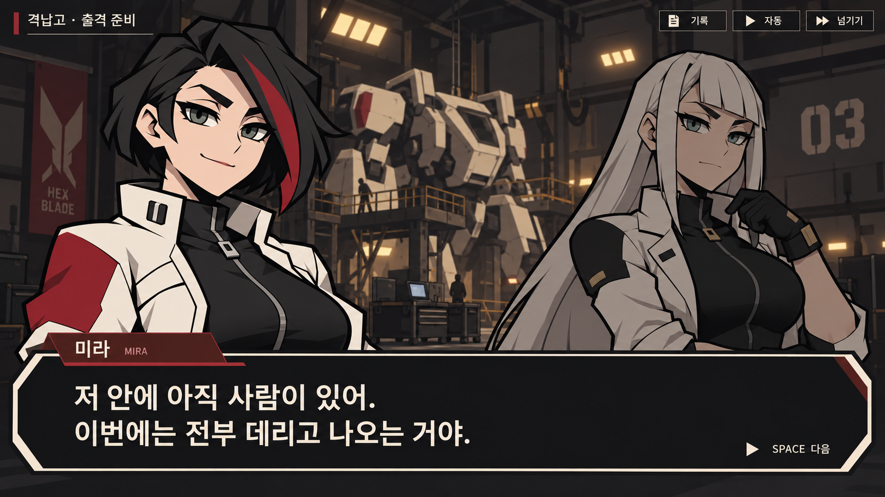

# 파일럿 캐릭터와 대화 포트레이트 시안

2026-10-01 · 내장 image_gen 도구로 제작한 카툰 캐릭터와 임시 대화 UI

사용자가 승인한 미라의 굵은 외곽선·각진 실루엣·단순한 색면을 기준으로 새 캐릭터 세 명을 추가한다. 미라를 포함한 네 명의 감정 포트레이트를 각각 세 장씩 제공한다. 게임 코드에는 연결하지 않은 아트 시안이다.

## 구성

신규 전신 캐릭터 3장, 투명 배경 포트레이트 12장, 대화 장면 UI 1장으로 총 16장의 신규 이미지다. 미라 전신은 이전에 승인된 이미지를 참조한다.

| 캐릭터 | 콘셉트 | 전신 이미지 | 포트레이트 3종 |
|---|---|---|---|
| 미라 | 과묵하고 자신감 있는 중장기 파일럿. 단발과 붉은 머리 포인트, 기계 장갑 | [기존 전신](../character-cartoon-20261001/mira-cartoon-v1.png) | [자신감](mira-confident.png) · [분노](mira-angry.png) · [당황](mira-flustered.png) |
| 세나 | 활발한 고속기 파일럿. 구릿빛 피부, 주황 포니테일과 고글, 비행 재킷 | [전신](sena-full.png) | [기쁨](sena-joy.png) · [분노](sena-angry.png) · [놀람](sena-surprised.png) |
| 노아 | 차분한 통신 전문가. 안경과 긴 땋은 머리, 긴 기술 코트 | [전신](noa-full.png) | [평정](noa-neutral.png) · [의심](noa-skeptical.png) · [안도](noa-warm.png) |
| 에이린 | 도도한 선임 에이스. 긴 백발과 직선 앞머리, 장교형 재킷 | [전신](eirin-full.png) | [여유](eirin-confident.png) · [단호](eirin-stern.png) · [흔들림](eirin-vulnerable.png) |

## 임시 대화 화면

[대화 UI 원본](dialogue-ui.png)

격납고에서 출격을 준비하는 장면이다. 미라가 말하는 인물이고 에이린이 듣는 인물이다. 화자의 얼굴과 이름을 강조하고, 하단 대화창에는 큰 한국어 문장과 다음 대사 입력 안내를 배치한다. 전투 HUD와 수집 화면의 정보는 대화 중 숨긴다.

미라의 대사: “저 안에 아직 사람이 있어. 이번에는 전부 데리고 나오는 거야.”

## 파일 사용

포트레이트는 캐릭터별로 동일한 의상과 주요 특징을 유지한 정사각형 PNG다. 실제 대화창에 넣을 때는 캐릭터별 눈높이·크롭 위치를 맞추어 표정 전환을 연결한다. 생성 이미지 간 픽셀 단위 정렬이나 립싱크 분리는 적용하지 않았다. UI 이미지는 배치와 분위기를 검토하는 시안이며, 글자와 버튼이 별도 레이어로 제공되는 실행 UI는 아니다.

[브라우저 미리보기](preview.html)에서 이미지와 표정을 비교할 수 있다.

## 생성 기록

- [새 캐릭터와 미라 포트레이트 프롬프트](prompts-initial.txt)
- [나머지 캐릭터 포트레이트 프롬프트](prompts-portraits.txt)
- [대화 UI 프롬프트](prompt-dialogue-ui.txt)

기존 반실사 UI 시안은 이번 캐릭터 그림체의 기준으로 사용하지 않았다. 이전의 캐릭터 한 장 검토 범위는 이번 요청으로 세 명 추가·네 명의 포트레이트·대화 화면으로 확장되었다.
